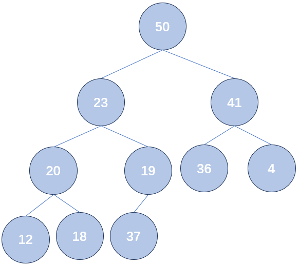

<h1 style="text-align: center">查找和排序</h1>

<p style="text-align:right; font-weight: bold;font-size: 18px;"> Mitake Moca</p>

[排序](#b---c---------)


* [选择排序](#---)
* [冒泡排序](#-----1)
* [插入排序](#-)
* [谢尔排序](#-)
* [堆排序](#-)
* [归并排序](#-)
* [快速排序](#-)
* [排序算法比较](#-)

[库函数 qsort](#b---c---------)

[查找](#b---c---------)

* [顺序查找](#---)
* [二分查找](#-----1)
* [索引查找](#-)
* [散列查找](#-)

​	查找和排序部分经常作为期末考试的第一题出现，往往只会考察你单纯的查找和排序（也就是说，以查找到某元素，或者对元素进行排序为目的，而并不要求你必须要用什么查找或者排序手段，比如一般情况下不会限制你必须使用归并排序等）。但是兼顾实现上的简单以及算法本身效率的高效，希望同学们能够掌握库函数 `qsort` 快速排序。

## 排序

### 选择排序

​	这种方法的思想十分简单：假如前 $\mathrm{k}$ 个元素还没排序，那我就找到这 $\mathrm{k}$ 个元素里最小的一个，把它放到这 $\mathrm{k}$ 个元素的最前面，再对后 $\mathrm{k - 1}$ 个元素进行排序。简单来说，就是每次从还没排序的元素里挑一个最小的，放在最前（当然，也可以依次跳出未排序的元素里最大的，放在最后面。为了和大家 PPT 上的方法保持一致，我们就统一采用了选择最小的）。下面我们来看一个具体的例子：


<p style="text-align: center"> 图 1 - 一个待排序的数组

​	在第一次选择中，我们查找五个元素里最小的元素，发现是 3，然后把它放在数组最前面（通过与原来数组中第一个元素交换），然后继续对后四个元素进行排序：


<p style="text-align: center"> 图 2 - 经历过一遍选择的数组

​	之后的过程也类似：

```
原数组：15 3 6 4 5
经历过一遍选择的数组：3 | 15 6 4 5 （| 前代表数组中已经排好序的部分）
经历过两遍选择的数组：3 4 | 6 15 5 （4 最小，所以与未排序部分的第一个元素 15 交换位置）
经历过三遍选择的数组：3 4 5 | 15 6
经历过四遍选择的数组: 3 4 5 6 | 15
```

​	实际上，对于长度为 $\mathrm{n}$ 的数组，经历 $\mathrm{n - 1}$ 遍选择就可以，因为经历 $\mathrm{n - 1}$ 遍选择时，我们已经选出了最小的 $\mathrm{n - 1}$ 个数并让它们有序。那么显然最后剩下的一个数字自然是最大的一个数字，放在最后面，所以经过 $\mathrm{n - 1}$ 次选择数组就有序了。

​	选择排序的参考代码如下（每次选择最小的）：

```c
#include <stdio.h>

int readInt() {
    int tem;
    scanf("%d",&tem);
    return tem;
}

int a[100001];

void swap(int *a, int *b) {
    int c = *a;
    *a = *b;
    *b = c;
}

int main() {
    int n = readInt();
    for(int i = 1; i <= n ;i++)
        a[i] = readInt();
    
    // 排序过程最多执行 n - 1 次
    for (int i = 1; i < n; ++i) {
        // ith 代表最小的元素的下标
        int ith = i;
        for (int j = i + 1; j <= n; ++j) 
            if (a[j] < a[ith]) {
                ith = j;
            }
        // 将最小的元素与未排序部分的第一个元素交换
        swap(&a[i], &a[ith]);
    }

    for(int i = 1; i <= n ;i++)
        printf("%d ", a[i]);

    return 0;
}
```

### 冒泡排序

​	冒泡排序基于一个很显然的观察，假如数组中每个元素都比前一个元素大，那么数组就是有序的（这里的"大"是一个相对概念，假如你想进行降序排序的时候这个"大"相当于小）。更形式化的表述方式如下：

​	如果 $\mathrm{(i,j)}$ 满足 $\mathrm{1 \le i \lt j \le n}$ 且 $\mathrm{a_i \gt a_j}$，则称 $\mathrm{(i, j)}$ 为一个逆序对。当且仅当数组中**不存在逆序对**时，数组是有序的（这里的有序指的就是从小到大升序）。

​	基于这个思想，冒泡排序每次从数组中，还未排序好的部分从前往后遍历。比较相邻两个元素的大小，如果前面的元素大于后面的元素，就交换它们（每次交换相当于减少了一个逆序对）。整个过程很像气泡冒出水面的过程，更大的元素向后沉，更小的元素向下浮。而且假如我们想象这 $\mathrm{k}$ 个元素里有一个最大值在这些元素的中间，那么比较它的时候它一定会一直与后面的元素进行交换，直到变成这堆元素中最后一个元素。也就是说，冒泡排序每一轮冒泡过程（即遍历一遍还未排序部分的过程），都能够把这堆元素中最大的一个元素交换至这堆元素的最后，那我们只要对前 $\mathrm{k - 1}$ 个元素继续使用冒泡排序就可以了。

​	同时冒泡排序还能做一个小优化，如果在某一轮中我们已经发现不存在逆序对了（也就是数组中任意两个相邻元素都有前一个小于后一个），那我们就不用继续后面几轮的冒泡了。

​	还是拿之前的数组举例子看一看冒泡排序的过程：

```c
原数组：
    15 3 6 4 5
    
第一轮冒泡：
    3 15 6 4 5（由于 15 > 3 且在 3 前面，所以交换它们俩）
    3 6 15 4 5
    3 6 4 15 5
    3 6 4 5 15
    
第二轮冒泡：
    3 6 4 5 | 15（| 后代表已经排好序的部分，由于 3 < 6 所以不用交换）
    3 4 6 5 | 15
    3 4 5 6 | 15
    
第三轮冒泡：
    3 4 5 | 6 15（3 < 4，不用交换）
    3 4 5 | 6 15（4 < 5，不用交换）
    
由于第三轮我们没做任何交换，说明数组中已经不存在前一个比后一个大的相邻元素，所以数组已经有序了，我们就不用继续下面的冒泡过程了
```

​	加入小优化的参考代码如下：

```c
for (int i = 1; i <= n - 1; i++) {
    int swapped = 0;
    for (int j = 1; j <= n - i; j++) 
        if (a[j] > a[j + 1]) {
            swapped = 1;
            swap(&a[j], &a[j + 1]);
        }
    
    if (!swapped) break;  // 提前退出
}
```

​	同选择排序一样，至多 $\mathrm{n - 1}$ 轮后，冒泡排序一定有序（原因可以参考选择排序）。

### 插入排序

​	插入排序的思想和它的名字一样：假如现在我们已经有了一个有序的数组，我们想在其中插入一个新的元素，让这个数组仍然有序，该怎么做？我们可以从数组中最后一个元素开始，与要新插进来的元素进行比较，直到找到一个元素，小于新插进来的元素，我们将新插进来的元素插在这个元素后面（当然如果数组中所有元素都比新元素小的话，那显然新元素要插在数组最前面）；同时把原数组中插入位置后面的元素都向后移动一位（给新来的让地方）。

​	显然将新元素插入到有序数组中的过程也可以由二分法来完成，不过由于要将对应位置后的元素都向后移动一位，所以实际上时间复杂度是没有变化的，都是 $\mathrm{O(n^2)}$。

​	插入排序的流程就是，将第 $\mathrm{k + 1}$ 个元素插入到数组前 $\mathrm{k}$ 个有序元素中，使得数组前 $\mathrm{k + 1}$ 位也有序，重复这个过程直到数组也有序。我们还是以最开始的数组模拟一下插入排序的过程：

```c
原数组：
    15 | 3 6 4 5（| 前表示已经排好序的部分，长度为 1 的数组一定有序）
    
第一次插入：
    3 15 | 6 4 5

第二次插入：
    3 6 15 | 4 5
    
第三次插入：
    3 6 4 15 5（由于 4 < 15，所以 4 先与 15 进行交换）
    3 4 6 15 | 5（由于 4 < 6，所以 4 与 6 进行交换；下一次比较发现 3 < 4，所以 4 的位置也被确定了）

第四次插入：
    3 4 6 5 15
    3 4 5 6 15 | （至此，数组有序）
```

​	插入排序参考代码如下：

```c
for (int i = 2; i <= n; ++i) {
    int key = a[i];
    int j = i - 1;
    while (j >= 0 && a[j] > key) {
        a[j + 1] = a[j];
        j--;
    }
    a[j + 1] = key;
}
```

​	与我们说明的流程不同，我们并不是每次交换相邻两个元素；而是让比新元素大的元素都向后移动一位，为新元素留出位置；然后再直接将新元素放在留出的位置上。

### 谢尔排序

​	不会用也不会考，直接跳过。

### 堆排序

​	先来介绍什么是堆。

​	有的时候，我们并不关心数组整体的有序性，仅仅关心一个数组里谁最大，那我们可以怎么办？有的同学可能就会说，我们可以先进行排序，然后直接取出最大的元素。可是如果我增加需求，我可能会增加若干次操作，每次操作都可能增加或者删除当前最大的元素，经过几次操作后再问你谁是最大的元素，你还是得进行一次排序之后，才能告诉我谁是最大的元素，即使实际上大部分元素的有序性是没有被改变的。

​	堆就是用来解决这个问题的，堆支持的操作有向堆中插入元素，删除最大的元素，以及询问当前堆中最大的元素，并且前两种操作的时间复杂度都是 $\mathrm{O(logn)}$，最后一种操作的时间复杂度是 $\mathrm{O(1)}$ 的。

​	堆的实现就是一颗完全二叉树，不过在这棵二叉树上，满足所有节点的元素都比子结点的元素大，比如下面就是一个堆（严格来讲，叫做大顶堆；还有要求父节点都比子节点小的，用来维护最小值的，叫做小顶堆）：


<p style="text-align: center"> 图 3 - 一个大顶堆

​	当向堆中插入元素时，我们先把它放在堆的最后（即按照完全二叉树方式应该放到的下一个结点），然后逐步向上调整，比如我们往上面的大顶堆里插入 37：



<p style="text-align: center"> 图 4 - 大顶堆中插入元素 37

​	显然，插入新元素之后，堆很有可能不满足 `所有节点的元素都比子结点的元素大` 这个性质了，比如 37，它比 19 大，所以应该让 19 与 37 进行交换，让 37 做父亲，19 做儿子：


<p style="text-align: center"> 图 5 - 向上调整_1

​	调整完之后，看 37 的父亲是 23，还比它小，所以继续调整：


<p style="text-align: center"> 图 6 - 向上调整_2

​	再看 37 的父亲是 50，满足父亲比儿子大了，所以不用调整了。整个过程调整的最多次数是树的高度，也就是 $\mathrm{O(logn)}$。这也就意味着，如果我们插入了一个比 50 大的元素的话，也能在 $\mathrm{O(logn)}$ 时间内知道最大值被更新了。

​	堆还支持删除堆顶元素（元素），也就是把 50 删除之后的最大值是谁（这个操作才是真正优势）。在删除堆顶元素后，树不能没有根，所以就把堆的最后一个元素临时放在堆顶的位置，然后利用类似于上面向上调整的过程逐步向下调整，具体过程是类似的，不再赘述，可以直接看代码：

```c
// 利用数组 a[0 ~ n - 1] 模拟完全二叉树
// i 的两个儿子分别是 2 * i + 1 和 2 * i + 2
// i 的父亲是 (i - 1) / 2
void up(int i) {
    while (i > 0) {
        int parent = (i - 1) / 2;
        // 满足堆性质，不再调整
        if (a[parent] >= a[i]) break;  
        swap(&a[parent], &a[i]);
        // 继续向上调整
        i = parent;  
    }
}

void down(int i, int n) {
    int j = 2 * i + 1;
    // 至少要有左儿子
    while (j < n) {
        // 如果有右儿子，且右儿子更大，选右儿子
        if (j + 1 < n && a[j] < a[j + 1])
            j++;
        // 满足堆性质，不用再调整了
        if (a[i] >= a[j])
            break;
        // 交换父子节点
        swap(&a[i], &a[j]); 
        // 继续向下调整
        i = j;                 
        j = 2 * i + 1;
    }
}
```

​	利用堆进行排序的思想是，不断地获取堆顶元素，即未排序部分的最大元素；再删除堆顶元素，堆自动调整结构，继续给出剩下元素的最大元素。这样就能源源不断地得到未排序部分的最大元素，时间复杂度 $\mathrm{Olog(n)}$。

​	还是用上面数组来模拟堆排序的过程：

```c
原数组：15 3 6 4 5

建堆：
    插入 15：15
    插入 3: 15 3
    插入 6: 15 3 6
    插入 4：15 4 6 3（插入 4 后，4 作为 3 的孩子，比 3 大，于是与 3 进行交换）
    插入 5: 15 5 6 3 4（插入 5 后，5 作为 4 的孩子，比 4 大，于是与 4 进行交换）

有序部分：15
删除堆顶：4 5 6 3 -> 6 5 4 3（4 临时充当根，发现比孩子小，且孩子中最大的是 6，与 6 交换位置）
        
有序部分：6 15
删除堆顶：3 5 4 -> 5 3 4（3 临时充当根，发现比孩子小，且孩子中最大的是 5，与 5 交换位置）
        
有序部分：5 6 15
删除堆顶：4 3（4 临时充当根，发现满足堆的性质）        
        
有序部分：4 5 6 15
删除堆顶：3

最后数组：3 4 5 6 15
```

​	参考的 C 语言代码实现如下：

```c
// 边读入边维护堆
for(int i = 0; i < n ;i++)
	a[i] = readInt(), up(i);

// 先将第一个元素和已经排好的元素前一位做交换，再重新调整（刚调整的元素之前的元素），直到排序完毕
for (int i = n - 1; i > 0; i--) {
	swap(&a[0], &a[i]);
	down(0, i);
}
```

​	从感性的角度来理解为什么堆排序的时间复杂度是 $\mathrm{O(nlogn)}$，比前三种排序要快：因为堆排序利用了一个性质，就是若 $\mathrm{a \lt b}$，$\mathrm{b \lt c}$，那么我们不用比较 $\mathrm{a}$ 和 $\mathrm{c}$，也知道一定有 $\mathrm{a \lt c}$。而前三种排序都是要两两比较的，没有利用到这一点。后面要介绍的快速排序和归并排序也可以这么感性理解。

### 归并排序

​	归并排序淋漓尽致地体现了递归思想。

​	我们做过这样的题目，如果现在有两个有序数组，我们如何高效地合并这两个有序数组？如果两个数组有序，那么显然合并后数组的最小元素，要么是 $\mathrm{a}$ 数组的最小元素，要么是 $\mathrm{b}$数组的最小元素。所以我们通过一次比较，就知道了合并数组的最小值，并把这个最小值在原数组中去掉，继续合并两个新的有序数组。由于每次比较都会让 $\mathrm{a}$ 或者 $\mathrm{b}$ 中的元素减少一个，所以最多进行 $\mathrm{O(|a| + |b|)}$ 次比较就能成功合并两个有序数组；相较于两两比较的方法是十分高效的。这也是利用到了我们在堆排序结尾说的那个感性理解。

​	举个具体的例子：

- $\mathrm{a}$ = 1 4 5 6，$\mathrm{b}$ = 2 3 7 8，用 $\mathrm{c}$ 表示已经排序好的元素，初始时 $\mathrm{c}$ 为空。
- 由于 $1 \lt 2$ ，有 $\mathrm{a}$ = 4 5 6 ，$\mathrm{b}$ = 2 3 7 8，$\mathrm{c}$ = 1
- 由于 $4 \gt 2$ ，有 $\mathrm{a}$ = 4 5 6 ，$\mathrm{b}$ = 3 7 8 ，$\mathrm{c}$ = 1 2
- 由于 $4 \gt 3$ ，有 $\mathrm{a}$ = 4 5 6 ，$\mathrm{b}$ = 7 8 ，$\mathrm{c}$ = 1 2 3
- 由于 $4 \lt 7$ ，有 $\mathrm{a}$ = 5 6 ，$\mathrm{b}$ = 7 8 ，$\mathrm{c}$ = 1 2 3 4
- 由于 $5 \lt 7$ ，有 $\mathrm{a}$ = 6，$\mathrm{b}$ = 7 8，$\mathrm{c}$ = 1 2 3 4 5 
- 由于 $6 \lt 7$ ，有 $\mathrm{a}$ 为空，$\mathrm{b}$ = 7 8，$\mathrm{c}$ = 1 2 3 4 5 6
- 由于 $\mathrm{a}$ 中没有元素了，将 $\mathrm{b}$ 中剩余元素放入 $\mathrm{c}$ ，有 $\mathrm{a}$ 为空，$\mathrm{b}$ 为空，$\mathrm{c}$ = 1 2 3 4 5 6 7 8

​	所以我们想到，如果能把原来的数组分成前后两部分，然后再将这两部分合并成一个新数组，这是不是会更高效呢？但是别忘了，上面高效合并方法的前提是两个数组均有序，可是我们数组的前后两部分显然是不一定有序的。所以我们要先分别对数组的前后两部分进行排序。

​	那该怎么对数组的两部分分别进行排序呢？我们以对数组的前半部分进行排序为例，我们想到，如果能将把这个数组分成前后两部分，然后再将这两部分合并成一个新数组，不就可以排序了吗？于是我们就可以将这个过程递归下去了。即我们排序的方法 `mergeSort`，就是分别对数组的前后两部分分别用 `mergeSort` 排序，然后再合并两个有序部分（递归函数最重要的两个部分就是递归关系和边界，前面这句话就是递归关系，递归边界就是**只有一个元素的数组是有序的**）。

​	还是以一开始的数组为例：

```c
原数组：15 3 6 4 5
    
分成前后两部分：15 3 6       4 5
    对 15 3 6 进行排序：
    	分成前后两部分：15 3       6
    		对 15 3 进行排序：
    			分成前后两部分：15     3
    		两部分有序，合并：3 15
    	两部分有序，合并：3 6 15 
    对 4 5 进行排序：
    	分成前后两部分：4      5
    	两部分有序，合并：4 5
    两部分有序，合并：3 4 5 6 15
```

​	参考代码如下：

```c
void merge(int l, int r) {
    int mid = (l + r) >> 1;	
    // 两端的开始和结束
    int i = l, j = mid + 1; 
    int k = l;
    while((i <= mid) || (j <= r)) {	// 合并
        if(j > r || (i <= mid && a[i] <= a[j])) {
            // 如果右子列空了或者左子列当前元素小于右子列当前元素，新的位是左面第一位，且计算逆序对数
            tem[k++] = a[i++];
        }
        else {// 否则，新的位是右面第一位
            tem[k++] = a[j++];
        }
    }
    
    for(int i = l;i <= r;i++) 
        a[i] = tem[i];    // 归还排好序的段
}

void mergeSort(int l, int r) {
    int mid = (l + r) >> 1;
    if(l < r) {
        // 先对前后两部分排序
        mergeSort(l, mid);
        mergeSort(mid + 1, r);
        // 合并两个有序数组
        merge(l, r);
    }
}

int main() {
    ...
    mergeSort(1, n);
    ...
}
```

### 快速排序

​	其实快速排序跟归并排序有一些相似之处，都是将数组分成前后两部分然后分别排序，我们就简单讲了，因为一般在数据结构课上不会要去你手写一个快排。

​	快速排序 `quickSort` 的实现，是先选择一个基准元素，把所有比它小的元素放在它的左面，所有比它大的元素放在它的右面，然后分别对左右两部分分别利用  `quickSort` 进行排序，显然 `有序的小于 k 的元素` + `k` + `有序的大于 k 的元素` 就是一个有序数组（还是以一个元素为终点。同学们在思考递归函数的时候，一定不要思考函数递归的细节，而是**坚信函数一定能够完成它所应该完成的职责**，基于此写出递归转移）。借由这个基准元素实现了我们说的感性理解。

​	参考代码如下：

```c
void quickSort(int l, int r) {
    int i, last;
    if (l < r) {
        last = l;
        for (i = l + 1; i <= r; i++)
            if (a[i] < a[l])
                swap(&a[++last], &a[i]);
        swap(&a[l], &a[last]);
        quickSort(l, last - 1);
        quickSort(last + 1, r);
    }
}
```

​	但是其实快排最坏情况下的时间复杂度可能会被卡到 $\mathrm{O(n^2)}$。

### 排序算法比较

​	先介绍一个概念：排序算法的稳定性，在选填里还是总考的。这个稳定性指的不是排序算法的效率表现稳不稳定，而是就是如果两个元素值相等，排序算法在排好序后是否**可能**（并非一定）会改变他们的相对位置（比如本来一个 3 在另一个 3 之前，但是排好序后在它之后了）。

​	你可能感到奇怪：既然值相等了，那改变相对位置了又有什么关系呢？举个例子，比如我们用学生的姓名给学生排序，可能有两个都叫 `Tom` 的人，但是他们学号一个是 `1`，一个是 `2`，那么我们使用稳定排序算法和使用不稳定排序算法得到的结果是可能不同的。反正这个不分不用细究，一般考试也只会问你下面哪个是稳定（或不稳定）排序算法；或者你在写 `qsort` 的时候如果要求你值相同时，按照输入的相对顺序进行输出，你要知道快排是不稳定排序，所以你要再加一个字段表示输入的顺序，用这个字段进行比较，而不能直接 `qsort` 比较值之后就不管了。

​	各个排序算法各个方面的比较如下，感觉考试也只可能考选填，不会的时候现翻这个表就行了：


<p style="text-align: center"> 图 7 - 排序算法的比较


## 库函数 qsort

​	每次期末的第一题往往也就是结构体、排序、查找一类的考点。

​	首先我们先来回顾一下结构体。比如有这样一个需求，输入若干个学生的姓名、语数外三门课程的成绩，然后对学生按照总分进行排序，我们应该开几个数组保存这些信息：

```c
// 不超过 1000 个学生，姓名不超过 8 个字符，同时字符串应该以空字符结尾，所以我们第二维至少应该是 9
char name[1005][10];
int chinese[1005], math[1005], english[1005];
```

​	其中 `name[i]` 表示第 `i` 名同学的名字，`chinese[i]` 等表示第 i 名同学对应科目的成绩。这样的写法存在一个问题，就是我们在感觉上，明明几个数组是分开的，但是对应的第 `i` 个元素都是同一个同学的信息，对它们的操作（比如在排序过程中，交换数组中两个元素的操作）应当是牢牢绑定在一起的。C 语言为我们提供了结构体，将多个数据绑定在一起（即使这些数据的数据类型不同）：

```c
struct student {
    char name[10];
    int chinese, math, english;
};
struct student stu[1005];
```

​	上述代码中的 `struct student` 称为一个**结构类型**（类似于我们之前学到过的 `int` 类型，只不过这个类型是我们自己定义的）；`name` 和 `chinese` 等称为的**结构成员**；`stu` 称为**结构变量**（更严谨的说应该是结构变量的数组；类似于 `int a;` 或者 `int a[100]` 中的 `a` 称为一个 `int` 类型的变量（的数组）一样）。想访问某个结构变量的结构成员可以用 `stu[i].name` 这样的写法。

​	上面介绍了结构体，下面为大家介绍排序。大家可能会自己写冒泡排序、选择排序等，但是还是希望大家能够掌握 C 语言 `<stdlib.h>` 库提供的 `qsort`，第一是因为它快，第二是因为它写起来也比较简单。

​	`qsort` 函数的写法比较固定，它需要接受四个参数，依次是：

- 要排序数组的起始地址
- 要排序元素的个数
- 每个元素的大小（每个元素占多少字节）
- 排序规则对应的函数

​	前三个参数的写法比较固定，大家多看几个例子就能知道怎么写了。我们重点说明第四个参数，即`排序规则对应的函数`。显然，我们排序的要求是多种多样的，C 语言不是读心大师，它不知道我们是想升序还是想降序，是想对 `int` 进行排序还是想对 `struct student` 进行排序。我们的心意只有我们自己最清楚，所以如何排序应当由身为程序员的我们告诉计算机。我们要实现这样一个函数（下面只是一个示例，函数不一定非得叫 `cmp`，叫啥都行）：

```c
int cmp(const void *a, const void *b) {
    ...
}
```

​	其中 `a` 和 `b` 表示排序过程中，进行比较的两个元素的指针。`cmp` 返回负数时，表示 `a` 指向的元素比 `b` 指向的元素小（这里的小指的是逻辑上在前，并不一定是数值上更小）；`cmp` 返回 0 时，表示两个指针指向的元素一样大，谁在前谁在后无所谓；`cmp` 返回正数时，表示 `a` 指向的元素比 `b` 指向的元素大（这里的大指的是逻辑上在后，并不一定是数值上更大）。你可能觉得他的参数类型很奇怪，是 `const void *`。其实，这是因为我们可能会对 `int` 进行排序，也可能会对 `double` 进行排序，还可能对 `struct student` 进行排序；`qsort` 本身是没法确定数据的类型的。幸运的是，所以类型的指针指向的都是某个起始地址，都是一样长的，所以我们可以就用一个单纯的值来表示起始地址，至于这个起始地址开始存的是哪种类型对应变量的数据，在函数里交给我们自己来处理。

​	下面我们来举两个例子：

```c
// 对 int 进行升序排序
int a[105];

int cmp(const void *a, const void *b) {
    int x = *(int *)a;
    int y = *(int *)b;
    // y 比 x 小，返回负数，x 在逻辑上靠前
    // y 比 x 大，返回正数，x 在逻辑上靠后
    return y - x;
}

int main() {
    ...
    // qsort 写法较为固定，这里是对 a[0] ~ a[n - 1] 进行排序
    qsort(a, n, sizeof(a[0]), cmp);
    // 如果需要对 a[1] ~ a[n] 进行排序，像下面那样写
    // qsort(a + 1, n, sizeof(a[0]), cmp);
}
```

```c
// 对学生按总分从低到高进行排序；如果总分相同，名字字典序更小的在前
struct student {
    char name[10];
    int chinese, math, english;
};
struct student stu[1005];

int cmp(const void *a, const void *b) {
    struct student x = *(struct student *)a;
    struct student y = *(struct student *)b;
    int total_x = x.chinese + x.math + x.english;
    int total_y = y.chinese + y.math + y.english;
    // 总分不同分数小的在前
    if(total_x != total_y)
        return total_x - total_y;
    // 总分相同名字字典序小的在前
    return strcmp(x.name, y.name);
}

int main() {
    ...
    qsort(stu, n, sizeof(stu[0]), cmp);
}
```

​	以上就是库函数 `qsort` 的基本用法了，同学们一定一定要掌握。

​	其实我们还可以从 `qsort` 的参数中看出很多学问。由于要排序元素的类型不确定，所以我要求程序员只需要给我一个起始地址，你要排多少个元素，每个元素多大；`qsort` 就会自己去这个起始地址开始，一个一个地将对应大小的元素取出来，直到取到我们指定的个数。然后再利用我们提供的排序规则，对这几个 `qsort` 预先不知道类型的指针指向的元素进行排序。虽然 C 语言要求变量都要有类型，虽然 C 语言无法猜出我们到底想按何种规则对各种各样的元素进行排序，但是它通过巧妙地设计为我们提供了一句话就能实现各种类型排序的 `qsort` 函数，我们要做的，就是实现 `cmp` 比较规则函数而已。


## 查找

​	查找一般是指在某个数组中，找到某元素出现的位置（或者找某元素出没出现过，第一次出现的位置等，都是类似的）。

### 顺序查找

​	特别简单，就是过一遍数组，如果发现某元素和目标元素相等，就相当于找到了目标元素；如果过了一遍数组也没发现有元素和目标元素相等，那么就相当于目标元素不存在。查找一个元素的时间复杂度为 $\mathrm{O(n)}$。

```c
int main() {
    ...
    for(int i = 1; i <= n ;i++) {
        if(a[i] == target) {
            printf("%d", i);
            return 0;
        }
    }
    printf("-1");
    ...
}
```

### 二分查找

​	虽然对于一般的数组，我们似乎只能使用顺序查找。但是当数组有一些其它额外的性质时，我们就可以利用上这些性质，降低查找所需要的时间。

​	比如如果原数组是有序的，我们就有办法将查找的时间复杂度降低到 $\mathrm{O(logn)}$，也就是使用二分查找的方式。其实我们之前不管是在程设还是在 DS 前期都已经多次学习并使用过二分查找了，所以这里我就简单讲了。

​	显然由于数组有序，我们先挑出数组中间的元素 $\mathrm{a_mid}$ 跟目标元素 $\mathrm{target}$ 进行比较：

- 如果 $\mathrm{a_mid == target}$，则说明目标元素在原数组中的一个合法位置是 $\mathrm{mid}$
- 如果 $\mathrm{a_mid > target}$，则说明假如目标元素在原数组中存在，也一定在 $\mathrm{mid}$ 左面的部分，因为显然我 $\mathrm{a_mid}$ 都比你目标元素大了，$\mathrm{a_mid}$ 右面的元素显然更要比目标元素大，就这样砍去了一半的数组元素
- 如果 $\mathrm{a_mid < target}$，则说明假如目标元素在原数组中存在，也一定在 $\mathrm{mid}$ 右面的部分
- 重复上述过程，直到找到目标元素或确定目标元素在原数组中不存在（也就是当区间缩小到 1 时，原数组中的元素和目标元素还不相等，那目标元素就不存在）

​	二分查找一般有以下几个应用场景：确定目标元素在数组中是否存在，找到第一个 $\mathrm{\ge}$ 目标元素的元素，找到最后一个 $\mathrm{\le}$ 目标元素的元素。比如下面我们就给出查找数组中最后一个 $\mathrm{\le}$ 目标元素的元素的参考代码：

```c
int binary_search(int l, int r, int target) {
    int ret = -1;
    while(l <= r) {
        int mid = l + r >> 1;
        if(a[mid] <= target)
            ret = mid, l = mid + 1;
        else
            r = mid - 1;
    }
    return ret;
}
```

​	二分查找的实现是非常多样的，可能每个人都有不同的写法。如果做题的时候真碰到了指定你必须使用二分查找，并且记录比较的次数的话，**一定要看题目是怎么让你实现的，不要直接就套用模版**！

### 索引查找

​	假如现在我们有一本词典，我们想找到某个单词，比如想找到 `sure` 这个单词。那我们一般不可能说用顺序查找，从词典的第一个单词开始一个一个看；或者二分查找，先翻到词典中间，看看是什么单词，看一下 `sure` 是在它前面还是后面。而是应该先看索引表，看 `s` 开头的单词在哪页到哪页，然后再在这些页里应用顺序查找或者二分查找，或者建立更多级的索引再找以 `su` 开头的单词是从哪页到哪页（但是我们数据结构做题编程时一般只让你实现一级索引就行，索引查找本身考的都少）。

​	一般期末题绝对不会考索引排序，假如真考了的话也一定会告诉你建几级索引（$\mathrm{99\%}$ 可能是一级），索引之后用顺序查找还是二分查找。

### 散列查找（哈希查找）

​	先介绍一下散列的思想。比如我们想记住某人的电话号时，我们一般只用记住后四位，等我们接到一个电话时，我们一看后四位是 `1234`，我们就基本能知道这个是张三打来的电话，而不用把所有位都记住才能确定（这样的想法在日常生活中也是非常常用的，比如坐网约车时问你手机号后四位，取快递柜里的外卖时只需要输入手机后四位）。假如我们有一个电话簿，我们可以用后四位记录对应的人，比如：

```
1234：张三
2345：李四
```

​	这样，我们把一个大整数转换为了一个只有四位的小整数，就能够当做数组下标了，就可以用 `user[i]` 表示手机尾号为 $\mathrm{i}$ 的人的名字。这就是哈希（散列）的思想，将某种数据类型转换为整数类型（比如大整数、字符串等）。

​	但是显然，我们在取外卖的时候可能会遇见这种情况：有其他人和我们手机尾号相同，外卖柜不知道我们想要取的到底是哪个外卖，也就是有多个元素的哈希值相同，这就叫做**哈希冲突**。结合日常生活中的经验，这种情况下，外卖柜会紧接着让我们输入完整的手机号，从而确定我们到底是哪一个人，也就是通过存储完整的值来解决哈希冲突：

```
1234：张三（18712341234） 王五（15812341234） 赵六（13012341234）
2345：李四（18723452345）
```

​	也就是说，在空间方面，哈希的方法并没有什么优化，因为它还是要存储所有的原值。但是在时间方面，哈希先通过计算哈希值的方式，缩小目标元素的范围，然后再在哈希值相等的元素里比对，看看谁的值相等，以此确定目标元素。简单来说，就是**先缩小目标范围，再逐个进行比对**。

​	对应的数据结构就叫做**哈希表**，一提到表（Table）同学们就不难想象到应该是一个链的数组，数组下标对应着哈希值，而一条链对应着哈希值相等（哈希冲突）的一堆元素。每条链一般用链式存储来实现（节省空间），所以一般使用散列查找时，先计算哈希值，找到对应的链，然后再在对应的链中使用顺序查找。下面给出一个参考代码：

```c
#include <stdio.h>
#include <stdlib.h>
#include <string.h>

// 一般设定为一个比较大的质数
const int mod = 9007; 
typedef struct node  node;
typedef struct node* nptr;

struct node {
	char *str;
	int freq;
	nptr nxt;
};

nptr head[9007]; // 如果是 cpp 可以直接写下标为 mod，这其实就算是一个哈希表了

nptr newnode() {
	return (nptr)malloc(sizeof(node));
}

nptr getnode(char *str) {
	nptr p = newnode();
	p -> str = (char *)malloc(strlen(str) + 1);
	strcpy(p -> str, str);
	p -> freq = 1;
	p -> nxt = NULL;
	return p;
}

// 计算哈希值函数
int hashCode(char *str) {
	int tem = 0;
	int len = strlen(str);
	for (int i = 0; i < len; i++)
		tem = (tem * 26 + str[i] - 'a' + 1) % mod;
	return tem;
}

// 寻找单词对应的结点的函数
nptr find(char *str) {
	int val = hashCode(str);
	for (nptr i = head[val]; i; i = i -> nxt)
		if (strcmp(str, i -> str) == 0)
			return i;
	return NULL; // 没找到
}

// 映射函数
nptr insert(char *str) {
	nptr tem = find(str);
	if (tem) {
		tem -> freq++;
		return tem;
	}
	// 之前没有，新插一个结点
	int val = hashCode(str);
	nptr p = getnode(str);
	p -> nxt = head[val];
	head[val] = p;
	return p;
}

int main() {
    // 只能输入小写字母组成的单词
	int n, m;
	scanf("%d%d", &n, &m);
	char *str;

	// n 次插入操作
	for (int i = 1; i <= n; i++) {
		scanf("%s", str);
		insert(str);
	}

	// m 次查询操作
	for (int i = 1; i <= m; i++) {
		scanf("%s", str);
		nptr tem = find(str);
		printf("%s %d\n", str, tem ? tem->freq : 0); // 不存在对应的单词返回 0
	}
	return 0;
}
```

​	一般考试的时候不会考编程题，而是考选填，问你有多少个元素冲突之类的。值得注意的是，处理哈希冲突的方法多种多样，我们使用的是一种常用的叫做开拉链法的方法；哈希函数的构建也是多样的（上面的例子里我们使用了一个简单的 26 进制来计算小写字母组成的单词的哈希值）；将新元素插入链的方式也是多样的（我们就是插在链头，也有按字典序插、插在链尾等）。总之，面对考试的话你知道原理会算冲突就行。