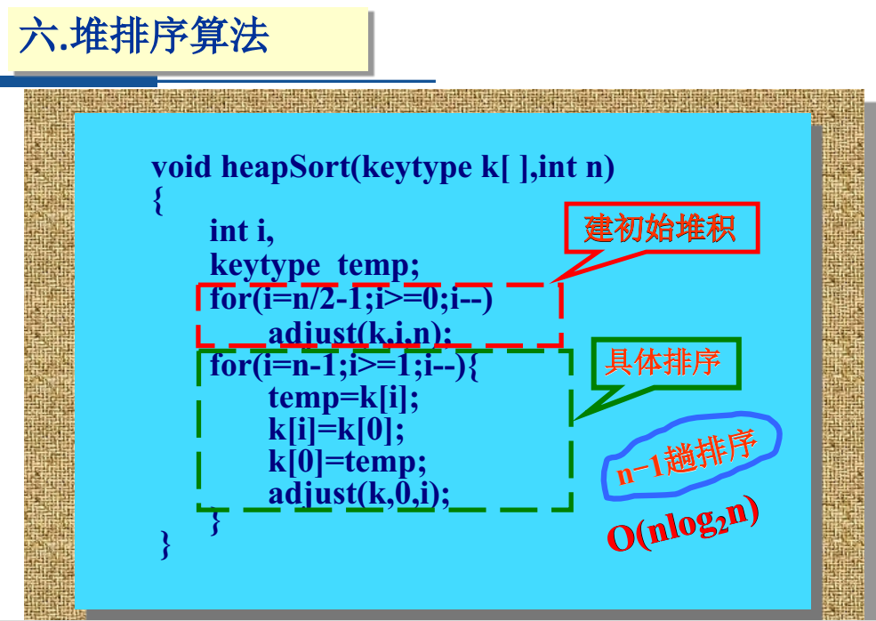
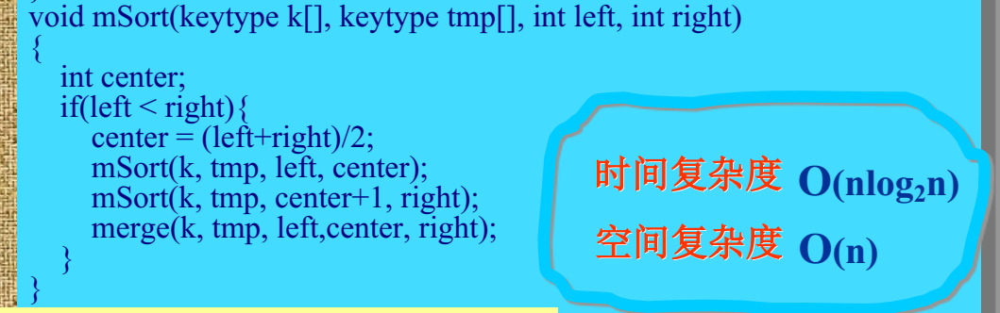

<h1 style="text-align: center"> 第七次作业题目详解</h1>

[A - 学生在线上机时间统计](#a------)

[B - 单词查找](#b---c---------)

[C - 排座位](#b---c---------)

[D - 整数排序](#b---c---------)

## A - 学生在线上机时间统计

简单来说，就是输入若干条记录，把学号相同的记录合并（时间相加），最后按照时间从小到大的顺序输出（时间相同按照学号从小到大的顺序）。

首先进行合并操作时，我们之前也已经做过很多次类似的操作了（比如`函数调用关系`一题）。我们可以在某个学生第一次出现时，将这条记录放到一个数组 $\mathrm{b}$ 中。每当读入一个新记录的时候，在数组 $\mathrm{b}$ 中查找，如果有该学生的记录，那么直接合并到上面（即把新记录的时间加在原来的记录上）；如果没有过该学生的记录，则把这条记录放到数组 $\mathrm{b}$ 的最后。也就是说，在数组 $\mathrm{b}$ 中，每个学生只对应一个元素，是原来对应该学生的多条记录合并后的结果。

```c
// m 表示数组 b 已经存了多少元素
int n = read(), m = 0;
for(int i = 1; i <= n; i++) {
    student x;
    // 由于姓名中间无空格，直接用 scanf 即可
    scanf("%s%d%d", x.name, &x.id, &x.time);
    // 用 vis 标记是否出现过
    int vis = 0;
    for(int i = 0; i < m; i++) 
        if(b[i].id == x.id) {
            b[i].time += x.time;
            vis = 1;
            break;
        }
        
    if(vis == 0) 
        b[m++] = x;
}
```

后面的双关键字排序就不多说了，请同学们参考 `查找与排序讲解` 里的 `库函数 qsort` 部分。还有几个实现的细节：首先，由于 `time` 最大不超过 `86400`，记录不超过 `100` 条，所以合并后的时间最大也就 `8640000`，远远不会超过 `int`；其次，虽然我们在 `cmp` 函数返回时，一直写的都是 `return x - y;` 这样的写法，但是当数据比较大时，一定要注意 `x - y` 是否会溢出，如果可能溢出的话就不能这么写了；最后，学号是 8 位整数，如果我们读入时学号以 `0` 开头的话输出就必须用 `%08d` 这样的方式显式补 0 凑齐 8 位，否则输出的学号会默认省略前置 0（虽然一般不会有这样的数据，但是单纯按照题目本身来看这一点是要考虑的）。

参考代码：

```c
#include <stdio.h>
#include <stdlib.h>

int read() {
    int tem;
    scanf("%d",&tem);
    return tem;
}

typedef struct student  student;
struct student {
    char name[25];
    int id, time;
};

student b[105];

int cmp(const void *a, const void *b) {
    student x = *(student *)a;
    student y = *(student *)b;
    if(x.time != y.time)
        return x.time - y.time;
    return x.id - y.id;
}

int main() {
    // m 表示数组 b 已经存了多少元素
    int n = read(), m = 0;

    for(int i = 1; i <= n; i++) {
        student x;
        scanf("%s%d%d", x.name, &x.id, &x.time);

        int vis = 0;
        for(int i = 0; i < m; i++) 
            if(b[i].id == x.id) {
                b[i].time += x.time;
                vis = 1;
                break;
            }
            
        if(vis == 0) 
            b[m++] = x;
    }

    qsort(b, m, sizeof(b[0]), cmp);

    for(int i = 0; i < m; i++)
        printf("%s %08d %d\n", b[i].name, b[i].id, b[i].time);

    return 0;
}
```


## B - 单词查找

题意简单来说，就是读入一个词典，然后输入一个单词，并指定查找方式（就是我们在查找讲解里说的四种查找方式中的某一种），输出这个单词是否存在，以及你判断它是否存在需要的比较次数。

首先涉及到文件读入，而且题目中说了输入文件的换行符可能是 `\n` 或者 `\r\n`，我建议大家在做数据结构体的时候，涉及到文件读入少用 `fgets` 来读入，它不处理换行符。如果已经知道了读入的一个部分中间没有空格，那你就用 `fscanf` 或者 `freopen`，这样压根都不用考虑换行符的问题了（其实对于正常的规范的题目数据而言，换行符不应该出现 `\r\n`，但是在做我们数据结构题的时候你一定要考虑）。

题目中说了词典里有不超过 $\mathrm{3500}$ 个单词，每个单词不超过 $\mathrm{20}$ 个字符，为了简单我们可以用一个二维数组进行词典的存储，空间是完全足够的。

下面我们逐一实现四种查找方式。首先是顺序查找，同时因为单词表已经排好序了，所以我们遇到第一个大于目标单词的单词就不用往下找了，这样能稍微优化一点查找次数：

```c
// 全局变量 cmp_cnt 记录比较次数
// 返回值表示是否找到
int linear_search(char *target) {
    cmp_cnt = 0;
    for(int i = 0; i < dict_sz; i++) {
        cmp_cnt++;
        // 虽然我们下面用了俩 strcmp，但是其实从题目的角度看只会让比较计数 + 1
        if(strcmp(target, dict[i]) < 0)
            return 0;
        if(strcmp(target, dict[i]) == 0)
            return 1;
    }
    // 遍历到字典最后也没找到
    return 0;
}
```

在判断 `strcmp` 返回值时请注意，按照 C 标准规定 `strcmp` 返回的是负数、0、正数，而并非 `-1`、`0`、`1`。

第二种查找方式是折半查找，正如我在`查找讲解`里说的，二分查找的实现是非常多样的，可能每个人都有不同的写法。如果做题的时候真碰到了指定你必须使用二分查找，并且记录比较的次数的话，**一定要看题目是怎么让你实现的，不要直接就套用模版**！题目让我们用 PPT 上的实现，那我们就不能自己直接写一个二分查找，不然很有可能比较次数和答案不同。下面这个是 PPT 上给的二分查找：


我们把它稍微改造一下，让它更好看一点。同时字符串比较值的时候不能直接用 `==`，要用 `strcmp`（如果用 `==` 比较两字符串，我们知道字符串名相当于字符串的起始地址，所以是在比这俩字符串的起始地址是否相同，也就是这俩字符串到底是不是同一个人，是灵魂的相同，而不仅仅是值相等，貌合神离）。同时请注意那个 `keytype` 并不是一个真的类型（也就是说你不能直接这么写），它是泛型的意思，比如我们要在 `int` 数组里找 `int`，那它就是 `int`；要在 `char *` 数组里找 `char *`，那它就是 `char *`。

```c
int binary_search(char *target) {
    cmp_cnt = 0;
    int l = 0, r = dict_sz - 1;
    while(l <= r) {
        int mid = l + r >> 1;
        cmp_cnt++;
        if(strcmp(target, dict[mid]) == 0)
            return 1;
        else if(strcmp(target, dict[mid]) > 0)
            l = mid + 1;
        else
            r = mid - 1;
    }
    return 0;
}
```

然后是索引查找，你可以手动建索引，就自己去文件里找一个每个字母开头的第一个单词和最后一个单词所在的行。也可以在读入的时候直接处理好索引，需要注意的是输入文件里没有以 `x` 开头的单词，有同学的处理方式会误把 `y` 开头的单词记录到 `x` 上；还有的同学记录每个字符开头的单词的起始位置和结束位置，默认这俩位置初始值都是 `0`，这样的话在搜索以 `x` 开头的单词时就会误以为 $\mathrm{[0, 0]}$ 区间内有以 $\mathrm{x}$ 开头的单词，导致比较次数错误。

```c
// 维护索引
for(int i = 0; i < 26; i++)
    idx_begin[i] = -1, idx_end[i] = -2;
while(~fscanf(in, "%s", dict[dict_sz])) {
    // 维护某字母对应的区间
    int idx = dict[dict_sz][0] - 'a';
    if(idx_begin[idx] == -1)
        idx_begin[idx] = dict_sz;
    idx_end[idx] = dict_sz;
    dict_sz++;
}
```

之后，再查找某单词时，先看它的起始字母对应的区间，再在这个区间里使用二分查找。我们可以改造一下之前的二分查找代码，使得查找区间 $\mathrm{[l, r]}$ 是我们手动传进去的，实现代码的复用：

```c
int idx_begin[30], idx_end[30];
int index_search(char *target) {
    int idx = target[0] - 'a';
    return binary_search(target, idx_begin[idx], idx_end[idx]);
}
```

最后是哈希查找。题目给了我们哈希函数。我们在构建哈希表时，计算出某单词的哈希函数之后，要把它插入对应的链里；题目要求我们插入的时候保持字典序：

```c
typedef struct node  node;
typedef struct node* nptr;
// 不直接记录值，而是记录在原数组中的位置
struct node {
    char str[25];
    nptr nxt;
};
nptr head[NHASH];

nptr newnode() {
    return (nptr)malloc(sizeof(node));
}

nptr getnode(char *str) {
    nptr p = newnode();
    strcpy(p -> str, str);
    p -> nxt = NULL;
    return p;
}

void hash_insert(char *str) {
    int ha = hash(str);
    nptr p = getnode(str);
    // 这条链为空
    if(head[ha] == NULL)
        head[ha] = p;
    // 插在头结点之前
    else if(strcmp(str, head[ha] -> str) < 0)
        p -> nxt = head[ha], head[ha] = p;
    else {
        nptr tmp = head[ha];
        // 插在中间
        while(tmp -> nxt) {
            if(strcmp(str, tmp -> nxt -> str) < 0) {
                p -> nxt = tmp -> nxt;
                tmp -> nxt = p;
                return ;
            }
            tmp = tmp -> nxt;
        }
        // 插在尾部
        tmp -> nxt = p;
    }
}
```

在查找的时候，策略与顺序查找类似：

```c
int hash_search(char *target) {
    cmp_cnt = 0;
    int ha = hash(target);
    for(nptr i = head[ha]; i; i = i -> nxt) {
        cmp_cnt++;
        if(strcmp(target, i -> str) < 0)
            return 0;
        if(strcmp(target, i -> str) == 0)
            return 1;
    }
    return 0;
}
```


## C - 排座位

感觉这道题的题目描述让人的费解程度在数据结构题里也算很高的。想要做好这种题，我们只能尽可能地一句一句将题目描述翻译为代码语言。

我们遵循题目描述，一步一步地走下去。首先先读入 $\mathrm{n}$ 名学生，每个学生的信息包含学号、姓名和座位号：

```c
// 根据输入描述选用合适类型的变量
typedef struct student student;
struct student {
    int id, seat;
    char name[25];
};
student a[105];
```

然后，输入学生的座位号可能会重复，但是这肯定不是正常的。所以下面，我们就要按照题目的要求，为每个同学排一个新的座位号了，使得每个同学的座位号都不重复。

第一步，先对原数组进行排序，得到按座位号排序后的新数组：

```c
int cmp(const void *a, const void *b) {
    student x = *(student *)a;
    student y = *(student *)b;
    if(x.seat != y.seat)
        return x.seat - y.seat;
    return x.id - y.id;
}
```

第二步，既然座位号有重的，那肯定就有漏的，所以我们先把这些漏的先补上。方法是先取 $\mathrm{q}$ = min(当前人数，当前同学们的最大座位号)。然后从 1 遍历到 q，如果发现某个座位号没被安排学生，那就将按座位号排好序的数组的最后一个学生安排在这个位置。如果后面又出现了一个新的座位号没被安排学生，那就将按座位号排好序的数组的倒数第二个学生安排在这个位置，以此类推。这有一点特别坑，就是 $\mathrm{q}$ = min(当前人数，当前同学们的最大座位号)，当我把后面的同学安排到新座位时，就改变了他的座位号，那么 $\mathrm{q}$ 的值是有可能改变的，也就是说 **$\mathrm{q}$ 的值在整个过程中是可以动态变化的**，然而感觉题面也没有说明白这个意思。**如果你只有第五个数据点没有过，请考虑这一点。**

```c
// vis 统计每个座位号出现了多少次
for(int i = 1; i <= n; i++)
    scanf("%d%s%s", &a[i].id, a[i].name, &a[i].seat), vis[a[i].seat]++;
qsort(a + 1, n, sizeof(a[0]), cmp);

// end 表示假如有空座位号，该把哪名同学放到那
int q = min(a[n].seat, n), end = n;
for(int i = 1; i <= q; i++) {
    // 这个座位号没有人
    if(vis[i] == 0) {
        // 我要离开以前的座位了
        vis[a[end].seat]--;
        a[end].seat = i;
        // 下次再换换他的前一名同学
        end--;
        // 动态更新
        q = min(a[end].seat, n);
    }
}
```

第三步，补漏之后，应该开始去重了。首先找出表中安排的最大座位号 $\mathrm{m}$，然后把座位号重复的同学的座位号从 $\mathrm{m + 1}$ 开始排。这我感觉描述有一个地方有点歧义，就是题面说 `将座位号重复的、学号较大的学生的座位号依次设置为`。那他指的是先把所有座位号重复的学生挑出来，然后再给他们按学号从大到小排个序，然后再依次分配座位；还是说直接按照座位号从前往后遍历，如果某个座位号对应多个同学，就把学号更大的拿出去？比如现在情况是这样的：

```c
1 号座位： 1 2
2 号座位： 3 4
```

如果我们按照`将座位号重复的，学号较大的学生的座位号`理解，那显然 `2` 和 `4` 跟别人座位号重复了，由于 `4` 的学号比 `2` 大；所以 `4` 坐在位置 `3`，`2` 坐在位置 `4`。

如果理解为从前往后遍历座位号，发现 `1` 号座位有多个同学，于是把学号更大的 `2` 安排在位置 `3`；再看 `2` 号座位有多个同学，把学号更大的 `4` 安排在位置 `4`。这两种理解得到的答案是不一样的，而且我感觉题目并没有说`从前往后扫描每个座位号`之类的话。虽然从`同一座位号最多有两位同学的座位号相同`这个条件来看后面的这个理解应该是出题人想要的。

按照后面的一种理解来实现。我们还是先将同学们按照座位号加学号排个序。因为第二步中我们把所有空位置补上了，所以现在的情况一定是所有同学的座位号是从 $\mathrm{1 \sim m}$ 之间的数字，而且每个座位上都有人。所以我们只需要检查每个同学如果和前一名同学座位号相等，我们就把他安排到后面就可以了（因为我们的排序规则是座位号相等时，学号小的在后面，而且根据输入，一个座位号最多只会对应两名同学）：

```c
qsort(a + 1, n, sizeof(a[0]), cmp);
int m = a[n].seat;
for(int i = 2; i <= n; i++)
    if(a[i].seat == a[i - 1].seat)
        a[i].seat = ++m;
```

第四步，按学号排序后输出。

```c
int cmp2(const void *a, const void *b) {
    student x = *(student *)a;
    student y = *(student *)b;
    return x.id - y.id;
}
```

总体代码：

```c
#include <stdio.h>
#include <stdlib.h>

int read() {
    int tem;
    scanf("%d",&tem);
    return tem;
}

typedef struct student student;
struct student {
    int id, seat;
    char name[25];
};
student a[105];

int cmp(const void *a, const void *b) {
    student x = *(student *)a;
    student y = *(student *)b;
    if(x.seat != y.seat)
        return x.seat - y.seat;
    return x.id - y.id;
}

int cmp2(const void *a, const void *b) {
    student x = *(student *)a;
    student y = *(student *)b;
    return x.id - y.id;
}

int vis[105];

int min(int a, int b) {
    return a < b ? a : b;
}

int main() {
    int n = read();
    // 在控制台读入 n 后，只有一个文件的输入，用 freopen 最简单
    freopen("in.txt", "rb", stdin);
    freopen("out.txt", "wb", stdout);
    // vis 统计每个座位号出现了多少次
    for(int i = 1; i <= n; i++)
        scanf("%d%s%d", &a[i].id, a[i].name, &a[i].seat), vis[a[i].seat]++;
    qsort(a + 1, n, sizeof(a[0]), cmp);

    int q = min(a[n].seat, n), end = n;
    for(int i = 1; i <= q; i++) {
        // 这个座位号没有人
        if(vis[i] == 0) {
            vis[a[end].seat]--;
            a[end].seat = i;
            end--;
            q = min(a[end].seat, n);
        }
    }
    
    qsort(a + 1, n, sizeof(a[0]), cmp);
    int m = a[n].seat;
    for(int i = 2; i <= n; i++)
        if(a[i].seat == a[i - 1].seat)
            a[i].seat = ++m;
    
    qsort(a + 1, n, sizeof(a[0]), cmp2);
    for(int i = 1; i <= n; i++)
        printf("%d %s %d\n", a[i].id, a[i].name, a[i].seat);
    return 0;
}
```

在实现的过程中，还发现有的同学将学号 `id` 设置为了字符串类型，然后在排序的时候使用 `strcmp` 进行 `id` 的比较，结果居然也能过。但是实际上这是不对的，比如两名同学的学号分别是 `2` 和 `15`，那 `strcmp` 就会以为 `2` 比 `15` 大，导致错误的排序。推测能过的原因可能是输入数据里学号都是正好八位的，而非输入描述中所承诺的`长度小于八位`那么广泛。


## D - 整数排序

这道题感觉比前两道都要简单。

正如 `单词查找` 通过输出比较次数，从而限制我们必须使用某查找方法一样，这题也是让我们输出比较次数，从而限制我们必须使用某排序方法。但是最难写的三种排序（堆、归并、快排）的代码实现都给你了，你只需要在合适的位置插入一行增加比较次数的代码就可以。我们依次来看五个排序。

首先是选择排序，没啥好说的，也是每次选择未排序部分的最小元素。可以直接参考我们的`排序讲解`（同时为了与后三种排序保持一致，我们都让下标从 `0` 开始）：

```c
void selection_sort(int n) {
    for (int i = 0; i < n - 1; i++) {
        // ith 代表最小的元素的下标
        int ith = i;
        for (int j = i + 1; j < n; j++) {
            cmp_cnt++;
            if (a[j] < a[ith]) 
                ith = j;
        }
        // 将最小的元素与未排序部分的第一个元素交换
        swap(&a[i], &a[ith]);
    }
}
```

冒泡排序，同时要求`某趟排序中没有进行数据交换，则提前结束`，也跟我们`排序讲解`里实现的一样：

```c
void bubble_sort(int n) {
    for (int i = 1; i <= n - 1; i++) {
        int swapped = 0;
        for (int j = 0; j < n - i; j++) {
            cmp_cnt++;
            if (a[j] > a[j + 1]) {
                swapped = 1;
                swap(&a[j], &a[j + 1]);
            }
        }
        if (!swapped) break;  // 提前退出
    }
}
```

堆排序，跟我们在 `排序讲解` 里看到的 `up` 和 `down` 方法实现的堆不太一样，只给了一个 `adjust` 方法。这个 `adjust` 同时充当了 `up` 和 `down` 的作用，既负责创建初始堆，又负责在移除堆顶元素时进行堆的调整。用一个 `adjust` 的实现可以参考 PPT：



他提示我们比较次数就是红色代码执行的次数，那我们直接在它前面加一行 `cmp_cnt++` 就可以了（注意，**千万不能加在该语句下面**，因为这样的话只有 `if` 判断为真时才增加比较次数，而我们想要的是比较次数，而不是成功进入分支的次数）（堆排序原理请参考`排序讲解`）：

```c
void adjust(int k[ ], int i, int n) {
    int j, temp;
    temp = k[i];
    j = 2 * i + 1;
    while(j < n) {
        if(j < n - 1 && k[j] < k[j + 1])
            j++;
        cmp_cnt++;
        if(temp >= k[j]) 
            break;
        k[(j - 1) / 2] = k[j];
        j = 2 * j + 1;
    }
    k[(j - 1) / 2] = temp;
}

void heap_sort(int n) {
    for(int i = n / 2 - 1; i >= 0; i--)
	    adjust(a, i, n);
    for (int i = n - 1; i > 0; i--) {
        swap(&a[0], &a[i]);
        adjust(a, 0, i);
    }
}
```

然后是归并排序。题目给了我们一个 `merge` 的代码，也就是合并两个有序段的代码，逻辑和我们的 `merge` 还是有点不一样的（但区别不大），我们同时还是参考他让我们参考的 PPT 上的代码，来简单实现一下（归并排序原理请参考`排序讲解`）：



```c
int tem[105];
void merge(int l, int mid, int r) {
	int i = l, j = mid + 1, q = l;
	while (i <= mid && j <= r) {
        cmp_cnt++;
		if (a[i] <= a[j])
			tem[q++] = a[i++];
		else
            tem[q++] = a[j++];
	}
	while (i <= mid)
		tem[q++] = a[i++];
	while (j <= r)
		tem[q++] = a[j++];
	for (i = l; i <= r; i++)
		a[i] = tem[i];
}

void merge_sort(int l, int r) {
    int mid = (l + r) >> 1;
    if(l < r) {
        // 先对前后两部分排序
        merge_sort(l, mid);
        merge_sort(mid + 1, r);
        // 合并两个有序数组
        merge(l, mid, r);
    }
}
```

最后是快速排序，这个不像堆排序和归并排序一样都有一些辅助函数，这个直接把整个排序代码给你了，你直接在标红的代码前加一句 `cmp_cnt++` 就可以了（快速排序原理请参考`排序讲解`）：

```c
void quick_sort(int l, int r) {
    int i, last;
    if (l < r) {
        last = l;
        for (i = l + 1; i <= r; i++) {
            cmp_cnt++;
           if (a[i] < a[l])
                swap(&a[++last], &a[i]); 
        }
            
        swap(&a[l], &a[last]);
        quick_sort(l, last - 1);
        quick_sort(last + 1, r);
    }
}
```

我们这次没有像单词查找那道题一样，把 `cmp_cnt` 的清零写在排序函数里，因为归并排序和快速排序都是递归函数，一次排序过程中会调用多次，将之前记录的 `cmp_cnt` 抹去；而且这道题只排序一次，所以完全可以不对 `cmp_cnt` 进行任何初始处理，因为全局 `int` 变量的初始值就是 `0`：

```c
int main() {
    int n = read(), method = read();
    for(int i = 0; i < n; i++)
        a[i] = read();
    if(method == 1)
        selection_sort(n);
    else if(method == 2)
        bubble_sort(n);
    else if(method == 3)
        heap_sort(n);
    else if(method == 4)
        merge_sort(0, n - 1);
    else 
        quick_sort(0, n - 1);
    
    for(int i = 1; i <= n; i++)
        printf("%d ", a[i]);
    printf("\n%d", cmp_cnt);
    return 0;
}
```


