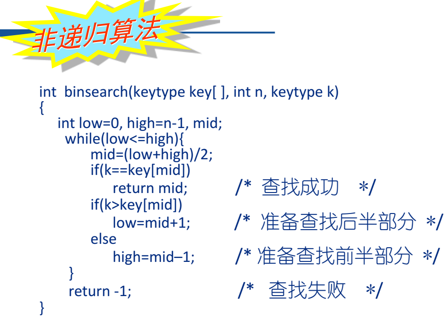

<h1 style="text-align: center"> 第七次作业题目详解</h1>

[A - 学生在线上机时间统计](#a------)

[B - 单词查找](#b---c---------)

[C - 排座位](#b---c---------)

[D - 北京地铁乘坐线路查询](#b---c---------)

## A - 学生在线上机时间统计

简单来说，就是输入若干条记录，把学号相同的记录合并（时间相加），最后按照时间从小到大的顺序输出（时间相同按照学号从小到大的顺序）。

首先进行合并操作时，我们之前也已经做过很多次类似的操作了（比如`函数调用关系`一题）。我们可以在某个学生第一次出现时，将这条记录放到一个数组 $\mathrm{b}$ 中。每当读入一个新记录的时候，在数组 $\mathrm{b}$ 中查找，如果有该学生的记录，那么直接合并到上面（即把新记录的时间加在原来的记录上）；如果没有过该学生的记录，则把这条记录放到数组 $\mathrm{b}$ 的最后。也就是说，在数组 $\mathrm{b}$ 中，每个学生只对应一个元素，是原来对应该学生的多条记录合并后的结果。

```c
// m 表示数组 b 已经存了多少元素
int n = read(), m = 0;
for(int i = 1; i <= n; i++) {
    student x;
    // 由于姓名中间无空格，直接用 scanf 即可
    scanf("%s%d%d", x.name, &x.id, &x.time);
    // 用 vis 标记是否出现过
    int vis = 0;
    for(int i = 0; i < m; i++) 
        if(b[i].id == x.id) {
            b[i].time += x.time;
            vis = 1;
            break;
        }
        
    if(vis == 0) 
        b[m++] = x;
}
```

后面的双关键字排序就不多说了，请同学们参考 `查找与排序讲解` 里的 `库函数 qsort` 部分。还有几个实现的细节：首先，由于 `time` 最大不超过 `86400`，记录不超过 `100` 条，所以合并后的时间最大也就 `8640000`，远远不会超过 `int`；其次，虽然我们在 `cmp` 函数返回时，一直写的都是 `return x - y;` 这样的写法，但是当数据比较大时，一定要注意 `x - y` 是否会溢出，如果可能溢出的话就不能这么写了；最后，学号是 8 位整数，如果我们读入时学号以 `0` 开头的话输出就必须用 `%08d` 这样的方式显式补 0 凑齐 8 位，否则输出的学号会默认省略前置 0（虽然一般不会有这样的数据，但是单纯按照题目本身来看这一点是要考虑的）。

参考代码：

```c
#include <stdio.h>
#include <stdlib.h>

int read() {
    int tem;
    scanf("%d",&tem);
    return tem;
}

typedef struct student  student;
struct student {
    char name[25];
    int id, time;
};

student b[105];

int cmp(const void *a, const void *b) {
    student x = *(student *)a;
    student y = *(student *)b;
    if(x.time != y.time)
        return x.time - y.time;
    return x.id - y.id;
}

int main() {
    // m 表示数组 b 已经存了多少元素
    int n = read(), m = 0;

    for(int i = 1; i <= n; i++) {
        student x;
        scanf("%s%d%d", x.name, &x.id, &x.time);

        int vis = 0;
        for(int i = 0; i < m; i++) 
            if(b[i].id == x.id) {
                b[i].time += x.time;
                vis = 1;
                break;
            }
            
        if(vis == 0) 
            b[m++] = x;
    }

    qsort(b, m, sizeof(b[0]), cmp);

    for(int i = 0; i < m; i++)
        printf("%s %08d %d\n", b[i].name, b[i].id, b[i].time);

    return 0;
}
```


## B - 单词查找

题意简单来说，就是读入一个词典，然后输入一个单词，并指定查找方式（就是我们在查找讲解里说的四种查找方式中的某一种），输出这个单词是否存在，以及你判断它是否存在需要的比较次数。

首先涉及到文件读入，而且题目中说了输入文件的换行符可能是 `\n` 或者 `\r\n`，我建议大家在做数据结构体的时候，涉及到文件读入少用 `fgets` 来读入，它不处理换行符。如果已经知道了读入的一个部分中间没有空格，那你就用 `fscanf` 或者 `freopen`，这样压根都不用考虑换行符的问题了（其实对于正常的规范的题目数据而言，换行符不应该出现 `\r\n`，但是在做我们数据结构题的时候你一定要考虑）。

题目中说了词典里有不超过 $\mathrm{3500}$ 个单词，每个单词不超过 $\mathrm{20}$ 个字符，为了简单我们可以用一个二维数组进行词典的存储，空间是完全足够的。

下面我们逐一实现四种查找方式。首先是顺序查找，同时因为单词表已经排好序了，所以我们遇到第一个大于目标单词的单词就不用往下找了，这样能稍微优化一点查找次数：

```c
// 全局变量 cmp_cnt 记录比较次数
// 返回值表示是否找到
int linear_search(char *target) {
    cmp_cnt = 0;
    for(int i = 0; i < dict_sz; i++) {
        cmp_cnt++;
        // 虽然我们下面用了俩 strcmp，但是其实从题目的角度看只会让比较计数 + 1
        if(strcmp(target, dict[i]) < 0)
            return 0;
        if(strcmp(target, dict[i]) == 0)
            return 1;
    }
    // 遍历到字典最后也没找到
    return 0;
}
```

在判断 `strcmp` 返回值时请注意，按照 C 标准规定 `strcmp` 返回的是负数、0、正数，而并非 `-1`、`0`、`1`。

第二种查找方式是折半查找，正如我在`查找讲解`里说的，二分查找的实现是非常多样的，可能每个人都有不同的写法。如果做题的时候真碰到了指定你必须使用二分查找，并且记录比较的次数的话，**一定要看题目是怎么让你实现的，不要直接就套用模版**！题目让我们用 PPT 上的实现，那我们就不能自己直接写一个二分查找，不然很有可能比较次数和答案不同。下面这个是 PPT 上给的二分查找：



我们把它稍微改造一下，让它更好看一点。同时字符串比较值的时候不能直接用 `==`，要用 `strcmp`（如果用 `==` 比较两字符串，我们知道字符串名相当于字符串的起始地址，所以是在比这俩字符串的起始地址是否相同，也就是这俩字符串到底是不是同一个人，是灵魂的相同，而不仅仅是值相等，貌合神离）。同时请注意那个 `keytype` 并不是一个真的类型（也就是说你不能直接这么写），它是泛型的意思，比如我们要在 `int` 数组里找 `int`，那它就是 `int`；要在 `char *` 数组里找 `char *`，那它就是 `char *`。

```c
int binary_search(char *target) {
    cmp_cnt = 0;
    int l = 0, r = dict_sz - 1;
    while(l <= r) {
        int mid = l + r >> 1;
        cmp_cnt++;
        if(strcmp(target, dict[mid]) == 0)
            return 1;
        else if(strcmp(target, dict[mid]) > 0)
            l = mid + 1;
        else
            r = mid - 1;
    }
    return 0;
}
```

然后是索引查找，你可以手动建索引，就自己去文件里找一个每个字母开头的第一个单词和最后一个单词所在的行。也可以在读入的时候直接处理好索引，需要注意的是输入文件里没有以 `x` 开头的单词，有同学的处理方式会误把 `y` 开头的单词记录到 `x` 上；还有的同学记录每个字符开头的单词的起始位置和结束位置，默认这俩位置初始值都是 `0`，这样的话在搜索以 `x` 开头的单词时就会误以为 $\mathrm{[0, 0]}$ 区间内有以 $\mathrm{x}$ 开头的单词，导致比较次数错误。

```c
// 维护索引
for(int i = 0; i < 26; i++)
    idx_begin[i] = -1, idx_end[i] = -2;
while(~fscanf(in, "%s", dict[dict_sz])) {
    // 维护某字母对应的区间
    int idx = dict[dict_sz][0] - 'a';
    if(idx_begin[idx] == -1)
        idx_begin[idx] = dict_sz;
    idx_end[idx] = dict_sz;
    dict_sz++;
}
```

之后，再查找某单词时，先看它的起始字母对应的区间，再在这个区间里使用二分查找。我们可以改造一下之前的二分查找代码，使得查找区间 $\mathrm{[l, r]}$ 是我们手动传进去的，实现代码的复用：

```c
int idx_begin[30], idx_end[30];
int index_search(char *target) {
    int idx = target[0] - 'a';
    return binary_search(target, idx_begin[idx], idx_end[idx]);
}
```

最后是哈希查找。题目给了我们哈希函数。我们在构建哈希表时，计算出某单词的哈希函数之后，要把它插入对应的链里；题目要求我们插入的时候保持字典序：

```c
typedef struct node  node;
typedef struct node* nptr;
// 不直接记录值，而是记录在原数组中的位置
struct node {
    char str[25];
    nptr nxt;
};
nptr head[NHASH];

nptr newnode() {
    return (nptr)malloc(sizeof(node));
}

nptr getnode(char *str) {
    nptr p = newnode();
    strcpy(p -> str, str);
    p -> nxt = NULL;
    return p;
}

void hash_insert(char *str) {
    int ha = hash(str);
    nptr p = getnode(str);
    // 这条链为空
    if(head[ha] == NULL)
        head[ha] = p;
    // 插在头结点之前
    else if(strcmp(str, head[ha] -> str) < 0)
        p -> nxt = head[ha], head[ha] = p;
    else {
        nptr tmp = head[ha];
        // 插在中间
        while(tmp -> nxt) {
            if(strcmp(str, tmp -> nxt -> str) < 0) {
                p -> nxt = tmp -> nxt;
                tmp -> nxt = p;
                return ;
            }
            tmp = tmp -> nxt;
        }
        // 插在尾部
        tmp -> nxt = p;
    }
}
```

在查找的时候，策略与顺序查找类似：

```c
int hash_search(char *target) {
    cmp_cnt = 0;
    int ha = hash(target);
    for(nptr i = head[ha]; i; i = i -> nxt) {
        cmp_cnt++;
        if(strcmp(target, i -> str) < 0)
            return 0;
        if(strcmp(target, i -> str) == 0)
            return 1;
    }
    return 0;
}
```


## C - 排座位

感觉这道题的题目描述让人的费解程度在数据结构题里也算很高的。想要做好这种题，我们只能尽可能地一句一句将题目描述翻译为代码语言。

