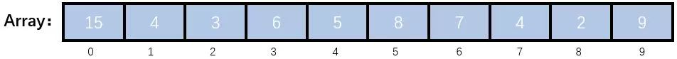
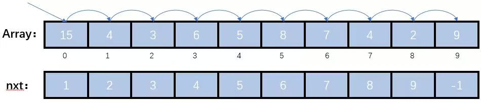
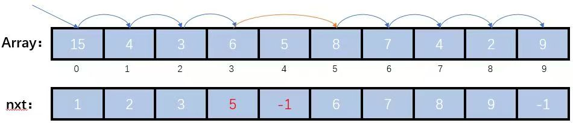
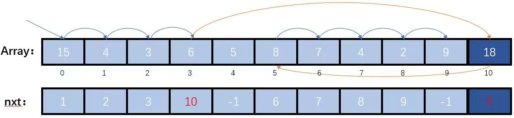
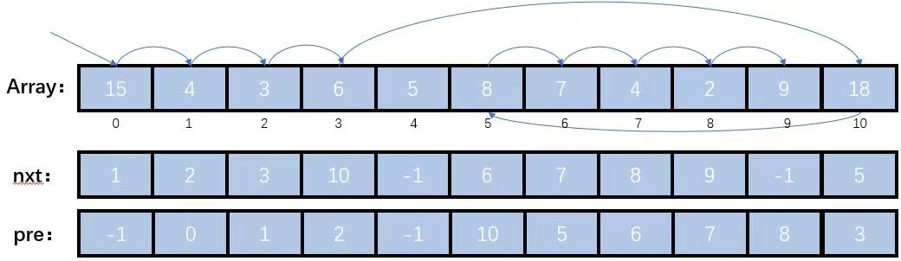
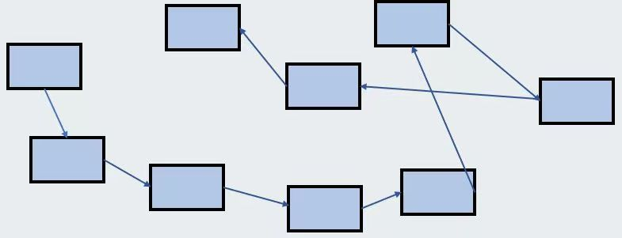

<h1 style="text-align: center">链表</h1>

<p style="text-align:right; font-weight: bold;font-size: 18px;"> Mitake Moca

## 逻辑上的前驱后继关系

​	首先我们还是带大家理解一下链表吧。不少同学对链表的理解还是有误区，比如认为出于插入删除的便捷性，所以才引入了自引用结构。实际上，自引用结构解决的是动态分配和释放的问题，而不是插入和删除的问题。

​	对于数组而言，其中的元素在内存空间上是连续的，如果我们想删除中间的某个数字，需要将后面的数字都向前移动一位（当然，也可以用**打标记**的方法进行删除，这样就能避免这个低效的操作了）；或者想在数组中间插入一个数字，就要将后面的数字都向后移动一位。归根结底，这都是因为数组中的元素在内存空间上是连续的。

​	由于元素在内存空间上是连续的，所以对于元素 $\mathrm{a[i]}$，自然地有 $\mathrm{a[i-1]}$ 是它的前驱，$\mathrm{a[i+1]}$ 是它的后继（这里我们省去说明最后一个元素没有后继之类的细节）。删除了一个元素之后，就会连锁式地改变一堆元素的后继，比如要想删除 $\mathrm{a[i]}$，那么 $\mathrm{a[i - 1]}$ 的后继元素就会发生改变，把原来的 $\mathrm{a[i+1]}$ 移动到 $\mathrm{a[i]}$，这样不断地对后面的元素产生影响。



<p style="text-align: center"> 图 1 - 依靠位置决定前驱后继关系

​	于是，我们想到，如果直接把后继元素本身记录下来，那么是不是就没有这个问题了。不单单地去依靠下标来决定自己的前驱和后继元素，于是，我们想到要利用额外的数组来记录每个元素的后继元素：



<p style="text-align: center"> 图 2 - 附加了一个数组来记录后继关系

​	如上图所示，一开始时，元素 $\mathrm{a[i]}$ 的后继元素还是 $\mathrm{a[i+1]}$，整个序列的起始元素是 $\mathrm{0}$ 号元素；当我们想删除其中某个元素时，比如我们想删除 $\mathrm{a[4] = 5}$ 这个元素（下标从 $\mathrm{0}$ 开始），我们只需要让 $\mathrm{nxt[3] = 5}$，这样就实现了删除，在以 $\mathrm{0}$ 号元素起始的序列中就“查无此人”了。



<p style="text-align: center"> 图 3 - 运用附加的数组进行逻辑上的删除

​	上图里被删除元素的 `nxt` 也可以不改，对结果没什么影响。

​	同样地，假如我们想要在元素值为 $\mathrm{6}$ 的元素 $\mathrm{p}$ 后面插入一个元素值为 $\mathrm{18}$ 的新元素，在以前依靠下标来决定前驱和后继元素的方式里，我们需要移动 $\mathrm{p}$ 后面的所有元素，现在我们只需要在数组的最后加入一个新元素，然后再修改 $\mathrm{nxt[p]}$ 就可以了：



<p style="text-align: center"> 图 4 - 运用附加的数组进行逻辑上的插入

​	注意上图中新结点的 `nxt` 的值，是原来 $\mathrm{nxt[p]}$ 的值，这是因为新结点被插在 $\mathrm{p}$ 和原来的 $\mathrm{nxt[p]}$ 之间，所以原来的 $\mathrm{nxt[p]}$ 将作为新节点的后继元素。

​	我们一开始说通过下标，能够对应到前驱和后继关系，但是在这里我们只用了一个 `nxt` 数组记录了每个元素的后继。实际上，如果 $\mathrm{p}$ 是 $\mathrm{q}$ 的后继，那么 $\mathrm{q}$ 就是 $\mathrm{p}$ 的前驱，所以 `nxt` 数组也能够找到每个元素的前驱。但是为了寻找元素 $\mathrm{x}$ 的前驱，我们可能要把整个序列遍历一遍，看看谁的后继元素是 $\mathrm{x}$，这样不仅麻烦而且耗时，所以我们可以舍弃一些空间，再开一个数组来维护前驱关系，这个数组与 `nxt` 的逻辑是对称的（即 $\mathrm{nxt[pre[x]] = x}$）。



<p style="text-align: center"> 图 5 - 附加数组表示前驱关系

​	当然，既然 $\mathrm{arr、nxt、pre}$ 三个数组之间有下标上的对应关系，即 $\mathrm{arr[i]、nxt[i]}$ 与 $\mathrm{pre[i]}$ 维护的既然都是第 $\mathrm{i}$ 个元素相关的信息，我们不妨将三个数据放在一个结构体中，增强他们之间的逻辑关系，最后的实现应该是类似于下面：

```c
typedef struct node node;

// 下面这一行也可以直接写 node
struct node {
    int num;
    int pre, nxt;
};
node a[105];
```


## 动态空间的分配

​	上面的实现已经能够解决我们在插入与删除时，面临的时间操作代价大的问题了，那么还有没有什么不足呢？

​	不知道同学们有没有感觉，上面的实现虽然满足了要求，但是并没有做到真正的“插入和删除”。因为删除之后，那个位置还在，只不过被我们从逻辑的角度上忽略了；同时一开始的时候我们就要将数组开的很大，以为插入操作提前预留好空间，而不是等程序需要进行插入操作时，我们再去分配恰好合适的空间，给程序使用。这样做的问题就是：已经从逻辑上被删除的空间，明明以后不会再使用了，但是我还在占领它，不让别人使用；可能我还用不到那么大的空间，但是我就是要开，以防后面插入的时候数组空间不够发生错误，导致了空间的浪费。

​	我们解决了时间的问题，下面我们要来解决空间的问题了。基于此，我们决定使用**动态空间分配**，来进行优化，动态空间分配使用 `malloc` 和 `free`，来显式地进行运行时的动态空间申请与释放。

​	`malloc`  函数传入一个 `size_t`，告诉它你想要多大的空间，然后它会帮你申请这么大的空间后，返回这块空间的首地址。现在，我们每需要插入一个元素，就要用 `malloc` 来申请一块对应大小的空间。原来我们利用 `pre` 与 `nxt` 数组记录前驱后继元素的下标来维护前驱后继关系，但是这种方法的前提仍然是将所有元素存储在一个数组中。现在我们要动态地申请空间，就要通过记录**前驱后继元素地址**的方式来维护前驱后继关系（准确地讲，之前在数组中记录下标也相当于记录地址，根据上学期学到的知识，数组名 $\mathrm{arr}$ 对应着数组的起始地址，数组中每个元素的大小是固定的 $\mathrm{sz}$，那么数组中下标为 $\mathrm{i}$ 的元素对应的地址也不难推算出来是 $\mathrm{[arr + i \times sz,\  arr + (i+1) \times sz)}$）。

​	要注意的是指针存的只是一个起始地址，但是由于每种类型占用的空间以及结构字段是确定的，所以也不难获得指针对应元素的地址空间，或者其某个结构字段对应的地址空间（注意，这里我们不讨论诸如编译器自动对齐这样复杂的情况，只是进行一个思维上的简单说明）。所以，通过一个指针变量，就能够找到一个元素，我们就可以通过指针变量来维护前驱后继关系。也就是说，对于每个元素，除了要存储这个元素对应的值以外，还要存储这个元素前驱后继元素相关的指针信息。我们仿照上一节最后的做法将他们封装在一个结构体中，其中存储元素相关的值的部分我们称为**值域**，为了维护前驱后继关系存储的指针信息我们称为**指针域**。

​	所以链表中每个节点的结构应该如下所示：

```c
typedef struct node  node;
typedef struct node* nptr;

struct node {
    int num;
    nptr pre, nxt;
};
// 指向链表中的第一个节点
nptr head;
```

​	对于插入节点与删除节点的部分，除了申请释放空间的操作外，维护指针域的逻辑与上一节维护 `nxt` 和 `pre` 数组的逻辑是基本一致的，我们在下一部分给出一个参考代码同学们对照理解一下就好；在这里我们主要来理解一下申请和释放空间的部分。

​	释放内存的处理逻辑是：

```c
void del(nptr p) {
    // 维护指针域的处理
    // ...
    free(p);
}
```

​	这里主要使用了 `free` 函数，同学们可能很好奇说 `free` 函数的唯一参数就是一个指针，甚至是一个 `void *`，也就是无类型的指针（也就是一个单纯的地址），那它是如何知道自己应该释放多大空间的呢？这是因为在申请空间的时候，`malloc` 会多申请一部分空间，用于存储申请空间的大小，在 `free` 的时候就可以利用这个信息。

​	对于一个指针变量，其合法的值有对某个变量取地址、`malloc` 动态申请、将其值赋为已有的某个合法指针值三种来源，那为什么我们不能利用**对某个变量取地址的方法**动态申请空间呢？在需要动态申请空间的时候，新写一个变量，然后返回它的地址，即：

```c
nptr newnode() {
    node x;
    return &x;
}
```

​	这是因为，在函数中写了一个局部变量后，它所占有的内存在函数结束之后就会被收回（具体的方式在后面的栈这节课中进行讲解），这点也很符合我们作用域的设计，因为在函数外就没法用到函数里新开的变量了。所以实际上，`newnode` 函数返回了一个不再有效的地址值，那么对它的访问就可能发生错误，是不被允许的。所以，我们才要用 `malloc` 的方式动态申请空间，其几次分到的空间不一定是连续的，基于这种方式实现的链表可以通过下面的图来理解：



<p style="text-align: center"> 图 6 - 自引用结构形成的动态空间的链表


## 单链表、双链表与循环链表

​	我们要用到的链表主要有三种：

- **单链表：** 每个结点只有一个指针域，指向了自己的后继元素
- **双链表**： 每个结点有两个指针域，分别指向自己的前驱和后继元素（前两种链表的区别可以参考第一部分）
- **循环链表：** 在普通链表的基础上，尾结点的后继元素是头结点，即 `tail -> nxt = head`

​	最后，我们为同学们提供一份可以参考的双向链表模板代码（其余两种链表的实现稍作修改即可）：

```c
#include <stdio.h>
#include <stdlib.h>

typedef struct node  node;
typedef struct node* nptr;

struct node {
    int n;
    nptr nxt, pre;
};

nptr head, tail;
int size;

// 申请空间
nptr newnode() {
    return (nptr)malloc(sizeof(node));
}

// 创建结点
nptr getnode(int n) {
    nptr p = newnode();
    p -> n = n;
    p -> nxt = p -> pre = NULL;
    return p;
}

// 将 p 插在链表的头部
void insert_head(nptr p) {
    size++;
    if(size == 1) {
        head = tail = p;
        return ;
    }
    p -> nxt = head;
    head -> pre = p;
    head = p;
}

// 将 p 插在链表尾部
void insert_tail(nptr p) {
    size++;
    if(size == 1) {
        head = tail = p;
        return ;
    }
    p -> nxt = NULL;
    tail -> nxt = p;
    p -> pre = tail;
    tail = p;
}

// 将 p 插在链表上的元素 elm 之后
void insert_after(nptr elm, nptr p) {
    if(elm == tail) 
        insert_tail(p);
    else {
        // 这段代码中有一个很关键的点就是 elm -> nxt = p 一定要写在 elm -> nxt -> pre = p 和 p -> nxt = elm -> nxt 之后
        size++;
        p -> nxt = elm -> nxt;
        elm -> nxt -> pre = p;
        elm -> nxt = p;
        p -> pre = elm;
    }
}

// 将 p 插在链表上的元素 elm 之前
void insert_before(nptr elm, nptr p) {
    if(elm == head) 
        insert_head(p);
    else {
        // 这段代码中有一个很关键的点就是 elm -> pre = p 一定要写在 elm -> pre -> nxt = p 和 p -> pre = elm -> pre 之后
        size++;
        elm -> pre -> nxt = p;
        p -> pre = elm -> pre;
        p -> nxt = elm;
        elm -> pre = p;
    }
}

// 寻找 n 在链表中对应的第一个结点
nptr query(int n) {
    for(nptr i = head; i; i = i -> nxt)
        if(i -> n == n)
            return i;
    return NULL;// not found
}

// 删除链表中的元素 p ,应该确保元素 p 在链表中
void del(nptr p) {
    size--;

    if(size == 0) { // 特殊情况 size = 0
        head = tail = NULL;
        free(p);
        return ;
    }

    if(p == head) { // 特殊情况 p 是头指针
        head = head -> nxt;
        head -> pre = NULL;
    }
    else if(p == tail) { // 特殊情况 p 是尾指针
        tail = tail -> pre;
        tail -> nxt = NULL;
    }
    else { // p 在中间的情况
        p -> pre -> nxt = p -> nxt;
        p -> nxt -> pre = p -> pre;
    }

    free(p);
}

// 初始化链表函数
void init() {
    head = tail = NULL;
    size = 0;
}

int main() {
    init();
    int n;
    scanf("%d", &n);

    // 插入 n 个结点
    for(int i = 1; i <= n; i++)
        insert_tail(getnode(i));

    // 删除 n 个结点，这里只是为了展示 query 的用法
    for(int i = 1; i <= n; i++) {
        nptr p = query(i);
        if(p) del(p); // 如果在链表中有对应的结点再删
    }

    return 0;
}
```

​	需要注意的是每次实现不需要把所有功能都拿上去，上面的实现只是为了让大家理解链表的一些操作**应该如何实现**，后面大家就可以基于自己的理解自己去实现这些基本操作了。


## 利用哑结点简化代码

​	假如我们按照上面的链表实现的话，在这个过程中可能会有以下几个问题：

- 插入第一个节点时需要给 `head` 和 `tail` 赋值，也就是要特判 `head` 是否为空：

```c
if(head == NULL)
    head = tail = p;
```

- 在删除操作中，比如我们想删除结点 `p`，我们还要对 `p` 是不是头结点或尾结点进行特判，因为头结点不含有前驱元素（`head -> pre == NULL`），尾结点不含有后继元素（`tail -> nxt == NULL`）。同时，由于 `p` 作为头结点被删除了，那我们就要让 `p` 的后继成为新的头结点；尾结点的情况也类似。总的来说，删除结点的代码如下：

```c
void remove(nptr p) {
    if(head == tail) { // 特殊情况只有一个结点
        head = tail = NULL;
        free(p);
        return ;
    }

    if(p == head) { // 特殊情况 p 是头结点
        head = head -> nxt;
        head -> pre = NULL;
    }
    else if(p == tail) { // 特殊情况 p 是尾结点
        tail = tail -> pre;
        tail -> nxt = NULL;
    }
    else { // p 在中间的情况
        p -> pre -> nxt = p -> nxt;
        p -> nxt -> pre = p -> pre;
    }

    free(p);
}
```

​	我们思考，为什么会出现这样麻烦的问题——就是因为后面进来的结点可能作为头结点和尾结点，而头结点和尾结点不保证一定有前驱后继元素。所以，我们可以直接创建两个结点分别作为头结点和尾结点，后面插入进来的结点，一定在这两个结点之间，一定有前驱后继元素，就不需要特判了。这样，头结点和尾结点只负责占位，而不存储真实的数据，仅仅是为了保证各个结点处理的一致性，我们就把这种仅用于占位的结点叫哑结点（也叫做哨兵结点）。

​	利用了哑结点优化后的双向链表代码如下（其余两种链表稍作修改即可。跟上面一样，每次这些操作不一定都要写上，仅仅给大家都实现一下做一个参考，方便大家理解）：

```c
#include <stdio.h>
#include <stdlib.h>

typedef struct node  node;
typedef struct node* nptr;

struct node {
    int n;
    nptr nxt, pre;
};

nptr head, tail;
int size;

// 申请空间
nptr newnode() {
    return (nptr)malloc(sizeof(node));
}

// 创建结点
nptr getnode(int n) {
    nptr p = newnode();
    p -> n = n;
    p -> nxt = p -> pre = NULL;
    return p;
}

// 将 p 插在链表上的元素 elm 之后
// 哑结点保证了每个节点都一定有前驱和后继
void insert_after(nptr elm, nptr p) {
    size++;
    elm -> nxt -> pre = p;
    p -> nxt = elm -> nxt;
    p -> pre = elm;
    elm -> nxt = p; 
}

// 将 p 插在链表上的元素 elm 之前
void insert_before(nptr elm, nptr p) {
    size++;
    elm -> pre -> nxt = p;
    p -> pre = elm -> pre;
    p -> nxt = elm;
    elm -> pre = p;
}

// 将 p 插在链表的头部（即头结点之后）
void insert_head(nptr p) {
    insert_after(head, p);
}

// 将 p 插在链表尾部
void insert_tail(nptr p) {
    insert_before(tail, p);
}

// 寻找 n 在链表中对应的第一个结点
nptr query(int n) {
    // 注意，遍历的时候要跳过 head 和 tail
    for(nptr i = head -> nxt; i != tail; i = i -> nxt)
        if(i -> n == n)
            return i;
    return NULL;// not found
}

// 删除链表中的元素 p ,应该确保元素 p 在链表中
void del(nptr p) {
    size--;
    p -> pre -> nxt = p -> nxt;
    p -> nxt -> pre = p -> pre;

    free(p);
}

// 初始化链表函数
void init() {
    head = getnode(0);
    tail = getnode(0);
    head -> nxt = tail;
    tail -> pre = head;
    size = 0;
}

int main() {
    init();
    int n;
    scanf("%d", &n);

    // 插入 n 个结点
    for(int i = 1; i <= n; i++)
        insert_tail(getnode(i));

    // 删除 n 个结点，这里只是为了展示 query 的用法
    for(int i = 1; i <= n; i++) {
        nptr p = query(i);
        if(p) del(p); // 如果在链表中有对应的结点再删
    }

    return 0;
}
```

​	可以看到，各个部分的操作代码都简化了非常多，尤其是删除操作，由于不用特判仅仅两行就能写完了（因为删除的结点一定不是头结点和尾结点，删除的结点必有前驱后继元素）。要注意的是初始化的结点，虽然 `head = getnode(0);` 和 `tail = getnode(0);`，但是一定不能直接写 `head = tail = getnode(0)`。因为 `getnode` 返回一个 `malloc` 分配的空间的起始地址，第一种写法相当于两个不同的地址；第二种写法是两个同样的地址，那 `head` 和 `tail` 实际上就是一个结点了，`head -> nxt = tail;` 和 `tail -> pre = head;` 就相当于：

```c
head -> pre = head;
head -> nxt = head;
```

这样就成环了，显然是不对的。
