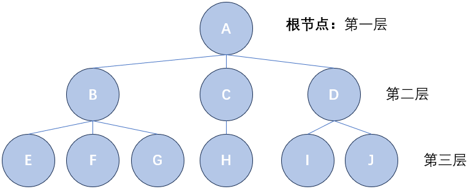
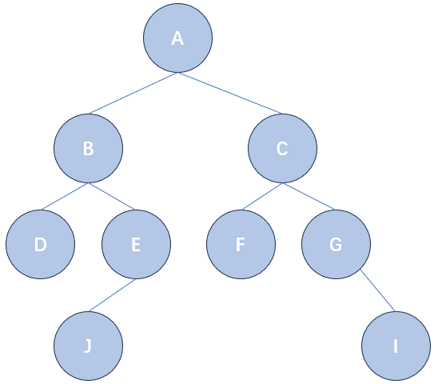

<h1 style="text-align: center">树</h1>

<p style="text-align:right; font-weight: bold;font-size: 18px;"> Mitake Moca

## 树及相关概念

​	在前面两个章节里，我们学习了链表和栈队，但是这些数据结构都有一个特点：这些数据结构中的元素之间，只有线性的逻辑关系。换句话说，对于一个确定的元素，它有唯一确定的前驱元素和后继元素（有可能是 NULL）。换句话说，它们没有办法表示更加复杂的逻辑关系，比如每个元素可以有多个前驱元素或多个后继元素。

​	树就是这样一种非线性的数据结构，对于每个节点，它都有**唯一确定的前驱元素，和若干个后继元素**。树结构在我们日常生活中也是比较常见的，比如我们电脑上的文件系统，除了根文件夹外的每个文件夹都有唯一确定的父文件夹，每个文件夹可以有若干个子文件夹和文件，这就形成了一个树结构。树是一种层级结构，同时每个节点可以有多个分支（后继）。



<p style="text-align: center"> 图 1 - 树的示例

​	上图就是一个树的示例，我们借由这个示例说明树中的一些概念：

- **结点的度：**结点拥有子树的数目，比如结点 `B` 的度为 3，结点 `C` 的度为 1，结点 `D` 的度为 2，结点 `E` 的度为 0。
- **树的度：**树中结点度的最大值，比如上面的树度为 3。
- **叶结点：**度为 0 的结点。
- **树的深度：**树中结点的最大层次数
- **父节点：**树上节点的唯一前驱（根节点没有父节点；也有人叫做双亲结点，这里我们仅为了方便而采用父节点这种说法），比如 `B` 的父节点是 `A`，`I` 的父节点是 `D`。
- **祖先结点：**从根到某结点 `node` 路径上的所有结点（不包括 `node` 本身）都叫做 `node` 的祖先结点，比如 `A`、`B` 都是 `E` 的父节点（当然也是 `F` 和 `G` 的）。
- **子树：**以某个结点 `node` 为根，它下面的所有节点和相关的边构成一棵树，我们称这棵树为以 `node` 为根的子树。
- 有 n 个结点的树一定有 n - 1 条边，也就是说所有结点的总度数加在一起一定是 n - 1。


## 二叉树及其实现

​	在树中有一种特殊的树叫做二叉树，它是指每个节点最多有两个孩子的树（也就是树的度不超过 2）。有非常多实用的树形数据结构都是二叉树的变种，比如二叉查找树、二叉堆等。

​	同时，相较于普通的树，二叉树的实现也更为容易。我们思考，对于链表而言，由于每个元素只有一个后继元素，所以我们在每个节点中仅仅需要设置一个 `nxt` 指针域即可。但是现在对于一棵普通的树而言，我们根本没法知道它每个节点有多少个后继元素，可能是 100 个，1000 个，甚至 10000 个，多大都有可能。所以我们根本就没有办法以一个简单的变量或者变量的固定大小数组作为指针域，而必须把指针域实现为一个链，这样才能每个节点都有能力记录任意多的后继元素。

​	但是对于二叉树而言，情况完全没有这么复杂，因为每个节点最多只有两个后继元素，相较于链表的每个节点最多有一个后继元素而言，他向我们保证了这种情况不会太大，所以我们可以对每个节点，从链表的一个后继指针域扩展到两个指针域：

```c
struct node {
    int val;
    nptr ls, rs;
    // 你也可以根据情况再来一个前驱元素指针域
    // nptr fa;
};
```

​	类似于整个链表都用一个头结点 `head` 来代表；我们的整棵树也可以用一个根节点 `root` 来代表。



<p style="text-align: center"> 图 2 - 二叉树的示例

​	比如上面给出的二叉树，可以用如下代码来创建（在真正写题的时候一般都会说谁是谁的孩子，然后我们先找到父亲再插入孩子，而不是像下面这样，下面这样只是为了构建一个测试数据方便测试后面实现的基于二叉树的功能）：

```c
#include <stdio.h>
#include <stdlib.h>

typedef struct node  node;
typedef struct node* nptr;

struct node {
    char i;
    nptr ls, rs;
};

nptr newNode() {
    return (nptr)malloc(sizeof(node));
}

nptr getNode(char ch) {
    nptr p = newNode();
    p -> i = ch;
    p -> ls = NULL;
    p -> rs = NULL;
    return p;
}

nptr root;

int main() {
    nptr a = getNode('A');
    nptr b = getNode('B');
    nptr c = getNode('C');
    nptr d = getNode('D');
    nptr e = getNode('E');  
    nptr f = getNode('F');
    nptr g = getNode('G');
    nptr i = getNode('I');
    nptr j = getNode('J');

    root = a;
    a -> ls = b;
    a -> rs = c;
    b -> ls = d;
    b -> rs = e;
    c -> ls = f;
    c -> rs = g;
    e -> ls = j;
    g -> rs = i;

    return 0;
}
```

​	这段代码和下面各个函数的代码可以在 `tree_test.c` 里找到。


## 二叉树的遍历

​	对于二叉树的插入操作而言，一般也是找到目标节点或者合适的位置再插入，所以我们要先了解二叉树的遍历。

​	我们都知道遍历一个链表，就是从 `head` 开始，把一个链表走一遍：

```c
for(nptr i = head; i; i = i -> nxt)
    printf("%d ", i -> val);
```

​	我们只需要不断地访问当前元素之后移动到下一个元素就可以。这都是基于链表的线性性质，即每个元素都有唯一的后继元素。但是对于二叉树，每个元素可能有两个后继元素，事情就没有这么简单了。所以对于二叉树，有多种遍历方式。

### 中序遍历

​	这种方式是，如果想要遍历以 `node` 为根的树，那么先遍历 `node` 的左子树（即以 `node` 左孩子为根的树），再访问 `node`，再遍历 `node` 的右子树。

​	不难看出这种访问具有天然的递归性质：将遍历 `node` 为根的子树的问题转换为了遍历以 `node->ls` 为根的子树和 `node->rs` 为根的子树。假设函数 `inDfs(p)` 的功能为中序遍历以 `p` 为根的子树，那么 `inDfs` 可以实现为（递归函数，实现注意边界和如何转移）：

```c
void inDfs(nptr p) {
    if(p == NULL)
        return ;
   	inDfs(p -> ls);
    printf("%c ", p -> i);
    inDfs(p -> rs);
}
```

​	以上面的示例二叉树为例，输出 `D B J E A F C G I`。

### 前序遍历

​	前序遍历和中序遍历类似：如果想要遍历以 `node` 为根的树，那么先访问 `node`，再遍历 `node` 的左子树，再遍历 `node` 的右子树。

```c
void preDfs(nptr p) {
    if(p == NULL)
        return ;
    printf("%c ", p -> i);
   	preDfs(p -> ls);
    preDfs(p -> rs);
}
```

​	以上面的示例二叉树为例，输出 `A B D E J C F G I`。

### 后序遍历

​	与上面两种遍历也类似：如果想要遍历以 `node` 为根的树，那么先遍历 `node` 的左子树，再遍历 `node` 的右子树，再访问 `node`。

```c
void postDfs(nptr p) {
    if(p == NULL)
        return ;
   	postDfs(p -> ls);
    postDfs(p -> rs);
    printf("%c ", p -> i);
}
```

​	以上面的示例二叉树为例，输出 `D J E B F I G C A`。

​	不难看出，前序遍历、中序遍历和后序遍历中的**前中后**，都是根相对于两个子树的访问顺序而言的。如果根在所有子树前访问就叫前，如果根在两个子树中间访问就叫中，如果根在两个子树之后访问就叫后。

​	同时，一个有趣的事实是，普通的树也可以前序遍历（先访问根再访问所有子树）和后序遍历（先访问所有子树再访问根），但是不能中序遍历（因为不一定有几个子节点，没办法规定在哪两个子节点间访问）。

### 层序遍历

​	还有一种遍历方式，是希望以**从上到下、从左到右**的方式访问每个节点，这种遍历方式叫做层序遍历。我们可以用一个队来实现：开始时，只有根节点入队；每当一个结点出队时，将它的所有子节点按从左到右的顺序入队；重复上述过程，直到队为空。我们来看看这种方式是如何保证从上到下，从左到右的：

- **从上到下：** 队列中节点的深度一定是非递减的，因为只有当前层的节点全部出队后，下一层的节点才会被访问。而且不难想到队中最多只会有两种深度不同的结点。
- **从左到右：** 由`当一个结点出队时，将它的所有子节点按从左到右的顺序入队`，所以一个结点下的各个子节点一定从左到右被访问（因为从左到右入队，所以从左到右出队）；同时如果一个结点 A 比另一个结点 B 先入队，那 A 的所有子节点一定比 B 的所有子节点向入队。由这两点结合归纳思想，所有结点是从左到右被访问的。

​	层序遍历代码：

```c
nptr que[1005];
int front = 0, rear = -1;

void enqueue(nptr a) {
    que[++rear] = a;
}

nptr dequeue() {
    return que[front++];
}

int isEmpty() {
    return front > rear;
}

void initQueue() {
    front = 0;
    rear = -1;
}

void bfs() {
    initQueue();
    enqueue(root);
    while(!isEmpty()) {
        nptr p = dequeue();
        printf("%c ", p -> i);
        if(p -> ls != NULL)
            enqueue(p -> ls);
        if(p -> rs != NULL)
            enqueue(p -> rs);
    }
}
```

​	以上面的示例二叉树为例，输出 `A B C D E F G J I`。


## 二叉查找树

​	


​	关于树还有很多其它内容，比如完全二叉树及相关性质、Huffman 树等，这些内容我们放在具体题目里去讲；还有一些内容，比如一棵任意的树怎么转换为一棵二叉树（左孩子右兄弟表示法）、二叉平衡树，这些内容课程基本不会考题，同学们自行根据兴趣去了解即可。