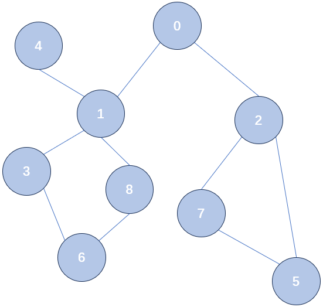

<h1 style="text-align: center">图</h1>

<p style="text-align:right; font-weight: bold;font-size: 18px;"> Mitake Moca
[图及相关概念](#a------)

[图的实现](#b---c---------)

* [临接矩阵](#---)
* [邻接表](#-----1)
* [链式前向星](#-)

[图的遍历](#c------)

* [临接矩阵图遍历](#---)
* [邻接表图遍历](#-----1)

[图相关的算法问题](#e---------)

* [Dijkstra 算法求最短路](#---)
* [最小生成树 Kruskal 算法](#-----1)
* [最小生成树 Prim 算法](#-)
* [拓扑排序](#-)

## 图及相关概念

​	在去年及之前，图的定位就一直是作业不查重，考试只考选填不考大题的存在。但是今年同学反馈老师说图期末可能出编程题，所以还是希望大家能够理解图，及图上的一些常用操作和算法。

​	有了树一节的铺垫后，我们理解图这个数据结构应该并无困难，在这里回顾一下我们这一学期学过的数据结构：

- **链表：**对每个元素都有唯一确定的前驱和后继。
- **栈、队：**特殊的链表，对每个元素都有唯一确定的前驱和后继。
- **树：**对每个元素有唯一的前驱，若干个后继（我们常用的是二叉树，对每个元素有唯一的前驱，最多两个后继）

- **图：**对每个元素有若干个前驱，若干个后继

​	图在我们生活中可以说是非常常见了，比如说城市交通网、人物关系图等。



<p style="text-align: center"> 图 1 - 图的示例


​	上图就是一个图的示例，我们借由这个示例说明图中的一些最简单的概念：

- 图由顶点和边组成，边可以带权重（比如一张图表示城市交通网，那边就可以带一个距离权重）。
- **有向图：**图中的边有方向，表示从一个点指向另一个点。
- **无向图：**图中的边没有方向，表示两个点之间相互连接。
- **图的入度和出度：**都是**有向图**中的概念，某个点的出度表示以这个点为出发点的边的数目，每个点的入度表示以这个点为终止点的边的数目。


## 图的实现

​	图一般的存储方法（存储主要是存储图的边，因为图的顶点往往是编号从 $\mathrm{1}$ 到 $\mathrm{n}$ 的）有两种，分别叫做临接矩阵、邻接表。

### 临接矩阵

​	临接矩阵的思想非常简单，就是假如图中有 $\mathrm{n}$ 个顶点，那么我们就创建一个大小为 $\mathrm{n \times n}$ 的二维数组 $\mathrm{e}$，如果 $\mathrm{e[i][j] = 1}$ ，说明有一条从 $\mathrm{i}$ 到 $\mathrm{j}$ 的边；如果 $\mathrm{e[i][j] = 0}$，说明从 $\mathrm{i}$ 到 $\mathrm{j}$ 没有边。

​	当然，如果边有权重的话，你也可以用 $\mathrm{e[i][j]}$ 来存边的权重值，然后再另找一个特殊值表示从 $\mathrm{i}$ 到 $\mathrm{j}$ 没有边。如果是一个无向图的话，一条 $\mathrm{i}$ 与 $\mathrm{j}$ 之间的无向边可以转换为从 $\mathrm{i}$ 到 $\mathrm{j}$ 和从 $\mathrm{j}$ 到 $\mathrm{i}$ 的有向边。

​	以图 1 中的图结构距离，我们创建它对应的临接矩阵：

```c
#include <stdio.h>
int e[9][9];

int main() {
    e[0][1] = e[1][0] = 1;
    e[0][2] = e[2][0] = 1;
    e[1][3] = e[3][1] = 1;
    e[1][4] = e[4][1] = 1;
    e[1][8] = e[8][1] = 1;
    e[2][5] = e[5][2] = 1;
    e[2][7] = e[7][2] = 1;
    e[3][6] = e[6][3] = 1;
    e[5][7] = e[7][5] = 1;
    e[6][8] = e[8][6] = 1;

    return 0;
}
```

### 临接表

​	临接矩阵表示虽然简单，但是缺点也很明显：比如在上面的图里，一共有 9 个节点，所以开了一个 $\mathrm{9 \times 9}$ 的数组，但是实际上只有 $10$ 条无向边，也就是说只有 $20$ 个数组中的元素是有值的，很多空间其实没有利用上。这种边数远远少于节点数平方的图，我们称之为**稀疏图**；显然，如果用临接矩阵表示稀疏图的话，很多空间都被浪费了。尤其是比如当边的数量达到以万、十万计时，我们甚至压根没法开一个这么大的二维数组。所以，类似于我们之前经常用的动态开空间的思想，我们实际上要存多少边，就开多少空间就可以了。

​	邻接表就利用了这种思想，它将某点 $\mathrm{i}$ 经过一条边能够到达的点（用术语说，就是临接的点）放到了一个链表中。对于每个节点都有一个这样的链表，所以我们要实现一个**链表的数组**（之前我们说过了，这种结构就叫做表；尽管这么定义表是不严谨的，不过在我们的 DS 课程里学的这些表，包括哈希表和邻接表，都可以这么实现）。

​	简单来说，邻接表就是链表的数组，其中每个链表存了对应点 $\mathrm{i}$ 的所有临接点。还是以图 1 中的图结构距离，我们创建它对应的临接表：

```c
#include <stdio.h>
#include <stdlib.h>

typedef struct node  node;
typedef struct node* nptr;

struct node {
    int val;
    nptr nxt;
};

nptr newnode() {
    return (nptr)malloc(sizeof(node));
}

nptr getnode(int val) {
    nptr p = newnode();
    p -> val = val;
    p -> nxt = NULL;
    return p;
}

nptr e[9];
// 添加有向边 (u, v)
void add_edge(int u, int v) {
    nptr p = getnode(v);
    p -> nxt = e[u];
    e[u] = p;
}

int main() {
    // 在无向图中，你也可以把 add_edge 改成双向边版本
    add_edge(0, 1);add_edge(1, 0);
    add_edge(0, 2);add_edge(2, 0);
    add_edge(1, 3);add_edge(3, 1);
    add_edge(1, 4);add_edge(4, 1);
    add_edge(1, 8);add_edge(8, 1);
    add_edge(2, 5);add_edge(5, 2);
    add_edge(2, 7);add_edge(7, 2);
    add_edge(3, 6);add_edge(6, 3);
    add_edge(5, 7);add_edge(7, 5);
    add_edge(6, 8);add_edge(8, 6);
    return 0;
}
```

### 链式前向星

​	其实还有一种比较简单的建图方法，叫链式前向星。它的主要思想就是用一个数组空间来模拟申请的堆空间，这样利用每个边的数组下标还能天然获得一个编号，优点是代码比较好写（不管是建图过程还是后续的遍历过程），而且建无向图时能轻松地找到某条边的反边，不过理解起来可能需要一点时间。我们就不在这提供这种方式了，请感兴趣的同学自行查找学习。


## 图的遍历

​	不像有根树一样，有根树具有一个天然的起点，你如果想遍历一个图的话需要指定从哪个点开始遍历（需要注意的是，这个点实际上并不一定能访问到其它的所有点）。同时，如果还像树一样简单地去递归遍历自己的所有后继节点，很容易陷入一种死循环。比如对于我们用来举例的无向图来说，$\mathrm{0}$ 会访问到 $\mathrm{1}$，而 $\mathrm{1}$ 又会访问到 $\mathrm{0}$，所以我们需要再增加一个数组，用来标记哪些结点已经被访问过了。这种处理我们已经写过不少了，就不再赘述了，直接代码上见吧。

### 临接矩阵图遍历

```c
#include <stdio.h>
int e[9][9];
int vis[9];

void dfs(int u) {
    // 标记为已访问
    printf("%d ", u);
    vis[u] = 1;
    // 遍历所有顶点
    for (int v = 0; v < 9; v++) { 
        // 如果有边且未访问
        if (e[u][v] && !vis[v])  
            dfs(v);
    }
}

int main() {
    e[0][1] = e[1][0] = 1;
    e[0][2] = e[2][0] = 1;
    e[1][3] = e[3][1] = 1;
    e[1][4] = e[4][1] = 1;
    e[1][8] = e[8][1] = 1;
    e[2][5] = e[5][2] = 1;
    e[2][7] = e[7][2] = 1;
    e[3][6] = e[6][3] = 1;
    e[5][7] = e[7][5] = 1;
    e[6][8] = e[8][6] = 1;

    // 从 0 开始遍历
    dfs(0);
    return 0;
}
```

### 临接表图遍历

```c
#include <stdio.h>
#include <stdlib.h>

typedef struct node  node;
typedef struct node* nptr;

struct node {
    int val;
    nptr nxt;
};

nptr newnode() {
    return (nptr)malloc(sizeof(node));
}

nptr getnode(int val) {
    nptr p = newnode();
    p -> val = val;
    p -> nxt = NULL;
    return p;
}

nptr e[9];
// 添加有向边 (u, v)
void add_edge(int u, int v) {
    nptr p = getnode(v);
    p -> nxt = e[u];
    e[u] = p;
}

int vis[9];
void dfs(int u) {
    printf("%d ", u);
    vis[u] = 1;
    for (nptr p = e[u]; p != NULL; p = p -> nxt) {
        int v = p -> val;
        if (!vis[v]) dfs(v);
    }
}

int main() {
    // 在无向图中，你也可以把 add_edge 改成双向边版本
    add_edge(0, 1);add_edge(1, 0);
    add_edge(0, 2);add_edge(2, 0);
    add_edge(1, 3);add_edge(3, 1);
    add_edge(1, 4);add_edge(4, 1);
    add_edge(1, 8);add_edge(8, 1);
    add_edge(2, 5);add_edge(5, 2);
    add_edge(2, 7);add_edge(7, 2);
    add_edge(3, 6);add_edge(6, 3);
    add_edge(5, 7);add_edge(7, 5);
    add_edge(6, 8);add_edge(8, 6);
    dfs(0);
    return 0;
}
```


## 图相关的算法问题

​	下面为大家提供了图上常见的一些算法的讲解视频和 C 语言参考代码，大家可以结合视频来学习（因为部分实现并没有使用 C 语言，而是使用的 cpp，所以大家可以看视频理解原理，具体的代码实现可以参考我的代码，我的代码文件后缀名虽然都是 `.cpp` 但是都是用 C 语言实现的）。

### Dijkstra 算法求最短路

视频讲解：[最短路 Dijkstra 算法](https://b23.tv/3rDWWKy)

代码参考：详见 `选填板子/图/迪杰斯特拉求单源最短路.cpp`

### 最小生成树 Kruskal 算法

视频讲解：[最小生成树 Kruskal 算法](https://b23.tv/nBYazmG)

代码参考：详见 `选填板子/图/Kruskal求最小生成树.cpp`

### 最小生成树 Prim 算法

视频讲解：[最小生成树 Prim 算法](https://b23.tv/BqQJidm)

代码参考：详见 `选填板子/图/Prim求最小生成树.cpp`

### 拓扑排序

视频讲解：[拓扑排序](https://b23.tv/BQ3z0jo)

代码参考：详见 `选填板子/图/拓扑排序.cpp`