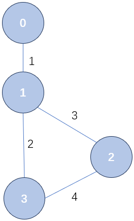

<h1 style="text-align: center"> 第六次作业题目详解</h1>

[A - 图遍历](#a------)

[B - 独立路径数计算](#b---c---------)

[C - 最少布线](#b---c---------)

[D - 北京地铁乘坐线路查询](#b---c---------)

## A - 图遍历

请先参考 `图讲解`。由于这道题节点数不超过 $100$，并且要求访问相邻结点时，按照编号从小到大的顺序访问，我们就使用临接矩阵来建图。因为如果使用邻接表建图想保证有`按照编号从小到大的顺序访问`的话我们就要保证将一个节点插入链表中时是有序的，写起来太繁琐了；而临接矩阵的第二个维度本身就维护了一个有序性，所以我们用临接矩阵来建图。同时在这里还要求实现广搜，广搜的原理请参考`作业讲解/第五次作业（树）/树讲解/二叉树的遍历/层序遍历`一节，这里的实现大同小异（提到深搜，就应该想到递归；提高广搜，就应该想到队）：

```c
// 为了大家看着方便，我们就不把队的基本操作封装了
int que[1005];
void bfs(int u) {
    int front = 0, rear = -1;
    que[++rear] = u;
    while (front <= rear) {
        int tem = que[front++];
        // 如果这里不判定的话，可能有多个点会将同一个还没被访问的点推入队中
        // 可以把这个判断删掉然后再运行一下样例理解一下
        if(vis[tem] == 1)
            continue;
        vis[tem] = 1;
        printf("%d ", tem);
        for (int v = 0; v < n; v++) 
            if (e[tem][v] && !vis[v]) 
                que[++rear] = v;
    }
}
```

第二个问题就是要删除掉一个结点 $\mathrm{k}$ 之后再遍历一次。实际上我们可以再建一个图（也就是再来一个临接矩阵），在建图过程中把所有带 $\mathrm{k}$ 的边都跳过去。当然更好的方法是在遍历过程中直接跳过对 $\mathrm{k}$ 的访问。具体实现上，只需要在第二次调用遍历图的函数之前，加上一句 `vis[k] = 1` 即可。这样按照我们之前的实现，就算不写其他控制语句，也能够自动地跳过对 $\mathrm{k}$ 的访问，即类似于下面这样：

```c
// 先打标记，再跑搜索
vis[del] = 1;
dfs(0);
```

注意要进行多次遍历，在两次遍历之间应该把 `vis` 数组清空，避免上一次的结果影响这一次的遍历。

 ```c
 #include <stdio.h>
 int e[105][105];
 int vis[105];
 
 int readInt() {
     int tem;
     scanf("%d", &tem);
     return tem;
 }
 
 int n, m;
 void dfs(int u) {
     // 标记为已访问
     printf("%d ", u);
     vis[u] = 1;
     // 遍历所有顶点
     for (int v = 0; v < n; v++) { 
         // 如果有边且未访问
         if (e[u][v] && !vis[v])  
             dfs(v);
     }
 }
 
 // 为了大家看着方便，我们就不把队的基本操作封装了
 int que[1005];
 void bfs(int u) {
     int front = 0, rear = -1;
     que[++rear] = u;
     while (front <= rear) {
         int tem = que[front++];
         // 如果这里不判定的话，可能有多个点会将同一个还没被访问的点推入队中
         // 可以把这个判断删掉然后再运行一下样例理解一下
         if(vis[tem] == 1)
             continue;
         vis[tem] = 1;
         printf("%d ", tem);
         for (int v = 0; v < n; v++) 
             if (e[tem][v] && !vis[v]) 
                 que[++rear] = v;
     }
 }
 
 void clear_vis() {
     for (int i = 0; i < n; i++) vis[i] = 0;
 }
 
 int main() {
     n = readInt(), m = readInt();
     for (int i = 0; i < m; i++) {
         int a = readInt(), b = readInt();
         e[a][b] = e[b][a] = 1;
     }
     int del = readInt();
 
     // 从 0 开始遍历
     dfs(0);printf("\n");clear_vis();
     bfs(0);printf("\n");clear_vis();
     vis[del] = 1;dfs(0);printf("\n");clear_vis();
     vis[del] = 1;bfs(0);printf("\n");clear_vis();
     return 0;
 }
 ```


## B - 独立路径数计算

首先注意到这题想让我们以字典序输出路径，也就是访问一个结点的关联边的时候按照编号从小到大的顺序访问。在上一题里我们使用临接矩阵建图搜索的时候，是按照临接边的编号从小到大访问的，这一点不太一样。所以这题里我们可以使用邻接表来建图，在某条链里插入新边时，保证边的编号的有序性。在实现的时候，我们可以使用带哨兵结点的链表，以方便插入，防止写一堆特判语句（利用哨兵结点实现的链表可以参考 `作业讲解/第三次作业（链表）/链表讲解/利用哑结点简化代码`。可以将每条链表的头结点编号都设为 -1，尾结点编号都设为 1005，这样保证将结点有序插入时不用特判有没有前驱后继。

其次就是，这道题很像全排列问题，当你访问到某个新节点的时候不需要进行输出，只需要记录，当走到终点的时候再进行输出。如果你经过某条边访问某个点的时候，就输出对应边的编号，就像下面这样：

```c
typedef struct edge  edge;
typedef struct edge* eptr;

struct edge {
    int id, to;
    eptr nxt;
};
eptr a[1005];
int vis[1005], n;

void dfs(int u) {
    eptr p = a[u];
    vis[u] = 1;
    if(u == n - 1) {
        printf("\n");
        return ;
    }
    for(eptr p = a[u]; p != NULL; p = p -> nxt) 
        if(!vis[p -> to]) {
            printf("%d ", p -> id);
            dfs(p -> to);
        }
}
```

这样的问题是显然假如有下面这样一个图，起点是 $0$，终点是 $3$：



从起点到终点有两条路径 `1 2` 和 `1 3 4`，但是上面的代码显然只能输出 `1` 一次（因为 `0` 临接到 `1` 输出一次边 `1` 后，就回不来了）。所以我们不能按照上面的写法，在访问的时候输出。而是应该参考全排列的做法，在过程中维护一个已经经过的边的数组，当达到边界时再进行输出（全排列的思路和代码请参考 `作业讲解/第一次作业/作业详解/E-全排列数的生成`）。其实我们想假如我们全排列代码那里不用数组记录，而是访问到一个新的数字就输出一次，那也会发生像这道题一样公共前缀不会重复输出的问题。同时注意到我们这道题不能输出环路，需要用 `vis` 数组来记录在当前的路径上哪些结点被访问过（就像全排列里的 `vis` 记录哪些数组被使用过，这个数组也是需要进行回溯的）。

思考完这两个关键问题后，我们就可以实现这道题了。注意到这题边的编号不会超过 1000，所以很显然不会有超过 1000 个节点，我们假设数据结构题目的数据不至于离谱到故意在这难为你，我们只需要开一个长度为 1000 的链表数组当做临接表即可。同时别忘了，**题目里的边是双向边**。

```c
#include <stdio.h>
#include <stdlib.h>

int readInt() {
    int tem;
    scanf("%d", &tem);
    return tem;
}

// 习惯性地我们还是这么命名吧
typedef struct node  node;
typedef struct node* nptr;

struct node {
    int id, to;
    nptr nxt;
};
// 我们还是利用带哨兵结点的链表
nptr head[1005], tail[1005];

nptr newnode() {
    return (nptr)malloc(sizeof(node));
}

nptr getnode(int id, int to) {
    nptr p = newnode();
    p -> id = id;
    p -> to = to;
    p -> nxt = NULL;
    return p;
}

// 插入的时候有序
void add_edge(int id, int u, int v) {
    nptr p = getnode(id, v);
    nptr q = head[u];
    // 因为有哑结点 1005，所以 q -> nxt 一定不为 NULL
    while(q -> nxt -> id < id) 
        q = q -> nxt;
    p -> nxt = q -> nxt;
    q -> nxt = p;
}

// 记录路径上有哪些边，以及路径的长度
int ans[1005], cnt;
// 记录当前路径访问过哪些节点
int vis[1005], n, m;
void dfs(int u) {
    // 到达了终点，输出路径
    if(u == n - 1) {
        for(int i = 0; i < cnt; i++) 
            printf("%d ", ans[i]);
        printf("\n");
        return ;
    }
    vis[u] = 1;
    for(nptr p = head[u] -> nxt; p -> id != 1005; p = p -> nxt) {
        int v = p -> to;
        if(!vis[v]) {
            ans[cnt++] = p -> id;
            dfs(v);
            cnt--;
        }
    }
    // 回溯
    vis[u] = 0;
}

int main () {
    n = readInt(), m = readInt();
    // 初始化邻接表里的每个链表
    for(int i = 0; i <= 1000; i++) {
        head[i] = getnode(-1, -1);
        tail[i] = getnode(1005, -1);
        head[i] -> nxt = tail[i];
    }
    for(int i = 0; i < m; i++) {
        int id = readInt(), u = readInt(), v = readInt();
        // 一定要双向建边
        add_edge(id, u, v);
        add_edge(id, v, u);
    }
    dfs(0);
    return 0;
}
```


## C - 最少布线

原题翻译一下就是**给一个带权的无向连通图，找一个权最小的连通子图**。显然连接 $\mathrm{n}$ 个点至少需要 $\mathrm{n - 1}$ 条边，而由 $\mathrm{n}$ 个点，$\mathrm{n - 1}$ 条边组成的连通图就是树，所以就是找权值最小的生成树，也就是最小生成树问题的模板题目。

最小生成树问题有两个经典算法，Prim 和 Kruskal 算法。Prim 是每次选一个点加入集合，这个点是距离当前已被选中的点集中的点最小的点；Kruskal 是每次尝试（看看会不会组成环）选一条边加入集合，这条边是当前未被选中的，权值最小的边。

关于两个算法的原理和流程，请务必参考：[最小生成树 Kruskal 算法](https://b23.tv/nBYazmG) 和 [最小生成树 Prim 算法](https://b23.tv/BqQJidm)（**如果想弄懂而不仅仅是想得分的话请一定要看！**）。我们下面假设大家看完了这两个深入浅出的视频，给出对应的 C 语言实现参考。个人认为  Kruskal 算法写着简单一点，虽然用到了一种新的数据结构并查集，但是并查集的实现也是非常简单实用的。

在使用 `Kruskal` 算法时，其实不需要真正建出来图，只需要保存一个边的集合就可以了。

```c
// Kruskal
#include <stdio.h>
#include <stdlib.h>

int readInt() {
    int tem;
    scanf("%d", &tem);
    return tem;
}

typedef struct edge  edge;
struct edge {
    int id, u, v, weight;
};

int f[10005];   // 用来维护并查集
edge e[10005];  // 用来维护所有边
int ans[10005]; // 记录 MST 选择的边

// 查
int find(int i) {
    return f[i] = f[i] == i ? i : find(f[i]);
}

// 并
void link(int u, int v) {
    f[find(u)] = find(v);
}

int edge_cmp(const void *a, const void *b) {
    edge x = *(edge *)a;
    edge y = *(edge *)b;
    if(x.weight - y.weight)
        return x.weight - y.weight;
    return x.id - y.id;
}

int int_cmp(const void *a, const void *b) {
    int x = *(int *)a;
    int y = *(int *)b;
    return x - y;
}

int main() {
    int n = readInt(), m = readInt();
    for(int i = 0; i < m; i++) 
        e[i].id = readInt(), e[i].u = readInt(), e[i].v = readInt(), e[i].weight = readInt();
    qsort(e, m, sizeof(e[0]), edge_cmp);
    int total = 0, cnt = 0;

    // 并查集初始化
    for(int i = 0; i < n; i++)   
        f[i] = i;

    for(int i = 0; i < m; i++) {
        if(find(e[i].u) != find(e[i].v))
            ans[++cnt] = e[i].id, total += e[i].weight, link(e[i].u, e[i].v);
    }

    qsort(ans + 1, cnt, sizeof(ans[0]), int_cmp);
    printf("%d\n", total);
    for(int i = 1; i < n ;i++)
        printf("%d ", ans[i]);
    return 0;
}
```

`Prim` 虽然看上去好像比 `Kruskal` 更好理解，但是其实真正代码实现起来很繁琐：

```c
#include <stdio.h>
#include <stdlib.h>

const int INF = 0x3f3f3f3f;

int readInt() {
    int tem;
    scanf("%d", &tem);
    return tem;
}

typedef struct node  node;
typedef struct node* nptr;

struct node {
    int id, v, weight;
    nptr nxt;
};

int vis[10005], dis[10005];
int from[10005];    // 记录每个点分别是由哪条边加入的最小生成树
int ans[10005]; // 记录用来构建最小生成树的边集
nptr head[10005];

nptr newnode() { 
    return (nptr)malloc(sizeof(node)); 
}

nptr getnode(int id, int v, int weight) {
    nptr p = newnode();
    p -> id = id;
    p -> v = v;
    p -> weight = weight;
    p -> nxt = NULL;
    return p;
}

// 建立双向边
nptr addedge(int id, int u, int v, int weight) {
    nptr e = getnode(id, v, weight);
    e -> nxt = head[u];
    head[u] = e;
}

int int_cmp(const void *a, const void *b) {
    int x = *(int *)a;
    int y = *(int *)b;
    return x - y;
}

int main() {
    int n = readInt(), m = readInt(), cnt = 0;    // cnt 表示加入最小生成树边的个数
    int total = 0, sta = 0;
    
    for(int i = 0; i < n ;i++)
        if(i != sta)
            dis[i] = INF;

    for(int i = 0; i < m ;i++) {
        int id = readInt(), u = readInt(), v = readInt(), weight = readInt();
        addedge(id, u, v, weight);
        addedge(id, v, u, weight);
    }

    // 每次选择一个距离最小的点加入最小生成树的点集
    for(int i = 0; i < n ;i++) {
        int tem = -1, min_dis = INF;    // 表示当前选择的距离最短的点和最短距离
        for(int j = 0; j < n ;j++)
            if(dis[j] < min_dis && !vis[j])
                min_dis = dis[j], tem = j;
        ans[cnt++] = from[tem];
        vis[tem] = 1;
        total += min_dis;

        for(nptr p = head[tem]; p ; p = p -> nxt) 
            if(!vis[p -> v] && dis[p -> v] > p -> weight)
                dis[p -> v] = p -> weight, from[p -> v] = p -> id;
    }

    qsort(ans + 1, n - 1, sizeof(ans[0]), int_cmp);
    printf("%d\n", total);
    for(int i = 1; i < n; i++)
        printf("%d ", ans[i]);

    return 0;
}
```


## D - 北京地铁乘坐线路查询

首先请去学习一下 Dijkstra 算法的原理：[最短路 Dijkstra 算法](https://b23.tv/3rDWWKy)（务必要先理解这个算法，再看下面的题解），它用来求解从一个点到其它所有点的最短路问题。

首先是中文读入的问题，有不少同学在这一步就倒下了，或者写到最后发现输出乱码。你需要确定`bgstations.txt`、主程序以及控制台三者的字符编码，以我本地为例，我的主程序和控制台编码都是 `utf-8`，`bgstations.txt` 编码是 `gbk`（尤其是这个文件的编码）。然后就能直接利用 `scanf` 和 `printf` 进行中文的读入和输出了，不需要其它的特殊操作；不过需要注意的是，由于字符编码不同，读入的中文的每个中文字符不止一个字节，所以你用的是二维数组存储的话，第二个维度务必开的稍微大一点。

中文读入的问题解决了，下面就是如何用输入来创建图。回想我们以前，都是题目输入节点编号，然后再利用节点编号来输入边；现在没有结点编号了，全都变成车站名了，但是显然车站名不能直接当成数组下标，所以我们需要把字符串映射为整数，这部分的操作可以参考 `作业讲解/第四次作业（栈和队）/F-函数调用关系`那里，简单来说就是需要实现一个类似于下面的函数，来将车站名映射为车站编号。每次遇到一个新车站时，我们检查它是否已经存在于 `station` 数组中。如果不存在，说明这是该车站第一次出现，我们将它添加到 `station` 数组的末尾；这个过程中我们就建立了一个车站名到整数的一一映射关系。

```c
int find(char *s) {
    // 如果一个车站名之前有出现过，那么返回它的编号
    for(int i = 0; i < total; i++) 
        if(strcmp(station[i], s) == 0) 
            return i;
    
    // 否则，将它插在 station 数组的末尾，并返回它的编号
    station[total] = (char *)malloc(strlen(s) + 1);
    strcpy(station[total], s);
    return total++;
}
```

建立好字符串到数字的关系后，我们就能把车站名转换为结点编号，把车站之间的关系转换为数字结点之间的关系，这样就能够开始建图了。下一个难题就是该如何建图了。由于输入某个线路站的时候，都是按照从起点站到终点站的顺序依次输入的，所以我们可以直接在相邻两站之间建一条长度为 1 的双向边（注意是双向边，因为显然地铁都是双向的）。建图的总流程大概就像下面这样（到最后我也没用上是否是换乘站这个字段，不过你必须得把它读进来，不然会影响后面的读入）：

```c
freopen("bgstations.txt", "rb", stdin);
// 有多少条地铁线路
int line_num = readInt();
for(int i = 0; i < line_num; i++) {
    // 线路号 + 车站数
    int line = readInt(), station_num = readInt();
    int pre = -1, now = 0;
    for(int j = 0; j < station_num; j++) {
        scanf("%s", tem);
        int is_change = readInt();
        now = find(tem);
        // 如果不是始发站，那么就将它和前一个车站连起来
        if(pre != -1) {
            add_edge(pre, line, now);
            add_edge(now, line, pre);
        }
        pre = now;
    }
}
```

这下图也建好了，我们就可以在图上跑 `Dijkstra` 算法了，找到从起点到所有结点的最短路（当然也包括我们要找的终点的）。到这为止，我们就能得到从起点到终点的最短路长度了，但是我们该如何得到一条从起点到终点的完整路径呢？显然，从 `Dijkstra` 得到的，从起点 $\mathrm{s}$ 出发到达某个点 $\mathrm{v}$ 的最短路，一定是从起点 $\mathrm{s}$ 出发到达某个点 $\mathrm{u}$ 的长度 + $\mathrm{u、v}$ 之间的最短路；所以我们只需要找一条能够更新得到 $\mathrm{v}$ 最短路的点 $\mathrm{u}$，记录 $\mathrm{v}$ 的最短路是被这个点 $\mathrm{u}$ 更新得到的就可以了。那么最后输出的就是从 $\mathrm{s}$ 到 $\mathrm{u}$ 的最短路径 + 边 $\mathrm(u, v)$；而从 $\mathrm{s}$ 到 $\mathrm{u}$ 的最短路径有类似求法。那这个 $\mathrm{u}$ 应该怎么找呢？根据 `Dijkstra` 算法的流程，这个点 $\mathrm{u}$ 就是成功对 `dis[v]`（也就是到 `v` 的当前最短路）进行松弛操作的点（如果你看不懂这段话的话，请务必再去看看 [最短路 Dijkstra 算法 ](https://b23.tv/3rDWWKy) 这个视频）。

```c
void Dijkstra(int s) {
    ...
    for(nptr p = e[u]; p; p = p -> nxt) {
    	int v = p -> to;
    	// 松弛操作，所有边的长度都是 1
    	if(!vis[v] && dis[v] > dis[u] + 1) {
        	dis[v] = dis[u] + 1;
        	from[v] = u;
    	}
	}
}
```

于是，我们就得到了一个从起点到终点的一条长度最短的路径，还剩下最后一步，就是如何把这个最短路径转换为题目想要的格式。我们面临的一个最大的困难就是有些结点可能属于多个线路，输出的时候我们需要确定乘客是否在这个站换乘了。其实就是相当于对得到的路径里的每一条边有一个编号，记录了这条边来自于哪条线路，在输出的时候我们对相邻相同的线路合并即可。那应该如何对边维护一个这个编号呢？我们可以在建图的时候直接对推入邻接表的边增加这样一个字段，记录这条边所属的线路；然后在求最短路的过程中，维护某个结点在最短路上前驱结点的同时，维护在最短路上从前驱结点到它的边所属的线路号。这样，最后得到的路径里，每条边都有一个线路号，合并相邻相同的线路后，按要求格式输出即可。总体代码如下：

```c
#include <stdio.h>
#include <string.h>
#include <stdlib.h>

int readInt() {
    int tem;
    scanf("%d", &tem);
    return tem;
}

typedef struct node  node;
typedef struct node* nptr;

// 记录边的线路和临接点
struct node {
    int line, to;
    nptr nxt;
};

nptr newnode() {
    return (nptr)malloc(sizeof(node));
}

nptr getnode(int line, int to) {
    nptr p = newnode();
    p -> line = line;
    p -> to = to;
    p -> nxt = NULL;
    return p;
}

// 原文件只有 410 行，最后发现也就 200 多个站
nptr e[505];

void add_edge(int from, int line, int to) {
    nptr p = getnode(line, to);
    p -> nxt = e[from];
    e[from] = p;
}

char begin[55], end[55], tem[55];
char *station[505];
int total;  // 记录车站的总数

int find(char *s) {
    // 如果一个车站名之前有出现过，那么返回它的编号
    for(int i = 0; i < total; i++) 
        if(strcmp(station[i], s) == 0) 
            return i;
    // 否则，将它插在 station 数组的末尾，并返回它的编号
    station[total] = (char *)malloc(strlen(s) + 1);
    strcpy(station[total], s);
    return total++;
}

// 分别记录每个点被谁更新，起点到每个点当前的最短距离，每个点是否已经被访问过，以及每个点被其它结点松弛时走的线路
int from[505], dis[505], vis[505], from_line[505];
void Dijkstra(int s) {
    memset(from, -1, sizeof(from));
    // 相当于把 dis 数组初始化为 0x3f3f3f3f，也就是无穷大
    memset(dis, 0x3f, sizeof(dis)); 
    // 起点到起点的距离为 0
    dis[s] = 0; 
    for(int i = 0; i < total; i++) {
        // 找到未被访问过的距离起点最近的点
        int u = -1, min_dis = 0x3f3f3f3f; 
        for(int j = 0; j < total; j++) 
            if(!vis[j] && dis[j] < min_dis) 
                u = j, min_dis = dis[j];
        
        // 标记为已访问
        vis[u] = 1; 
        for(nptr p = e[u]; p; p = p -> nxt) {
            int v = p -> to;
            // 松弛操作，所有边的长度都是 1
            if(!vis[v] && dis[v] > dis[u] + 1) {
                dis[v] = dis[u] + 1;
                from[v] = u;
                from_line[v] = p -> line;
            }
        }
    }
}

// 分别记录路径上坐了几号地铁，每次坐地铁坐了多少站，起点 + 换乘站 + 终点的编号，以及换乘了几次
// 换乘了几次就相当于路径的长度，最后输出的车站数 = 路径长度 + 1
int path[505], length[505], sta[505], cnt;
void print_path(int s, int t) {
    int line = -1;
    while(t != s) {
        if(from_line[t] != line) {
            line = from_line[t];
            path[++cnt] = line;
            sta[cnt] = t;
        }
        length[cnt]++;
        t = from[t];
    }
    printf("%s", station[s]);
    for(int i = cnt; i > 0; i--) {
        printf("-%d(%d)-", path[i], length[i]);
        printf("%s", station[sta[i]]);  
    }
}

int main() {
    scanf("%s%s", begin, end);
    freopen("bgstations.txt", "rb", stdin);
    int line_num = readInt();
    // 建图
    for(int i = 0; i < line_num; i++) {
        int line = readInt(), station_num = readInt();
        int pre = -1, now = 0;
        for(int j = 0; j < station_num; j++) {
            scanf("%s", tem);
            int is_change = readInt();
            now = find(tem);
            // 如果不是始发站，那么就将它和前一个车站连起来
            if(pre != -1) {
                add_edge(pre, line, now);
                add_edge(now, line, pre);
            }
            pre = now;
        }
    }

    int s = find(begin), t = find(end);
    Dijkstra(s);
    // 根据 Dijkstra 维护的信息输出题目指定的格式
    print_path(s, t);
    return 0;
}
```

这道题感觉确实不太好写，考试感觉也考不了这么难的，最多考个 Dijkstra 的选填，可以手推或者直接用我放在选填模板里的代码。那么这就是看起来很难的图这一节了，最后，我们只剩下一节简单的排序与查找了（我们当年排序与查找其实在图之前），回顾这一整个学习，我们学习了这么多的数据结构，用我们的思维和代码能力巧妙地破解了一个个码量巨大的编程题目，甚至还完成了看起来那么难的大作业，你应当为自己感到自豪。
