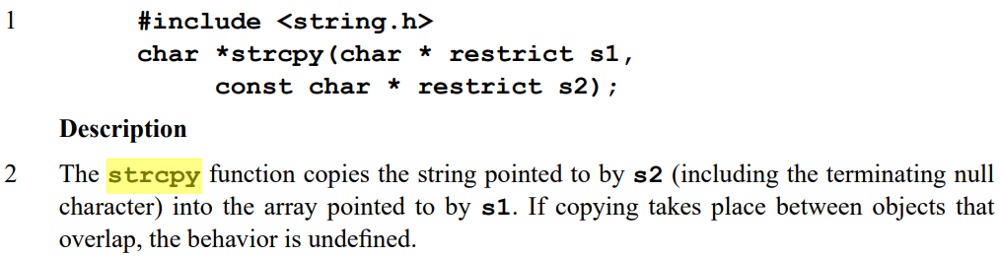

<h1 style="text-align: center"> 第四次作业题目详解</h1>

## A - 栈操作

参考 `栈队讲解` 和 `栈.c` 实现即可，就是一道栈的模板题。


## B - C 程序括号匹配检查

这道题有以下几个关键点：

- 文件读入

- 单行注释、多行注释、字符常量、字符串常量中的括号不应该被处理
- 遇到除上述情况及括号外的其它字符，应该直接跳过不管
- 假如说以上三点都处理结束了，从我们的视角来看源程序只有左括号和右括号，那该如何进行匹配？

对于**第一个关键点**，最简单的一个方法就是使用 `freopen`，很多同学对于文件 IO 十分惧怕，因为不知道该如何本地调试。其实文件 IO 相比于正常的控制台输入输出，唯一的区别就变成了输入源输出源变成了文件，其余的地方没有区别。可以参考**选填板子-文件**里的代码，比如我们要从 `in.txt` 读入，那就把 `in.txt` 放在跟源程序一个目录下就可以了。

在进行**最简单的文件读入输出**时，我们通常使用 `freopen`。`freopen` 也就是 `file re open`，文件重定向，只要在主函数一开始写上一行 `freopen("in.txt", "rb", stdin)`（相当于把输入源 stdin 换成了 "in.txt"），那以后的读入代码就什么都不用管了，程序已经把输入从文件取到缓冲区等待我们读取了（如果不理解的话就试着运行一下**选填板子-文件-文件读写_freopen**）。

对于**第二个关键点**，我们其实在之前做过很多次了，遇到这种**字符串模式匹配**的问题，尤其是看到注释的识别，我们就不难想到**状态转移的思想**。如果你还不了解状态转移的思想，可以先去看一下**作业讲解-程序设计基础练习-题目讲解**中第五道题的题解，这里的处理是大同小异的，不过是又多了字符串常量和字符常量，所以在这道题里我们用了以下七个状态：

- 0：普通状态，也就是不在单行注释、多行注释、字符常量、字符串常量中，正常的进行字符读入
- 1：在单行注释里
- 2：在多行注释里，且上一个读到的字符不是 `*`
- 3：在字符串常量里
- 4：在多行注释里，且上一个读到的字符是 `*`
- 5：上一个字符是 `/`（可能要进入单行注释或者多行注释了）
- 6：在字符常量中

作为一个练习，同学们可以试着自己画出这道题的状态转移图。

第三个关键点没什么好说的，直接看第四个关键点。

如果只有左括号 `(`、`{` 和右括号 `)`、`}`，那么该如何进行括号匹配呢？实际上，如果是一个右括号的话，它应该看谁是否跟它匹配？应该是它左面的，第一个还没人匹配的左括号，也就是最后一个进来的且还没有匹配的左括号。如果右括号跟这个左括号匹配，那就会把这个左括号给带走。用一句话概括，就是**左括号入栈，右括号出栈**。

当读入一个左括号时，我们就直接把它加入括号栈（当然题目里还有一个特殊规则，就是如果新进来的左括号是 `{`，此时的栈顶为 `(` 时就应该报错）。当读入一个右括号时，我们查看括号栈栈顶，如果跟这个右括号不匹配，那就报错；如果跟这个右括号匹配，那就让括号栈执行出栈操作。也就是说，括号栈里只可能出现左括号。最后读入完成后，如果括号栈里还有括号，也要报错（这段里的三个报错正好对应了三条规则）。

还有一些其它的细节，比如输出行号什么的，只要我们定义一个结构体和对应结构体类型的栈，在存括号的时候把对应的行号信息存进去就行了（想要维护行号的信息，还要记录一下当前读到了第几行，遇到一个换行符就让这个变量 + 1）。还可以给报错函数封装为一个函数，传入一个结构体根据结构体信息报错，看上去更加简洁。其余细节不过多赘述。


## C - 计算器

在读入的这个地方，注意我们不能像**作业讲解-第一次作业-表达式计算**那么读入，因为那道题里一定是`数字 符号 数字 符号 ...` 形式的，但是这道题符号和符号可能挨着。我一开始想这么读入：

```c
while(scanf("%d", &num)) {
    if(num == 0) {
        // 说明是符号
    } else {
        // 说明是数字
    }
}
```

想利用 `scanf` 返回值的技巧进行读入，因为 `scanf` 的返回值相当于成功匹配的元素的个数，比如假如我写的是 `scanf("%d", &num)`，然后输入了一个 `c`，那 `scanf` 就不会改变 `num` 的值，并且返回 `0`。结果发现输出完全不符合我的预期，de 了一会之后发现，`scanf %d` 会读入 `+` 和 `-`，因为它们可能是数字的一部分。比如对上面的代码输入 `1+1`，那它实际上会分别读入 `1` 和 `+1`，并且两次都返回 `1`。

所以这道题的读入大概要这么写：

```c
// 先将所有输入读入为一整个字符串
gets(str);
int i = 0;
while(str[i]) {
    char op = str[i];
    i++;
    // 如果是 = 直接 break 也行，continue 也不影响结果，就是简洁了点
    if(op == ' ' || op == '=')
        continue;
    // isdigit 是 <ctype.h> 里的，用来判断一个字符是不是数字字符
    if(!isdigit(op)) {
        // 进行操作符的处理
    } else {
        // 读入一整个数字
        double num = op - '0';
        while (isdigit(str[i])) {
            num = num * 10 + (str[i] - '0');
            i++;
        }
        // 放进数字栈
        numStk[numTop++] = num;
    }
}
```

读入数字的时候，只需要直接放进数字栈里即可。

读入操作符的时候，我们就要根据操作符的类型进行操作了，有这么几种情况：

- 如果符号栈为空，或者读入的是 `(`，那就直接让读入的操作符进入符号栈即可
- 如果读入的是 `)`，那就一直让符号栈出栈，直到遇到 `(`（其它的谁来也不行）
- 如果读进来的是其它操作符，那就和栈顶比较优先级，如果栈顶符号优先级 $$\mathrm{\ge}$$ 读入的操作符，就让符号栈弹栈，直到栈为空或者栈顶符号操作符 $$\mathrm{\lt}$$ 读入的操作符或者栈顶为 `(`（实际上，只有可能栈顶是 `*`、`/`，或者读进来的操作符是 `+`、`-` 时才会满足这一点，大家可以写一写各种情况理解一下）。

- 如果处理输入串结束后，符号栈不为空，就将符号栈中的符号依次出栈

同时，符号出栈就伴随着从数字栈栈顶弹出两个元素并计算（后出栈的数字 op 先出栈的数字），对于不同的符号，都经过一个相同的流程：

- 弹出第一个数字 a
- 弹出第二个数字 b
- a op b = c
- 将 c 入栈

所以我们可以直接将这个过程封装为一个函数：

```c
void cal(char c) {
    double a = numStk[--numTop];
    double b = numStk[--numTop];
    if(c == '+') numStk[numTop++] = b + a;
    else if(c == '-')   numStk[numTop++] = b - a;
    else if(c == '*')   numStk[numTop++] = b * a;
    else numStk[numTop++] = b / a;
}
```

这样主函数就会相当简单，比如和栈顶比较优先级的部分，就可以这么实现了：

```c
while (opTop > 0 && cmp(opStk[opTop - 1], op)) 
    cal(opStk[--opTop]);
opStk[opTop++] = op;
```


## D - 文本编辑模拟操作

我们先来简单回顾一下**字符串**，想要明白这些题里的一些操作，就一定要理解字符串。

### 字符串

字符串并不完全等价于字符数组，二者的关系就像杯子和水一样，字符数组就像杯子（存储字符数据的容器），字符串就像水（需要存在容器里）。字符串是一个**以空字符结尾的字符序列**，这个**空字符用来标记字符串的结束**，但是字符串本身的长度统计并不包括这个空字符。希望同学们一定要记住，**字符串最关键的一点就在于结尾的空字符**。

我们可以通过一个字符数组确定一个字符串，比如字符数组 `str[8]` 中的八个字符分别是 `h e l l o \0 a \0`，其中 `\0` 表示空字符。在这个字符数组中，`hello` 是一个字符串，因为它以空字符结尾。尽管字符数组中还有其他字符（如 `a` 和第二个空字符），但字符串 `str` 实际上指的只有 `hello`。

我们都知道，数组名相当于这个数组的起始地址。当我们想输出一个字符串的时候，我们用 `printf("%s", str)` ，只需要传递字符串的起始地址即可。明明只传进去了一个地址，没有任何关于长度的信息，但 `printf` 函数还是能够正确输出字符串的内容，因为它会从这个地址开始，逐个读取字符，直到遇到空字符（`'\0'`）为止，依赖于空字符界定标识一个字符串的结束，从而确保输出的内容正确。

### 回到题目

简单来看一下题目，题目中包含三种操作：插入、删除和撤销。涉及到撤销操作，所以我们不难联想到这题要使用栈，因为撤销操作满足最近进行的操作先被撤销，也就是后进先出的性质。初始时给出一个初始字符串，和一些已经执行完的操作；然后进行若干次上述操作，进行完这些操作后，输出最后的字符串。

我们先在不考虑占的情况下实现插入和删除操作，插入操作要求在某个指定位置处插入一段字符串，比如在字符串 `a` 的 `pos` 处插入一个字符串 `b`，我们不难想到可以用这样的流程去实现：

- 将 `a` 中 `pos` 处后的字符往后移动到合适的位置（具体来说，每个字符向后移动 `strlen(b)`）
- 用 `b` 覆盖从 `a` 的 `pos` 位置开始的 `strlen(b)` 个字符

比如说，我们想在 `momo` 的位置 $$\mathrm{2}$$ 处（也就是第一个 `o` 后面）插入字符串 `ca`，我们可以：

- 先将原字符串的后两个字符向后移动两位（因为 `ca` 长度为 $$\mathrm{2}$$），原字符串变成 `momomo`（原来的位置不清空也可以，因为一会还会被覆盖掉）
- 然后将 `ca` 放入到字符串的位置 $$\mathrm{2}$$，字符串就变成 `mocamo` 了

我们不难想到利用 `strcpy` 和 `strncpy` 去执行拷贝操作，两者的区别如下：

- `strcpy(a, b)`：将字符串 `b` 克隆到字符串 `a`，然后在后面填一个空字符。
- `strncpy(a, b, n)`：如果 `b` 的长度小于 `n`，那就将 `b` 的所有字符复制到字符串 `a`，然后一直补空字符，直到 `b` 的长度 + 空字符的个数 = n；否则就将 `b` 的前 `n` 个字符拷贝到 `a`，且不添加空字符。

对于上面的第一步（将字符串 `a + pos` 集体向后移动若干位），我们需要使用 `strcpy`，因为之前可能进行过删除操作，导致字符数组后面还有东西，如果不补空字符的话就会出问题，所以我们要使用 `strcpy`（或者手动补空字符）；对于第二步，我们需要使用 `strncpy`，因为我们相当于把 `b` 插在 `a` 的中间，最后的结构是 a 的前半部分 + b + a 的后半部分，如果用 `strcpy` 的话就会在 b 的后面补一个空字符，字符串变成 a 的前半部分 + b，后面的部分就丢失了，导致出错。

但是要注意的是，我们在实现插入函数的时候，不能直接用 `strcpy(a + pos + strlen(b), a + pos)`，C99 标准中规定，如果 `strcpy` 的两个参数代表的字符串有覆盖的话，将会发生未知的问题（希望同学们记住这一点）：



所以我们要新开一个字符串作为媒介，最后实现的插入操作的代码类似于下面：

```c
// 在 str 指定位置插入一个字符串 tem，tem 是一个全局变量，直接在主函数中被读入
void insert(int pos) {
    int len = strlen(tem);
    // 必须引入一个中间字符串
    // 第一步
    char *p = (char *)malloc(strlen(str) + 1);
    strcpy(p, str + pos);
    strcpy(str + pos + len, p);
    // 第二步
    strncpy(str + pos, tem, len);
    free(p);
}
```

删除的代码其实也类似，删除相应的实现在指定的位置处删除指定个数个字符。但是最后还有一个 `undo` 操作，我们不难想到，撤销一个删除操作，就相当于执行一个对应的插入操作；撤销一个插入操作，就相当于执行一个对应的删除操作。由于在删除的时候我们只有位置 + 长度信息，但是在撤销这次删除的时候我们要知道删除的字符串到底是什么，以重新插回去，所以在删除操作的时候也要记录被删掉的字符串（这一点在题面里也有说明），这里我的做法是将被删除的字符串存在一个全局字符数组 `tem` 中：

```c
// 删除 str 指定位置 pos 处的 len 个字符
void del(int pos, int len) {
    int total = strlen(str);
    // 
    if(pos + len > total) 
        len = total - pos;
    
    // 记录下被删除的字符串，以便 undo
    strncpy(tem, str + pos, len);
    tem[len] = 0;
    
    // 必须引入一个中间字符串
    char *p = (char *)malloc(strlen(str) + 1);
    strcpy(p, str + pos + len);
    strcpy(str + pos, p);
    free(p);
}
```

我们维护一个操作栈，对每一次操作我们都记录操作符、位置、插入/删除的字符串三个信息；利用这个操作栈，我们就能够实现 `undo` 操作：

```c
// 撤销一次操作
void undo() {
    if(opTop == 0) 
        return;
    operate op = opStk[--opTop];
    // 撤销插入相当于删除
    if(op.op == 1) 
        del(op.pos, strlen(op.str));
    else if(op.op == 2) {
        // 撤销删除相当于插入，插入 op.str，所以要先将 op.str 拷贝到 tem 上
        strcpy(tem, op.str);
        insert(op.pos);
    }
}
```


