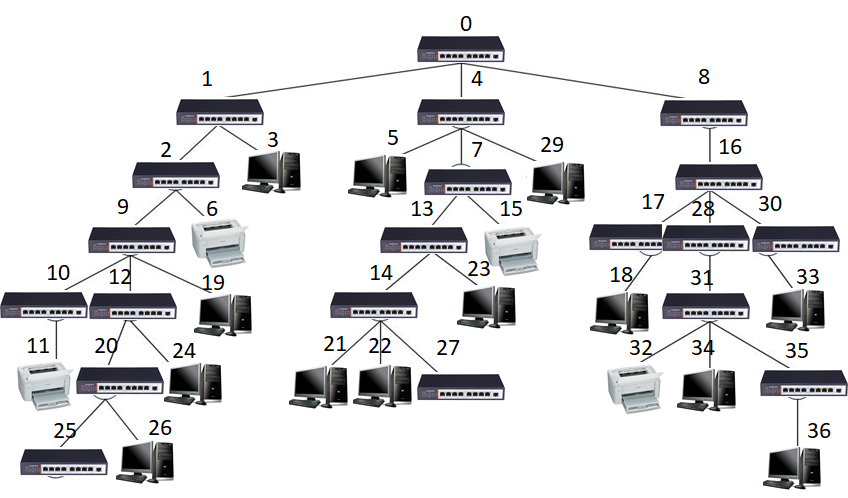

<h1 style="text-align: center"> 2020

## 编程题

### 1. 学生在线上机时间统计

**问题描述**  
教学平台日志数据中记录了学生使用系统的情况。假设已获取了某段时间内学生使用系统的情况（包括姓名、学号及使用系统的时间），由于 学生可以多次登陆、注销，所以有可能记录了**某位学生多次使用系统的情况**，请**统计合并**每位学生使用系统的时间，并**按由小至大排序输出**（**时间相同时按学号由小到大排序**输出）。 

**输入形式 **  
首先从控制台输入学生使用系统次数 n（大于等于 1 并且小于等于 100），然后分行输入 n 条学生使用系统情况，每行输入信息包括学生姓名（由 3-20 个英文字母组成，中间无空格）、学号（由 8 位 0-9 的数字组成）、使用系统时间（大于 0 并且小于等于 86400 的整数，单位为秒），各信息由一个空格分隔，每行末尾有换行符。输入信息中**不会出现学号相同而姓名不同**的情况。 

**输出形式**  
按照使用系统时间**由小到大的顺序**分行输出每位学生使用系统情况，**时间相同的按照学号由小到大的顺序**输出。每行信息分别包括学生姓名（3-20 位英文字母）、学生学号（**8 位数字**）和使用系统时间，各数据间**以一个空格分隔，每行最后一个数据后与回车间无空格**。 

**样例输入1**  

```
10 
wanghai 19373001 3600 
liupeng 19374521 1796 
zhanghuimei 19182538 2421 
lipengyou 19230908 7329 
qinhong 19060211 650 
zhaopin 17182785 1076 
sunliang 15375026 2028 
zhanghuimei 19182538 2537 
jikehong 16373890 4263 
wanghai 19373001 58 
```

**样例输出1**  

```
qinhong 19060211 650 
zhaopin 17182785 1076 
liupeng 19374521 1796 
sunliang 15375026 2028 
wanghai 19373001 3658 
jikehong 16373890 4263 
zhanghuimei 19182538 4958 
lipengyou 19230908 7329 
```

**样例输入2**  

```
20
wanghai 19373001 3600 
liupeng 19374521 1796 
zhanghuimei 19182538 2421 
lipengyou 19230908 7329 
qinhong 19060211 650 
zhaopin 17182785 1076 
sunliang 15375026 2028 
zhanghuimei 19182538 2537 
jikehong 16373890 4263 
wanghai 19373001 58 
qinhong 19060211 123 
zhanghuimei 19182538 3311 
liuxu 19373289 1239 
hongfei 19372976 900 
sunliang 15375026 1000 
liupeng 19374521 1862 
zhanghuimei 19182538 32 
sunliang 15375026 630 
wanghai 19375091 9023 
zhanghuimei 19182538 1096
```

**样例输出2**  

```
qinhong 19060211 773 
hongfei 19372976 900 
zhaopin 17182785 1076 
liuxu 19373289 1239 
sunliang 15375026 3658 
wanghai 19373001 3658 
liupeng 19374521 3658 
jikehong 16373890 4263 
lipengyou 19230908 7329 
wanghai 19375091 9023 
zhanghuimei 19182538 9397 
```

**样例说明**  

对于样例 1：输入了 10 条学生使用系统情况信息，其中学号为 19373001 和 19182538  的学生各有两条信息，合并使用时间后按照使用时间由小到大排序输出。   

对于样例 2：输入了 20 条学生使用系统情况信息，其中有两条是学号为 19373001 的学生使用系统情况，使用时间分别为 3600 秒和 58 秒，合并后为 3658 秒，类似的有：19374521有两条、19182538有五条、19060211有两条、15375026 有三条，其他学生都只有一条，因此共记录了 11 位同学的使用系统情况信息，最后将这 11 位同学的使用系统情况信息按照使用时间由小到大的顺序输出。其中有三位同学都使用了 3658 秒，这时按照学号由小到大的顺序输出。

$\newline$

### 2. 后缀表达式计算

**问题描述**  
从控制台输入一合法的后缀表达式，其中的**运算符只包括**+、-、*、/，运算数都是**大于等于 0 的整数（除数不为零）**，按要求输出计算结果，或输出计算结果和相对应的中缀表达式。输出中缀表达式时只**包含最少数目的圆括号（即在生成的中缀表达式中若去掉一对括号，则其将不能够转换回输入的后缀表达式）**。输出计算结果时，**小数点后保留两位**，例如：10/3 的结果为 3.33。假如输入的后缀表达式为： 

```
100 25 + 27 25 - / 248 + 201 -
```

其相对应的中缀表达式为： 

```
(100+25)/(27-25)+248-201
```

计算结果为 109.50。 

**输入形式 **  
首先从控制台输入一个合法的后缀表达式（**长度不超过 200 个字符**），其中的运算符、运算数之间**都以一个空格分隔**。然后在下一行输入一个整数 1 或 2 表示计算要求（1 表示只输出计算结果；2 表示输出对应的中缀表达式和计算结果）。 

**输出形式**  
若输入的计算要求为 1，则只将计算结果输出到控制台，小数点后保留两位；若输入的计算要求为 2，则先将后缀表达式对应的中缀表达式输出到控制台（其中添加的小括号都为**英文小括号**，表达式中**不包含任何空白符**），然后在下一行输出计算结果，小数点后保留两位。 

**样例输入1**  

```
100 25 + 27 25 - / 248 + 201 - 
1 
```

**样例输出1**  

```
109.50
```

**样例输入2**  

```
100 25 + 27 25 - / 248 + 201 - 
2 
```

**样例输出2**  

```
(100+25)/(27-25)+248-201
109.50
```

**样例输入3**  

```
100 25 + 2 58 42 + * / 
2 
```

**样例输出3**  

```
(100+25)/(2*(58+42)) 
0.63 
```

**样例说明**  

对于前两个样例，两样例输入了相同的后缀表达式。按计算要求，样例 1 只输出了计算结果；样例 2 输出了转换后的（包含最少括号的）中缀表达式和计算结果。按照后缀表达式的计算语义，当转换为中缀表达式时，前两个运算符连成的表达式 100+25 和 27-25 都要加上小括号。

对于样例 3，按照后缀表达式的计算语义，生成中缀表达时**表达式 `2*(58+42)` 外应该加上小括号**，否则两个表达式计算顺序不一致。 

**算法提示**

后缀转中缀时算法提示：

1、每步进行后缀表达式计算时，除了要保存计算结果外，还应保存对应的（以字符串形式表示的）运算符和中缀表达式。

2、 在进行后缀表达式计算时，**当前运算符的优先级大于左运算对象运算符优先级**，则生成对应的中缀表达式时左运算对象对应的**中缀表达式应加括号**；**当前运算符的优先级大于或等于右运算对象运算符优先级时**，则生成对应的中缀表达式时右运算对象对应的**中缀表达式应加括号**。其它情况则不用加括号。以样例 2 为例，在进行后缀表达式计算时：

- 第一次进行 `+` 运算时，左运算对象为 100，右为 25，运算结果为 125、运算符为 `+`、对应中缀表达式为 100+25； 
- 第二次进行 `-` 运算时，左运算对象为 27，右为 25，运算结果为 2、运算符为 `-`、对应中缀表达式为 27-25； 
- 第三次进行 `/` 运算时，左运算对象为 125、对应运算符为 `+`、对应中缀表达式为 100+25，由于 `/` 优先级高于 `+`，因此生成对应中缀表达式时 100+25 应加括号；右运算对象为 2、对应运算符为 `-`、对应中缀表达式为 27-25，由于 `/` 优先级高于 `-`，因此生成对应中缀表达式时 27-25 也应加括号。该步运算结果为 62.5、运算符为 `/`、对应中缀表达式为(100+25)/(27-25)； 
- 以此类推 

**建议先实现计算后缀表达式结果功能（可得 66.7%的分数），然后再考虑实现后缀表达式转换为对应的中缀表达式功能（占 33.3%分数）**。

$\newline$

### 3. 网络打印机选择

**问题描述**  
某单位信息网络结构呈树型结构，网络中节点可为交换机、计算机和打印机三种设备，**计算机和打印机只能位于树的叶节点**上。如要从一台计算机上打印文档，请为它**选择最近（即经过交换机最少）**的打印机。  

在该网络结构中，根交换机编号为 0，其它设备编号可为任意有效正整数，每个交换机有 **8 个端口（编号 0-7）**。当存在多个满足条件的打印机时，选择**按树前序遍历序**排在前面的打印机。 



**输入形式 **  
首先从标准输入中输入两个整数，第一个整数表示当前网络中设备数目，第二个整数表示需要打印文档的计算机编号。两整数间以一个空格分隔。**假设设备总数目不会超过 300**。  

然后**从当前目录下的 in.txt** 读入相应设备配置表，该表每一行构成一个设备的属性，格式如下：   

<设备 ID> <设备父节点 ID> <类型> <端口号>    

<设备 ID>为一个非负整数，表示设备编号；<设备父结点 ID>为相应结点父结点编号，为一个有效非负整数；<类型>分为：0 表示交换机、1 表示计算机、2 表示打印机；<端口号>为相应设备在父结点交换机中所处的端口编号，分别为 0-7。由于设备配置表是按设备加入网络时的次序编排的，因此，表中第一行一定为根交换机（其属性为 0 -1 0 -1）；其它**每个设备结点一定在其父设备结点之后输入**。每行中**设备属性间由一个空格分隔，最后一个属性后有换行符**。 

**输出形式**  
向控制台输出所选择的打印机编号，及所经过的交换机的编号，**顺序是从需要打印文档的计算机开始，编号间以一个空格分隔**。 

**样例输入**

```
37 19 
```

`in.txt` 中的信息如下：

```
0 -1 0 -1 
1 0 0 0 
2 1 0 2 
3 1 1 5 
4 0 0 1 
5 4 1 0 
6 2 2 2 
7 4 0 2 
8 0 0 4 
9 2 0 0 
10 9 0 0 
11 10 2 3 
12 9 0 2 
13 7 0 0 
14 13 0 0 
15 7 2 3 
16 8 0 1 
17 16 0 0 
18 17 1 5 
19 9 1 5 
20 12 0 1 
21 14 1 1 
22 14 1 2 
23 13 1 2 
24 12 1 5 
25 20 0 1 
26 20 1 2 
27 14 0 7 
28 16 0 1 
29 4 1 3 
30 16 0 7 
31 28 0 0 
32 31 2 0 
33 30 1 2 
34 31 1 2 
35 31 0 5 
36 35 1 3 
```

**样例输出**  

```
11 9 10
```

**样例说明**  

样例输入中 37 表示当前网络共有 37 台设备，19 表示编号为 19 的计算机要打印文档。in.txt 设备表中第一行 0 -1 0 -1 表示根节点交换机设备，其设备编号为 0 、父结点设备编号-1 表示无父设备、设备类型为 0（交换机）、端口-1 表示无接入端口；设备表第二行 1 0 0 0 表示设备编号为 1 、父结点设备编号 0（根交换机）、设备类型为 0（交换机）、端口 0 表示接入父结点端口 0；设备表中行 5 4 1 0 表示设备编号为 5 、父结点设备编号 4、设备类型为 1（计算机）、端口 0 表示接入 4 号交换机端口 0；设备表中行 6 2 2 2 表示设备编号为 6 、父结点设备编号 2、设备类型为 2（打印机）、端口 2 表示接入 2 号交换机端口 2。    

样例输出 11 9 10 表示选择设备编号为 11 的打印机打印文档，打印需要经过 9 号和 10 号交换机（尽管 6 号和 11 号打印机离 19 号计算机距离相同，但 11 号打印机按树前序遍历时排在 6 号之前）。 

