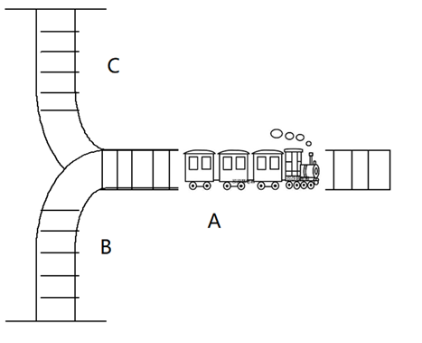
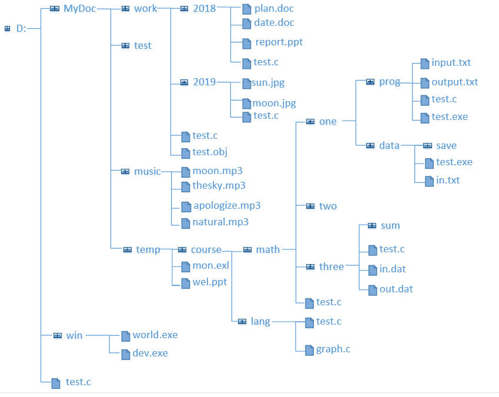

<h1 style="text-align: center"> 2019

## 选择题

1.下⾯面程序段的时间复杂度为  __________。  

```c
c = 0;
for(i = 0; i < m; i++)
    for(j = 0; j < n; j++)
        c = c + i * j;
```

A.$\mathrm{O( m^2 )}$     B.$\mathrm{O( n^2 )}$     $\mathrm{O( m \times n )}$    D.$\mathrm{O( m+n )}$

  

2.设某一⾮空的单循环链表的头指针 (指向第⼀个结点的指针 )为Head ，尾指针 (指向最后⼀个结点的指针 ) 为 Rear ，则下列列条件判断结果⼀定为真的是 __________  

A. `Head== Rear->link`   

B. `Head== Rear->link->link`  

C. `Rear== Head->link`   

D. `Rear== Head->link->link`  

 

3.若5个元素的出栈序列列为 1，2，3，4，5，则进栈序列列可为 __________。  

A.2,4,3,1,5   

B.2,3,1,5,4   

C.3,1,4,2,5   

D.3,1,2,5,4   

  


4.设栈 S 和队列列 Q 的初始状态均为空，元素 a,b,c,d,e, f, 依次进⼊入栈 S。若每个元素出栈后⽴立即进⼊入队列列 Q, 且 6 个元素出队的顺序是 b, f ,e, d, c, a ，则栈 S的容量量⾄至少是 __________。  

A.5 B.3 C.2 D.6   

  

5.下列列语句句中，能正确进⾏行行字符串串赋值的是 __________。  

A. `char *sp; *sp="BUAA"`;   

B. `char s[10]; s="BUAA"`;   

C. `char s[10]; *s="BUAA"`;  

 D. `char *sp="BUAA"`;   

  

6.下列列说法中，错误的是 __________。  

A. 在图的邻接矩阵存储中，⽆向图的邻接矩阵⼀定是⼀个对称矩阵 ;  

B. 在图的邻接表存储中，有向图的第 i 个链表中边结点个数是第 i 个顶点的出度;  

C. 包含具有 n 个顶点的连通图 G 的全部 n 个顶点,仅包含其 n-1 条边的极⼩连通⼦图称为 G 的⼀个⽣成树;  

D. 对于给定的带权连通⽆向图，从某源点到图中各顶点的最短路径构成的⽣成树⼀定是该图的最小生成树;  

  

7.可⽤用于求⽆无向图的所有连通分量量的算法是 __________。  

A. 广度优先遍历 B. 拓扑排序 C. 求最短路径 D. 求关键路径   

  

8.设有⼀组记录的关键字为 {19，16，23，1，68，20，84，27，55，11，10，75}，⽤链地址法构造散列表，散列函数为 `H(key)=key MOD 13`，散列地址为 1 的链中有 __________ 个节点。  

A.1 B. 2 C. 3 D. 4   

  

9.若在有序序列中采⽤折半查找⽅法进⾏查找，⽤来描述该查找过程的“判定树”的形状与 __________ 有关。  

A.序列中元素的值   B.序列中元素的排列次序   C.序列中元素的类型   D.序列中元素的个数  

  

10.若⽤⼀个⼤⼩为 6 的数组来实现循环队列，且当前 rear 和 front 的值分别为 0 和 3，当从队列中出队⼀个元素，再⼊队两个元素后，rear 和 front 的值分别为 __________。  

A. 1 和 5 B. 2 和 4 C. 4 和 2 D. 5 和 1  

  

11.⼀个具有767个结点的完全⼆叉树，其叶⼦结点个数为  __________。  

A. 383 B. 384 C. 385 D. 386   

  

12.在⼆叉排序树中进⾏查找的效率与 __________ 有关。  

A. ⼆叉排序树的深度    

B. ⼆叉排序树的叶结点的个数      

C. 被查找结点的度  

D. 二叉排序树的存储结构  

   

13.在下⾯的查找⽅法中， 不是基于关键字值⽐较的查找⽅法 __________。  

A. 顺序查找法 B. 折半查找法 C. 索引查找法 D. 散列列查找法   

  

14.下列排序⽅法中，不稳定的排序⽅法是 __________    

A.冒泡排序  B. 快速排序  C.归并排序  D. 插⼊排序    

  

15.对⼀组数据 (84，47，25，15，21) 排序，排序过程如下:  

(1) 15 47 25 84 21   

(2) 15 21 25 84 47   

(3) 15 21 25 84 47   

(4) 15 21 25 47 84   

则采⽤的排序算法是 __________  。  

A. 选择 B. 冒泡 C. 快速D. 插⼊  


## 填空题

1.若某完全⼆叉树采⽤顺序存储结构，结点存放的次序为 `ABCDEFGH`，请给出该⼆叉树的后序序列  (字符之间不加任何分隔符号) 。  

2.假设采⽤快速排序算法按照从⼩到⼤的顺序对10个数据元素进⾏排序，这10个数据的初始状态为 (57,11,12,-23,76,1901,20,96,-38,0)，若第⼀次选⽤第⼀个数据57作为分界元素，则第⼀趟排序后，分界元素 57 前有 __________  个数据元素。  

3.有 9 个叶结点的哈夫曼树共有 __________ 个结点。

4.n 个科技园区，现要为它们建成能相互通讯的有线⽹，并且使线路⻓度总和最短，这可以归结为图的 __________ 问题。

5.若某栈初始为空，符号PUSH与POP分别表示对栈进⾏1次进栈操作与1次出栈操作，那么，对于输⼊序列 ABCDE，经过PUSH, PUSH, POP, PUSH, POP, PUSH, PU SH, POP以后，出栈序列应该是  (字符之间不加任何分隔符号)。

  

## 编程题

### 1. 标识符的识别

**问题描述**  
⼀个内存空间块可⽤⼀对起始地址和结束地址表示，如 [0,100]。对于两个内存空间块：[0,100] 和 [101,200]，这两个空间是相邻的，所以可以合并成⼀个空间块：[0,200]。编写程序，输⼊⼀组空闲内存空间，对相邻空间进⾏合并，然后按照空间块的起始地址由⼩到⼤输出。注意：内存空间块不会存在重叠的情况。  

算法之⼀提示：可先将输⼊的空间块按起始地址排序，然后进⾏合并。  

**输入形式 **  
从控制台输⼊内存空间块的个数（⼤于等于1，⼩于等于100），然后分⾏输⼊每个内存空间块的起始地址和结束地址（地址⽤⼤于等于0，并且⼩于等于 100000 的整数表示），两地址间以⼀个空格分隔。

**输出形式**  
将合并后的内存空间块按照空间块的起始地址由⼩到⼤输出，每个空间块独占⼀⾏，先输出起始地址，再输出结束地址，两地址间以⼀个空格分隔。 

**样例输入**  

```
10
48 99
0 39
1024 2047
100 479
4000 5999
600 799
40 47
2048 3047
840 859
8000 8999
```

**样例输出**  

```
0 479
600 799
840 859
1024 3047
4000 5999
8000 8999
```

**样例说明**  

输⼊了 10 个内存空间块，其中：[0,39]、[40,47]、[48,99] 和 [100,479] 相邻，可以合并成⼀个空间块： [0,479]；[1024,2047] 和 [2048,3047] 相邻，可以合并成 [1024,3047]。合并后还有 6 个内存空间块，按照 空间块的起始地址由⼩到⼤输出。  

$\newline$

### 2. 火车货运调度模拟

**问题描述**   

某⽕⻋货场由 A、B、C 三段组成，⻅下图。现有⼀列货⻋停在A段上，由多个货物⻋厢组成，每节⻋厢信息包括编号和货物发往的⽬的地（⻋厢编号是唯⼀的，各节⻋厢发往的⽬的地可以相同，也可以不同）。当前停在 A 段的货⻋⻋厢发往⽬的地编组是乱的，需要按⽬的地由远⾄近进⾏重新编组，即⻋厢离⻋头越近其⽬的地越远，这样⽅便到达⽬的地时卸货（卸下相关⻋厢）。编组过程中⻋厢只能依次从 A 中移动⾄ B 或 C 中，或从 B 或 C 中移⾄ A 中，从 B 中不能直接移⾄ C 中，从 C 中也不能直接移⾄ B 中。编写⼀程序模拟货运⻋厢编组。



假设 A、B、C 三段交叉路⼝为各段的顶端，编组规则如下：

- 初始时所有⻋厢位于 A 中且均未完成编组，⻋头距离顶端最远；⾸先将其所有⻋厢从顶开始依次推进⾄ B 中。
- 从 B 中找到发往地最远的⻋厢中离顶最近的⻋厢，假设其为 M。将 M ⾄顶的所⻋厢依次推进⾄ A 中，此时 M ⼀定位于 A 中顶端。
- 若 A 中 M 之后（即：M 与⻋头之间）不存在未完成编组的⻋厢，则⻋厢 M 的编组完成了；若 A 中 M 之后存在未完成编组的⻋厢，则将 M 推进⾄ C 中，将 A 中 M 之后所有未完成编组的⻋厢依次推进⾄ B 中，再将 M 由 C 中推进⾄ A 中，这样就完成了⻋厢 M 的编组；
- 重复步骤 2-3，直到 B 中⽆⻋厢。

**输入形式**  
先从控制台输⼊⽬的地个数（⼤于等于 1，⼩于等于 50），然后分⾏输⼊⼀组由地名（⽤不含空⽩符的英⽂字符串表示，字符个数不超过 20）和⾥程（⽤⼤于等于1⼩于等于10000的整数表示）构成的发往⽬的地（由近⾄远序）⾥程表，地名和⾥程之间以⼀个空格分隔；在⾥程表之后输⼊⻋厢个数（⼤于等于1，⼩于等于50），然后分⾏输⼊⼀组由⻋厢编号（由四位数字组成）和发往⽬的地（⽬的地肯定在上述⾥程表中出现）构成的⻋厢信息，⻋厢编号和⽬的地之间以⼀个空格分隔，并且是从⻋头处开始依次输⼊每节⻋厢信息。

**输出形式**  
假设⼀节⻋厢从某段推出称为⼀次pop操作，推进某段称为⼀次push操作。程序运⾏输出第⼀⾏为从⻋头开始编好组的⻋厢编号，中间⽤⼀个空格隔开，最后⼀个⻋厢编号后也有⼀个空格。第⼆⾏输出编组过程中A段中push操作的次数。

**样例输入**  

```
10
shijiazhuang 280
xingtai 390
xinxiang 610
zhengzhou 689
wuchang 1221
chibi 1339
yueyang 1434
changsha 1559
shaoguan 2057
guangzhou 2273
12
0039 guangzhou
5217 xingtai
0262 yueyang
7205 wuchang
3211 guangzhou
4893 shijiazhuang
2283 shaoguan
0890 guangzhou
8729 wuchang
6839 shijiazhuang
2122 changsha
3280 wuchang
```

**样例输出**  

```
0039 3211 0890 2283 2122 0262 7205 8729 3280 5217 4893 6839
45
```

**样例说明**  

⾸先输⼊由 10 个地名及其⾥程组成的⾥程表，然后输⼊了 12 节需要编组的⻋厢的编号和发往的⽬的地，即初始时处于 A 中的⻋厢，其中 0039 编号的⻋厢离⻋头最近。按照上⾯编组规则，⾸先将所有⻋厢推进⾄ B 中，这时 0039 ⻋厢位于 B 的顶端，3280 ⻋厢位于底端，B 中所有⻋厢中最远⽬的地为 guangzhou、 且离顶最近的⻋厢为 0039，将其推进⾄ A 中，这时A 中只有其⼀节⻋厢，其后没有未编组的⻋厢，0039 ⻋厢编组完成（即完成第⼀节⻋厢编组），此时 A 的 push 操作次数为 1；接下来，B 中剩余的 11 个⻋厢中，最远⽬的地依然为guangzhou，其离顶最近的⻋厢为 3211，将该⻋厢及其上的 3 节⻋厢依次推进到 A 中，此时，3211 ⻋厢与⽕⻋头之间有三节⻋厢未完成编组，于是按规则将 3211 推进⾄ C 中，将7205、 0262 和 5217 依次推进⾄ B 中，再将 C 中的 3211 推进⾄ A 中，这时 3211 ⻋厢编组完成（即完成第⼆节⻋厢编组），此时 A 的 push 操作次数为 6；再依次按照上述步骤对 B 中剩余的⻋厢完成编组，直到 B 中⽆⻋厢。最后从⻋头开始将所有完成编组的⻋厢编号依次输出，由此得到⼀组发往⽬的地距离（从⻋头开始）由远⾄近的⻋厢序列。完成编组过程中 A 的 push 操作次数共有 45 次。

  

### 3. 查找同名文件

**问题描述**   

在操作系统中⽬录及⽂件是按树形式组织和管理的，从根⽬录开始，每⼀层⽬录下可以包含⼦⽬录和⽂件。假设⼀⽂件系统，从根⽬录开始，每个⽬录下可包含最多不超过 100 个⽂件及⼦⽬录，⽂件名及⽬录名是⼀字符串（不包含空⽩符，最多包含20个字符），每个⽂件和⽬录包含修改时间属性（仅由⽇期组成的字符串，例如：`20190927` 表示 2019 年 9 ⽉ 27 ⽇），在同⼀个⽬录下不会存在同名⽂件，⽽且所有的⽬录都不会重名。例如，下图是⼀给定的⽂件结构示意：



给定⼀⽂件名，请在给定⽂件结构中查找同名⽂件，并按修改时间由近⾄远排列输出其包含全路径名的⽂件名，即从根⽬录开始的⽬录及⽂件名（包含的字符个数不会超过200）；修改时间相同时，从根⽬录开始按层次由⼩到⼤的顺序输出；修改时间和层次都相同的，按照由上到下的顺序输出。假设找到的同名⽂件个数不会超过100。

**输入形式**  
从控制台输⼊⽂件结构中⽬录及⽂件的总个数和待查找的⽂件名，中间由⼀个空格分隔；然后从当前⽬录下⽂件 `files.txt` 中分⾏读⼊每个⽬录及⽂件的信息，其格式如下：

```
name parentName type date
```

name 是⼀字符串，表示⽬录或⽂件的名字，其中不包含空⽩符，最多包含 20 个字符；parentName 表示该⽬录或⽂件的上级⽬录名字，根⽬录没有上级⽬录，⽤字符 `-` 表示；type 为 0或 1，⽤于区分当前输⼊的是⽂件还是⽬录：0 表示⽂件，1 表示⽬录；date 为⼀⽇期字符串，表示⽬录或⽂件的修改时间，例如：`20190927` 表示 2019 年 9 ⽉ 27 ⽇。

读⼊的⽬录或⽂件遵循如下原则：读⼊当前⽬录或⽂件时，其上级⽬录已经读⼊；对于同⼀⽬录下的⽂件或⼦⽬录，先读⼊的位于前⾯（显示在上⽅）。

**输出形式**  
按修改时间由近⾄远排列分⾏输出找到的⽂件：包括其从根⽬录开始的各级⽬录及⽂件名，⽬录及⽂件之间以⼀个英⽂字符 `\` 分隔；修改时间相同时，按从根⽬录开始按层次由⼩到⼤的顺序输出；修改时间和层次都相同的，按照由上到下的顺序输出。注意：由于根⽬录⼀般为盘符，输出时要加英⽂字符 `:`，例如若根⽬录名为 D，则输出时应为 `D:`。

**样例输入**  

```
49 test.c
```

当前⽬录下 `files.txt` ⽂件中内容如下：

```
D - 1 20190101
MyDoc D 1 20190101
win D 1 20190101
test.c D 0 20190901
work MyDoc 1 20190101
2018 work 1 20190102
plan.doc 2018 0 20190202
date.doc 2018 0 20190305
2019 work 1 20190103
test.c work 0 20190901
test.obj work 0 20190902
sun.jpg 2019 0 20190405
report.ppt 2018 0 20190306
test MyDoc 1 20190103
music MyDoc 1 20190103
temp MyDoc 1 20190103
moon.mp3 music 0 20190607
thesky.mp3 music 0 20190701
moon.jpg 2019 0 20190506
test.c 2019 0 20190901
apologize.mp3 music 0 20190702
test.c 2018 0 20190901
natural.mp3 music 0 20190702
world.exe win 0 20190101
dev.exe win 0 20190102
course temp 1 20190505
mon.exl temp 0 20190505
wel.ppt temp 0 20190605
math course 1 20190506
lang course 1 20190607
one math 1 20190507
test.c lang 0 20190925
graph.c lang 0 20190926
two math 1 20190508
three math 1 20190508
test.c math 0 20190926
prog one 1 20190609
data one 1 20190610
sum three 1 20190509
test.c three 0 20190901
in.dat three 0 20190902
input.txt prog 0 20190809
output.txt prog 0 20190827
test.c prog 0 20190901
test.exe prog 0 20190901
save data 1 20190611
test.exe data 0 20190612
in.txt data 0 20190612
out.dat three 0 20190902
```

**样例输出**  

```
D:\MyDoc\temp\course\math\test.c
D:\MyDoc\temp\course\lang\test.c
D:\test.c
D:\MyDoc\work\test.c
D:\MyDoc\work\2018\test.c
D:\MyDoc\work\2019\test.c
D:\MyDoc\temp\course\math\three\test.c
D:\MyDoc\temp\course\math\one\prog\test.c
```

**样例说明**  

`files.txt` 中有 49 个⽬录和⽂件，形成如上图所示的⽂件系统。待查找的⽂件名为 `test.c`。可以在该⽂件系统中找到 8 个名为 `test.c` 的⽂件，其中 `D:\MyDoc\temp\course\math` ⽬录下的 `test.c` 最新，所以先输出， 然后是 `D:\MyDoc\temp\course\lang` ⽬录下的 `test.c` ⽂件。剩下六个 `test.c` ⽂件的修改⽇期相同，按照从根⽬录 D: 开始层次由⼩到⼤顺序输出。其中：⽬录 `D:\MyDoc\work\2018和D:\MyDoc\work\2019` 下的 `test.c` ⽂件所处层次相同，则按照由上⾄下的顺序输出。
