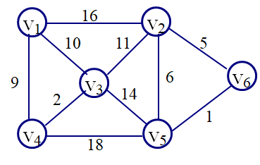

<h1 style="text-align: center"> 2020


## 填空题

1.对于下图所示的⽆向连通图，若采⽤普⾥姆（Prim）算法求其最⼩⽣成树，假设第⼀个选择加⼊最⼩⽣成树的顶点为V1， 则最后⼀条加⼊最⼩⽣成树的边的权值为  __________。  



  

2.具有 20 个顶点的⽆向图采⽤邻接矩阵表示（两顶点间有边⽤ 1 表示，⽆边⽤ 0 表示），若该图为连通图，则其邻接矩阵中至少有 __________  个⾮零元素。

  

3.若⼀棵深度为 6 的完全⼆叉树的第 6 层有 3 个叶结点（根结点在第 1 层），则该⼆叉树共有叶结点的个数为 __________。  

  

4.给定⼀组权值：{2,3,4,4,7,8}，以这些权值作为叶结点构造哈夫曼树，其带权路径⻓度为 __________。  


## 选择题

1.若在有序序列中采⽤折半查找⽅法进⾏查找，⽤来描述该查找过程的“判定树”的形状与 __________ 有关。  

A.序列中元素的值   B.序列中元素的排列次序   C.序列中元素的类型   D.序列中元素的个数  

  

2.下列排序⽅法中，不稳定的排序⽅法是 __________

A．冒泡排序   B. 快速排序    C归并排序   D. 直接插⼊排序  

  

3.下列列说法中，错误的是 __________。  

A. 在图的邻接矩阵存储中，⽆向图的邻接矩阵⼀定是⼀个对称矩阵 ;    

B. 在图的邻接表存储中，有向图的第 i 个链表中边结点个数是第 i 个顶点的出度;    

C. 包含具有 n 个顶点的连通图 G 的全部 n 个顶点,仅包含其 n-1 条边的极⼩连通⼦图称为 G 的⼀个⽣成树;    

D. 对于给定的带权连通⽆向图，从某源点到图中各顶点的最短路径构成的⽣成树⼀定是该图的最小生成树;  

  

4.⽆向图 G=(V,E)，其中：V={a,b,c,d,e,f}，`E={(a,b),(a,e),(a,c),(b,e),(c,f),(f,d),(e,d)}`，则下⾯的顶点序列中，__________  是该图深度优先遍历的⼀个正确的输出序列。

A. a,b,e,c,d,f   

B. a,c,f,e,b,d   

C. a,e,d,f,c,b   

D. a,e,b,c,f,d  

   

5.在建⽴散列表时，若散列函数为 H(k)，a 与 b 分别为关键字值，则当 __________  时，称此现象为散列冲突。

A. a == b    B. a != b   C. a == b 且 H(a) == H(b)     D. a != b 且 H(a) == H(b)  

  

6.有向带权图，若采⽤迪杰斯特拉（Dijkstra）算法求源点a到其他各顶点的最短路径，得到的第⼀条最短路径的⽬标顶点是b，第⼆条最短路径的⽬标顶点是c，后续得到的其余各最短路径的⽬标顶点依次是 __________  


A .d,e,f       B. e,d,f      C. f,d,e         D. f,e,d  

  

7.已知⼆叉树的中序序列为 `BADCE`，后序序列为 `BDECA`，则其前序序列为：__________    

A. ADBEC    B. DECAB   C. DEBAC   D. ABCDE  

  

8.若⽤⼀个⼤⼩为 6 的数组来实现循环队列，且当前 rear 和 front 的值分别为 0 和 3，当从队列中出队⼀个元素，再⼊队两个元素后，rear 和 front 的值分别为 __________   

A. 1 和 5  B. 2 和 4   C. 4 和 2   D. 5 和 1  

  

9.假设⼆叉树结点中都保存有关键字，那么下⾯的⼆叉树中：从任⼀结点出发到根的路径上所经过的结点序列都是按其关键字有序的是 __________   

A. 完全二叉树  

B. 二叉排序树  

C. 满二叉树  

D. 大顶堆  

  

10.若已知⼀个栈的⼊栈序列是 1、2、3、…、n-1、n，其输出序列为 p1、p2、p3、…、pn，若 p1=n，则 pi 为 __________   

A. i   B. n-i   C. n-i+1    D.不确定  

  

11.表达式 `a*(b+c)-(d+e)` 的后缀表达式是 __________   

A. `abcd*++-`  

B. `abc+*de+-`  

C. `abc*+d+-`  

D. `-++*abcd`  

  

## 编程题

### 1. 机试异常检测

**问题描述**  
某教学平台具有考试登录异常检测功能，检测规则如下：

- 考试开始后，如果**同⼀账号在不同机器上**登录，系统将报警输出异常登录信息（可能存在私⾃换机器的情况）；
- 考试开始后，如果同⼀账号在同⼀机器上多次登录，**属于正常情况**，系统不报警。

编写程序，读⼊某次考试学⽣的登录⽇志信息，对其进⾏异常检测，输出异常登录信息。⽇志信息包括学⽣学号（即学⽣账号，唯⼀标识学⽣身份的信息，⽤⼀整数表示，不超过 int 的表示范围）、学⽣姓名（⽤**不含空⽩符的字符串表示，字符个数不超过 15**）、机器号（⽤⼀整数表示，不超过 int 的表示范围）、登录时间（⽤包含 **6 个数字的字符串**表示，例如：093756，表示 9 点 37 分 56 秒）。

**输入形式 **  
先从控制台输⼊⽇志信息条数（不超过200条），然后按照**登录先后顺序**分⾏输⼊⽇志信息，每条信息包括学号、姓名、机器号和登录时间，以⼀个空格分隔各数据。

**输出形式**  
按照学号从⼩到⼤的顺序输出登录异常账号信息（仅包括学号和姓名），每条信息独占⼀⾏，学号和姓名以⼀个空格分隔。如果没有异常登录信息，则什么都不输出。

**样例输入**  

```
21
191028 wangdi 15 093000
192387 litong 39 093000
190877 liugang 37 093001
197583 huangqinian 196 093004
195211 liuhao 201 093005
193098 zhaogang 377 093006
190001 zhousheng 1 093007
190009 wuhong 12 093007
197583 huangqinian 197 093008
195877 lisisi 202 093008
192387 litong 309 093009
191000 tonghao 201 093402
197583 huangqinian 196 093500
191028 wangdi 15 093507
190010 wangzhuang 85 093558
195333 zhangye 63 093600
197583 huangqinian 195 094100
195211 liuhao 200 095103
190010 wangzhuang 287 095509
193098 zhaogang 377 095606
191028 wangdi 15 095709
```

**样例输出**  

```
190010 wangzhuang
192387 litong
195211 liuhao
197583 huangqinian
```

**样例说明**  

输⼊了 21 条登录⽇志信息，其中有四位学⽣（学号分别为 190010、192387、195211 和 197583）在多台机器上登录，属于异常登录，输出异常账号登录信息；注意：学号为 191028 的学⽣在 15 号机器上有多次登录，属于正常重复登录。

$\newline$

### 2. 函数调用关系

同 `第四次作业（栈和队）` 中的 `函数调用关系` 一题。

  

### 3. 服务优化

同 `第五次作业（树）` 中的 `服务优化` 一题。
