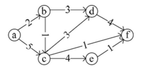
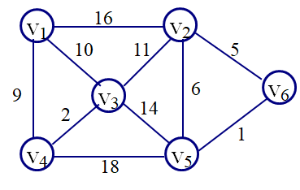

<h1 style="text-align: center"> 2021


## 选择题

1.已知二叉树的前序序列为：ABDFGCEHJIK，中序序列为：BFDGAJHEIKC，则其后序序列为 __________

A. KIJHECGFDBA   

B. GDFBCKIEHJA   

C. FGDBJHKIECA   

D. JHIKEFFGDBA  

​    

2.一有向带权图如下图所示，若采用迪杰斯特拉（Dijkstra）算法求源点 a 到其他各顶点的最短路径， 得到的第一条最短路径的目标顶点是 b，后续得到的其余各最短路径的目标顶点依次是  __________



A. c,d,e,f   B. c,e,d,f   C. c,f,e,d   D. c,f,d,e

  

3.若有以下说明和语句:

```c
struct student{
    int age;
    int no;
};
struct student std, *p;
p = &std;
```

则以下对结构变量 `std` 中成员 `no` 的引用方式正确的是 __________

A. `std->no`   B. `p->no`   C. `(*std).no`   D. `*p.no`  

   

4.下列列说法中，错误的是 __________。  

A. 在图的邻接矩阵存储中，⽆向图的邻接矩阵⼀定是⼀个对称矩阵 ;   

B. 在图的邻接表存储中，有向图的第 i 个链表中边结点个数是第 i 个顶点的出度;   

C. 对于给定的带权连通⽆向图，从某源点到图中各顶点的最短路径构成的⽣成树⼀定是该图的最小生成树;  

D. 包含具有 n 个顶点的连通图 G 的全部 n 个顶点,仅包含其 n-1 条边的极⼩连通⼦图称为 G 的⼀个⽣成树;  

   

5.有一无向图 G=(V,E)，其中：`V={a,b,c,d,e,f}`，`E={(a,b),(a,e),(a,c),(b,d),(c,f),(f,d),(e,c)}`，则下面的顶点序列中，__________ 是该图深度优先遍历的一个正确的输出序列。  

A. a,b,e,c,d,f   

B. a,c,f,e,b,d   

C. a,e,b,f,c,b   

D. a,e,c,f,d,b

  

6.下列排序方法中，稳定的排序方法是  __________  

A．选择排序   B. 快速排序   C.冒泡排序   D. 堆排序  

   

7.若⽤⼀个⼤⼩为 20 的数组（下标从 0 开始）来实现循环队列，且当前 rear 和 front 的值分别为 18 和 10，当从队列中出队两个元素，再⼊队五个元素后，rear 和 front 的值分别为 __________   

A. 3 和 12   B. 12 和 3   C. 0 和 15   D. 15 和 0

  

8.设 p 指针指向单链表（单链表长度为 n）中的某个结点（p≠NULL），若只知道指向该单链表第一个结点的指针和 p 指针，则在 p 指针所指结点之前和p指针所指结点之后插入一个结点的时间复杂度分别是 __________   

A. O(1) 和 O(n)    B. O(n) 和 O(1)   C. O(n) 和 O(n)    D. O(1) 和 O (1)  

  

9.若在有序序列中采用折半查找方法进行查找，用来描述该查找过程的“判定树”的形状与 __________   有关。

A.序列中元素的值    B.序列中元素的排列次序    C.序列中元素的类型   D.序列中元素的个数

  

10.在建⽴散列表时，若散列函数为 H(k)，a 与 b 分别为关键字值，则当 __________  时，称此现象为散列冲突。

A. a == b    B. a != b   C. a == b 且 H(a) == H(b)     D. a != b 且 H(a) == H(b)  

  

## 填空题

1.若一棵深度为 7 的完全二叉树的第 7 层有 15 个叶结点（根结点在第 1 层），则该二叉树所有叶结点的个数为 __________   

2.对于下图所示的⽆向连通图，若采⽤普⾥姆（Prim）算法求其最⼩⽣成树，假设第⼀个选择加⼊最⼩⽣成树的顶点为V1， 则最后⼀条加⼊最⼩⽣成树的边的权值为  __________。  



3.若一二叉树中有 20 个叶子结点，则其度为 2 的结点 __________  个。  

4.倘若输入的序列是 `e8,e4,e2,e5,e3,e9,e1,e6,e7`，如果使用多个队列，使其出队的序列为 `e1,e2,e3,e4,e5,e6,e7,e8,e9`，则至少需要 __________  个这样的队列。（要求：输入的元素可以选择进入任何一个队列，但是每个队列都需要遵循先入先出的原则。）  

5.表达式 `(a+b)/c-(d-e)*f` 的后缀表达式是 __________

6.如果用 push 表示进栈操作，用 pop 表示出栈操作，已知元素的进栈顺序为 `e1,e2,e3,e4,e5`，为了得到 `e2,e4,e5,e3,e1` 的出栈顺序，相应的入栈和出栈操作应为 __________（用 `push` 和 `pop` 表示，用英文逗号分割，例如：push,push,pop,pop）

7.若有一单链表，定义其结点的结构类型名为 struct node ，其中指向下一结点的指针为link；下面定义一递归函数实现该链表的删除操作（即：删除整个链表的所有结点），形参为链表头指针，请将语句补充完整：

```c
void delete(struct node *head){
    if(head!=NULL) {
        delete(_____________);
        free(head);
   }
}  

```

8.具有 30 个顶点的无向图采用邻接矩阵表示（两顶点间有边用 1 表示，无边用 0 表示），若该图为连通图，则其邻接矩阵中至少有 __________ 个非零元素。

9.给定一组权值：{1,2,3,4,4,5,6}，以这些权值作为叶结点构造哈夫曼树，其带权路径长度为 __________

10.有如下定义：

```c
struct point{
    float x, y;
};
struct triangle{
    struct point a, b, c;
}tr;
```

若要将三角形 tr 的顶点 b 的 x 坐标设置为1.5，请将该赋值语句补充完整：__________ = 1.5


## 编程题

### 1. 汉明距离

**问题描述**  
在信息论中，两个等长字符串之间的汉明距离（Harmming Distance）是指两个字符串中对应位置的不同字符的个数（区分大小写）。换句话说，它就是将一个字符串变换成另外一个字符串所需要替换的字符个数。例如：10110101与11011101的汉明距离为3，roses与cotes的汉明距离为2。从标准输入中输入一组等长字符串，以第一个字符串为基准，统计其与其它字符串的汉明距离，并按汉明距离由小至大输出字符串对及其汉明距离。

**输入形式 **  

首先从标准输入读入字符串的个数n（2<=n<=16），然后分行读入 n 个等长的字符串（长度小于等于 16）。

**输出形式**  
将结果输出到标准输出，具体要求如下：  

1、以第一个字符串为基准，按汉明距离由小至大的顺序分行输出字符串对及其汉明距离；字符串及其汉明距离间都以一个空格分隔。  

2、若汉明距离相同，则按照字符串对中第二个字符串的字典序（由小到大）输出；由于要区分大小写，故字典序是指字符的ASCII码序。  

**样例输入**  

```
5
roses
cotes
Roses
coset
rotes
```

**样例输出**  

```
roses Roses 1
roses rotes 1
roses coset 2
roses cotes 2
```

**样例说明**  

输入了 5 个长度为 5 的字符串；第一个字符串 roses 与其它字符串的汉明距离为 1 或 2；先输出汉明距离为 1 的字符串对，而且按字典序 Roses 小于 rotes，故先输出 roses 和 Roses 的汉明距离。  

$\newline$

### 2. 二叉搜索树

**问题描述**  
编写程序读入一组整数，按输入顺序构造一棵二叉查找树（BST树）来查找并统计相应整数的出现次数，BST树的构造规则如下：  

1、在输入整数过程中按照左子结点值小于根结点值、右子结点值大于根结点值的方式构造一棵BST树；  

2、输入的整数等于BST树中某结点值时，该结点的出现次数加1。  

示例详见下面的样例。  

对于最终构建的BST树，要求统计如下数据：  

1、在BST树的创建及查找整数过程中总的比较次数，仅统计输入的整数与结点值进行比较的次数，不统计指针的判断次数；  

2、出现次数最多的整数的比较路径；比较路径是指BST树中从根结点到该节点的路径；若出现次数最多的整数有多个，则只输出按照前序遍历次序访问的第一个出现次数最多的整数的比较路径。  

**输入形式 **  

先从控制台输入整数的个数 n(大于等于 1），然后在下一行输入 n 个整数，以一个空格分隔各个整数。  

**输出形式**  
先向控制台输出在BST树的创建及查找整数过程中总的比较次数，然后在下一行输出按照前序遍历次序访问的第一个出现次数最多的整数的比较路径，用该路径上各结点对应的整数表示，各整数间以一个空格分隔，最后一个整数后有无空格均可。  

**样例输入**  

```
12
670 1360 1871 921 128 1871 57 -200 1003 552 -200 57
```

**样例输出**  

```
26
670 128 57
```

**样例说明**  

开始BST树为空，第一个整数670作为根结点，没有与结点值进行比较，比较次数为0；第二个整数1360与结点670比较了1次；第三个整数1871与结点670和结点1360各比较了1次；第六个整数1871与结点670、1360和1871各比较了1次；其它整数与上述整数类同；在该BST树的创建及查找整数过程中总的比
较次数为26次。  

在该BST树中，出现次数最多的整数有三个，分别为1871、57和-200，其中按照前序遍历次序访问到的第一个为57，所以要输出结点57的比较路径，即从根结点670到结点57的路径。  

  

### 3. 解释系统

**问题描述**  
有一 min 解释语言，其只有整型常量、变量、赋值语句、算术表达式语句及打印语句组成。编写一程序，实现该系统。  

规则：  

1、变量仅由单个小写字母组成。  

2、只有三种语句：`print`、`exit` 和赋值语句。一行只有一个语句，语句中的字符个数不会超过 200，每条语句的末尾都有换行符。 语句格式为：  

​	a). 赋值语句：`<变量> = <算术表达式>`。`<算术表达式>` 是由十进制整型常量（末尾不带后缀）、变量、算术运算符（+, -, *, /）及小括号组成；赋值语句中没有空白符。  

​	b). print 语句：`print <变量列表>`。`<变量列表>` 为由空格分隔的变量序列，`print` 和变量间由空格分隔。功能是输出变量列表中各变量的值。  

​	c). exit 语句：`exit`。退出解释系统。  

3、 在进行赋值运算、算术运算、打印输出时，相应变量都会有具体值，不会出现语法错误。在计算过程中结果数据类型为浮点型，输出时保留小数点后 2 位。  

**输入形式 **  

从标准输入读入解释系统的待执行语句，每条语句独占一行；最后一条语句为 exit。注意：所有输入中出现的常量都是不带后缀的十进制整数常量。  

**输出形式**  
在解释系统执行过程中，每条print语句执行后，print后各变量的值将会输出到标准输出，输出时保留小数点后2位，各数据间以一个空格分隔，最后一个数据后没有空格，有换行符。  

**样例输入**  

```
a=10
b=20
c=(a+b)/4
print a b c
d=a*(b-c)
print d
exit
```

**样例输出**  

```
10.00 20.00 7.50
125.00
```
