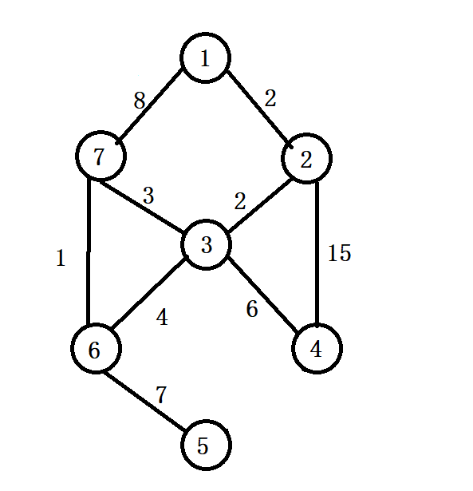
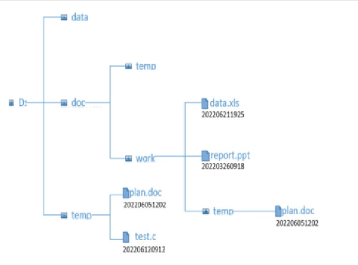
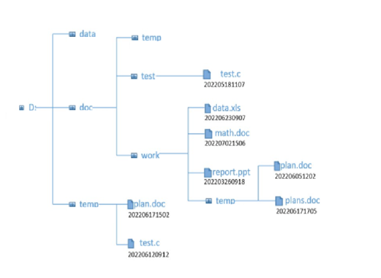
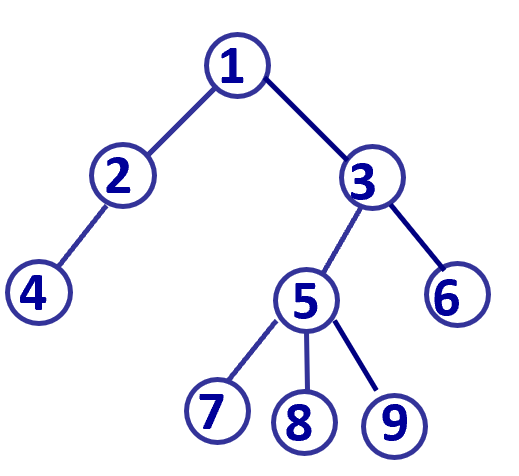

<h1 style="text-align: center"> 2022


## 选择题

1.下列排序方法中，不稳定的排序方法是 __________

 A. 冒泡排序 B. 归并排序 C. 快速排序 D. 插入排序   

​    

2.具有 n 个顶点的无向图用邻接矩阵表示，若该图为连通图，则其邻接矩阵中至少有 __________ 个非零元素。

A. $\mathrm{2 \times (n - 1)}$  

B. $\mathrm{n - 1}$  

C. $\mathrm{n \times n}$  

D. $\mathrm{n \times (n - 1)}$  

  

3.在堆排序中，基于关键字序列 6,9,1,5,8,4,7 建立初始大顶堆 H，得到的 H 是 __________ 

A. 9,8,7,6,5,4,1  

B. 9,8,7,5,4,1,6  

C. 9,8,7,5,6,4,1  

D. 9,6,7,5,8,4,1  

   

4.若对序列 `(2, 12, 16, 70, 5, 10)` 按值从小到大进行排序，前三趟排序的结果分别为： 第 1 趟排序的结果：(2, 12, 16, 70, 5, 10)， 第 2 趟排序的结果：(2, 5, 16, 70, 12, 10)， 第 3  趟排序的结果：(2, 5, 10, 70, 12, 16) 。则由此可以断定，该排序过程采用的排序方法是 __________ 

A. 快速排序  

B. 选择排序  

C. 插入排序  

D. 冒泡排序  

   

5.一棵满二叉树有 m 个树枝，n 个结点，其深度为 h，则 __________ 

A. n=h+m   

B. h+m=2n   

C. m=h-1   

D. n=2h-1  

  

6.栈和队列的共同点是  __________  

A. 都是先进先出   B. 都是先进后出    C. 只允许在端点处插入和删除元素   D. 没有共同点  

   

7.有一无向图 G=(V,E)，其中：`V={a,b,c,d,e,f}`，`E={(a,b),(a,e),(a,c),(b,d),(c,f),(f,d),(e,c)}`，则下面的顶点序列中，__________ 是该图深度优先遍历的一个正确的输出序列。  

A. a,b,e,c,d,f   

B. a,c,f,e,b,d   

C. a,e,b,f,c,b   

D. a,e,c,f,d,b  

  

8.若在有序序列中采用折半查找方法进行查找，用来描述该查找过程的“判定树”的形状与 __________   有关。

A.序列中元素的排列次序    B. 序列中元素的值   C.序列中元素的个数   D.序列中元素的类型

  

9.一有向带权图如下图所示，若采用迪杰斯特拉（Dijkstra）算法求源点 a 到其他各顶点的最短路径，得到的第一条最短路径的目标顶点是 b，后续得到的其余各最短路径的目标顶点依次是 __________   

A. d,c,e,f   B. d,e,c,f   C. d,f,e,c   D. d,f,c,e  

  

10.某栈的输入序列为 25,30,7,10，下面的四个序列中，__________   不可能是它的输出序列。

A.10,7,25,30   B. 30,7,10,25   C.25,7,30,10   D. 7,10,30,25    

  

## 填空题

1.设有一组记录的关键字为 `(19，16，23，1，68，20，84，27，55，11，10， 81)`，利用散列存储，地址空间范围为 `[0...12]`，散列函数为 `H(key) = key MOD 13`，利用链地址法解决散列冲突，则散列地址为 3 的链中有 __________  个链结点。  

2.已知一个有向图，其共有 10 个顶点，则其最多有 __________  条边。

3.对序列进行从小到大排序，若序列的原始状态为 `1,2,3,4,5,10,6,7,8,9`，要想使得排序过 程中元素的比较次数最少，应该采用 __________  方法。

4.若以 {3，7，2，9，18，4} 作为叶子结点的权值构造哈夫曼树，则其带权路径长度是 __________。 

5.若用一个大小为 10 的数组（下标从 0 开始）来实现循环队列，且当前 rear 和 front 的值 分别为 1 和 4，当从队列中出队一个元素，再入队两个元素后，rear 和 front 的值分别为 __________ 和 __________。

6.一棵完全二叉树，第6层的叶子结点个数为20，该树最多有 __________ 个结点。 

7.下图的最小生成树的权值是 __________。



8.一棵 5 阶 B- 树，除根结点以外的其它分支结点中最少有 __________ 个关键字。

9.已知二叉树的中序序列为：BADCE，后序序列为：BDECA，则其前序序列为 __________ 。

10.设栈S和队列Q的初始状态为空，元素 e1、e2、e3、e4、e5 和 e6 依次进栈 S，一个元素出栈后即进队列 Q，若 6 个元素出队的序列是 e2、e4、e3、e6、e5、e1，则栈 S 的容量至少应该是 __________ 

  

## 编程题

### 1. 查找同时空人员

**问题描述**  
假设一共有 6 个手机基站，都具有记录手机连接基站状态的能力，当手机进入和离开基站固定范围后，基站将及时记录手机的连接信息：  

1、约定基站覆盖范围不存在重合，也就是同一个手机在同一时间内只会处于一个基站覆盖范围内；  

2、同一个手机在同一个基站上多次连续登录，属于正常情况，说明该手机不断出入该基站的覆盖范围。  

编写程序，读入某一天多个基站的手机登录日志信息（服务商提供的日志信息是按手机进入基站的时间排好序，详见样例输入）和一个要查找的人员手机号，查找与该人员同时空人员的手机号（即与该手机号基站相同且进入与离开时间有重叠的手机号；若一手机号的进入时间与另一手机号的离开时间完全相同，两手机号也算有重叠）。输出与指定手机号有时空重叠的手机号及所在基站。  

基站的手机登录日志信息包括：手机号（11 位的数字，按字符串处理）、基站编号（一共为6个基站，分别用大写字母 A、B、C、D、E、F 表示）、登录时间和登出时间（用长度为 6 的数字串表示，例如：093756，表示 9 点 37 分 56 秒）。

**输入形式 **  

先输入手机登录日志信息的条数（小于 1000 条），然后按上述格式分行输入手机登录日志信息，手机号、基站编号、登录时间和登出时间之间以一个空格分隔。

**输出形式**  
按照手机号**由大至小**进行排序，分行输出与指定手机号有时空重叠的手机号及所在基站编号，手机号与基站编号之间以一个空格分隔。手机号相同时按基站字母序排序输出。

**样例输入**  

```
28
18222336979 F 060201 063539
18222336979 B 063601 063802
18222336979 C 063806 064607
18222336979 D 064615 065816
18222336979 A 065827 160003
18222336979 D 160013 161605
18222336979 C 161617 162633
18222336979 B 162702 172333
13810013509 C 080005 092537
13810013509 A 100356 124732
13810013509 C 125021 161619
13810013509 F 162315 163857
13810013509 B 163901 205602
13810013509 C 210509 230108
13810013509 D 230901 232556
13557912211 B 060615 080239
13557912211 E 120507 150309
13557912211 C 162633 163621
13557912211 B 163855 172209
13557912211 D 200609 230901
13985992766 A 070000 120203
13985992766 F 130506 160000
13985992766 B 160102 161503
13985992766 C 161617 163058
13985992766 E 163302 180709
13985992766 D 190005 200729
15857596331 D 000201 235051
13877882206 C 003123 220806
13557912211
```

**样例输出**  

```
18222336979 B
18222336979 C
15857596331 D
13985992766 C
13985992766 D
13877882206 C
13810013509 B
13810013509 D
```

**样例说明**  

先输入了 28 条手机登录基站的日志信息，然后输入手机号 13557912211，表示要查找与该手机号同时空的手机号。该手机号首先在 6 点 6 分 15 秒登录 B 基站，在 8 点 2 分 39 秒登出B 基站，在这个时间段内只有手机号 18222336979 存在重叠；指定手机号登录登出过E基站，但没有存在重叠的手机号；指定手机号在 C 基站与3个手机号发生重叠，其余重叠情况类似。按照这些手机号**由大至小**进行排序，分行输出与指定手机号有时空重叠的手机号及所在基站编号，手机号相同时按基站字母序排序输出。

$\newline$

### 2. 老鼠回家 - 无回路

同 `第四次作业（栈和队）` 中的 `老鼠回家` 题目。

  

### 3. 文件拷贝

**问题描述**  
假设已有一个文件目录和一组带有全目录路径的文件，请将该组文件按下面规则拷贝到已有文件目录中，并按要求输出拷贝后的文件目录：   

1．若相应目录下无给定文件，则将该文件直接拷贝到相应目录下；   

2．若相应目录下有给定同名文件且拷入文件比原有文件日期较新，则用新文件覆盖已有同名文件，否则不执行任何操作；   

3．若相应目录中无给定文件目录路径上的某个子目录，则在当前目录相应目录下创建相应子目录及文件。   

假设要拷贝的文件**根目录**与已有文件**根目录是相同的**。   

例如：若已有下图所示目录（文件名下方数字是其日期时间）：  



要拷贝的一组文件(文件名后为相应文件日期时间)如下所示： 

```
D:\doc\test\test.c 202205181107
D:\doc\work\data.xls 202206230907
D:\doc\work\temp\plans.doc 202206171705
D:\temp\plan.doc 202206171502
D:\doc\work\report.ppt 202203250830
D:\doc\work\math.doc 202207021506
```

按上面规则文件拷贝后目录如下图所示：  



**输入形式 **  

目录以下面形式给出：`a1(a11,a12,a13,……,a1n)`，表中 `a1` 是根目录编号，括号中每个元素，可以是一个具体文件编号 ，也可以是以同样方式定义的一个子目录编号。例如，下面方式：`1(2(4),3(5(7,8,9),6))` 则表示了如下目录树：



其中 1 为根结点目录编号，其有 2 个编号为 2 和 3 的子目录，而编号为 2 的子目录有一个编号为 4 的子目录或文件，以此类推。任一结点的子结点个数不超过 100 个。所有编号大于等于 1 且小于等于 1000，编号在一个目录树中是唯一的。  

以上面形式定义的一个已有目录树保存在当前目录下的文件 `in.txt` 中，目录树中的字符都是英文字符，字符数不超过 5000，只包含数字、小括号和逗号；在目录树后，`in.txt` 分行保存目录树中每个结点编号所对应的文件名（不超过 20 个字符）、文件属性（1 表示目录，0 表示普通文件）和日期时间（文件用 12 位数字串表示，目录没有时间，用英文减号字符 `-` 表示），各数据间以 1 个空格分隔。  

**从标准输入读入**要拷贝的文件数目，然后分行读入每个文件的全路径信息和日期时间（两者之间以一个空格分隔），最后一个文件信息后也有换行符。  

**输出形式**  
按层次遍历序分行输出拷贝后目录树中的文件及相应日期时间，**同一层的按文件名的字典序**输出，若同一层的文件名也相同，则按照**时间序**输出。注意只输出普通文件信息，不输出目录信息。  

**样例输入**  

`in.txt` 文件内容如下：

```
100(25,32(18,1(26,37,66(17))),101(2,3))
100 D: 1 -
101 temp 1 -
2 plan.doc 0 202206051202
3 test.c 0 202206120912
25 data 1 -
32 doc 1 -
18 temp 1 -
1 work 1 -
26 data.xls 0 202206211925
37 report.ppt 0 202203260918
66 temp 1 -
17 plan.doc 0 202206051202
```

标准输入如下：

```
6
D:\doc\test\test.c 202205181107
D:\doc\work\data.xls 202206230907
D:\doc\work\temp\plans.doc 202206171705
D:\temp\plan.doc 202206171502
D:\doc\work\report.ppt 202203250830
D:\doc\work\math.doc 202207021506
```

**样例输出**  

```
plan.doc 202206171502
test.c 202206120912
data.xls 202206230907
math.doc 202207021506
report.ppt 202203260918
test.c 202205181107
plan.doc 202206051202
plans.doc 202206171705
```

**样例说明**

根据 `in.txt` 文件中输入的目录树和文件目录信息，可以生成如上面第一张图所示的文件目录；将标准输入中读入的 6 个文件拷贝到该文件目录后，状态如上面第二张图所示，最后将其中的文件信息按层次输出到标准输出。
